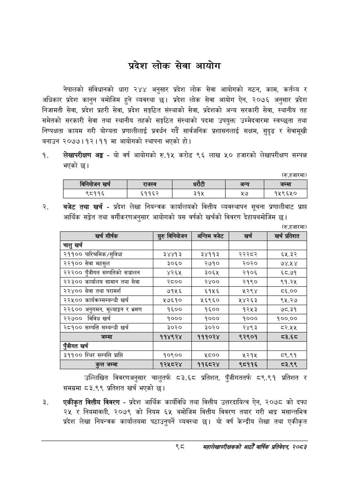

# Page 120 QA

## Rendered page


## Extracted text

```text
प्रदेश लोक सेवा आयोग
नेपालको संविधानको धारा २४४ अनुसार प्रदेश लोक सेवा आयोगको गठन, काम, कर्तव्य र अधिकार प्रदेश कानुन बमोजिम हुने व्यवस्था छ। प्रदेश लोक सेवा आयोग ऐन, २०७६ अनुसार प्रदेश निजामती सेवा, प्रदेश प्रहरी सेवा, प्रदेश सङ्गठित संस्थाको सेवा, प्रदेशको अन्य सरकारी सेवा, स्थानीय तह समेतको सरकारी सेवा तथा स्थानीय तहको सङ्गठित संस्थाको पदमा उपयुक्त उम्मेदवारमा स्वच्छता तथा निष्पक्षता कायम गरी योग्यता प्रणालीलाई प्रवर्धन गर्दै सार्वजनिक प्रशासनलाई सक्षम, सुदृढ र सेवामूखी बनाउन २०७७।१२।११ मा आयोगको स्थापना भएको हो।
लेखापरीक्षण अङ्ग -यो वर्ष आयोगको रु.१५ करोड ९६ लाख ५० हजारको लेखापरीक्षण सम्पन्न भएको छ।
(रु.हजारमा)
बजेट तथा खर्च -प्रदेश लेखा नियन्त्रक कार्यालयको वित्तीय व्यवस्थापन सूचना प्रणालीबाट प्राप्त आर्थिक सङ्केत तथा वर्गीकरणअनुसार आयोगको यस वर्षको खर्चको विवरण देहायबमोजिम |
(रु.हजारमा)
उल्लिखित विवरणअनुसार चालुतर्फ ८३.६८ प्रतिशत, पुँजीगततर्फ ८९.९१ प्रतिशत र समग्रमा ८३.९९ प्रतिशत खर्च भएको छ।
एकीकृत वित्तीय विवरण -प्रदेश आर्थिक कार्यविधि तथा वित्तीय उत्तरदायित्व ऐन, २०७८ को दफा २४ र नियमावली, २०७९ को नियम ६५४ बमोजिम वित्तीय विवरण तयार गरी भाद्र मसान्तभित्र प्रदेश लेखा नियन्त्रक कार्यालयमा पठाउनुपर्ने व्यवस्था छ। यो वर्ष केन्द्रीय लेखा तथा एकीकृत
महालेखापरीक्षकको आठौ वाषिकि प्रतिवेदन २०८२

|  |  | 'ननवाजन खर्च | राजस्व | धरेटी |  | अन्य | जम्मा |
| --- | --- | --- | --- | --- | --- | --- | --- |
|  |  | ९८११६ | ६११६२ | २१४५ |  | २७ | १५९६५० |

| खर्च शीर्षक | रुरु 'ननेबोणन | अन्तिम बजेट | खर्च | खर्च प्रतिशत |
| --- | --- | --- | --- | --- |
| चालु खर्च |  |  |  |  |
| २११०० पारिश्रमिक/सुविधा | ३४४१३ | ३४११३ | २२२८२ | ६५.३२ |
| २२१०० सेवा महसुल | ३०६० | २७१० | २०२० | ७४.५४ |
| २२२०० पुँजीगत सम्पतिको सञ्चालन | ४२६५ | ३०६५ | २१०६ | ६५८.७१ |
| २२३०० कार्यालय सामान तथा सेवा | २८०० | २४०० | २१९० | ९१.२५ |
| २२४०० सेवा तथा परामर्श | ७१५६ | ६१५६ | २२९४ | ८६.०० |
| २२५०० कार्यक्रम्सम्बन्घी खर्च | ५७६१० | ५६९६० | २५४२६३ | ९५.२७ |
| २२६०० अनुगमन, भूल्याङ्गन र भ्रमण | १६०० | १६०० | १२५३ | ७८.३१ |
| २२७०० विविध खर्च | १००० | १००० | १००० | १००.०० |
| २८१०० सम्पत्ति सम्बन्धी खर्च | ३०२० | ३०२० | २४९३ | ८२.४५४५ |
| जम्मा | ११४९२४ | १११०२४ | ९२९०१ | ठ३े.६८ |
| एंजीगत खर्च |  |  |  |  |
| ३११०० स्थिर सम्पत्ति प्राप्त | १०९०० | ५८०० | ५२१५ | ८९.९१ |
| जम्मा | १२५८२४ | ११६८२४ | ९८११६ | ८३.९९ |
```

## Flags
- table_page
- medium_quality_table
