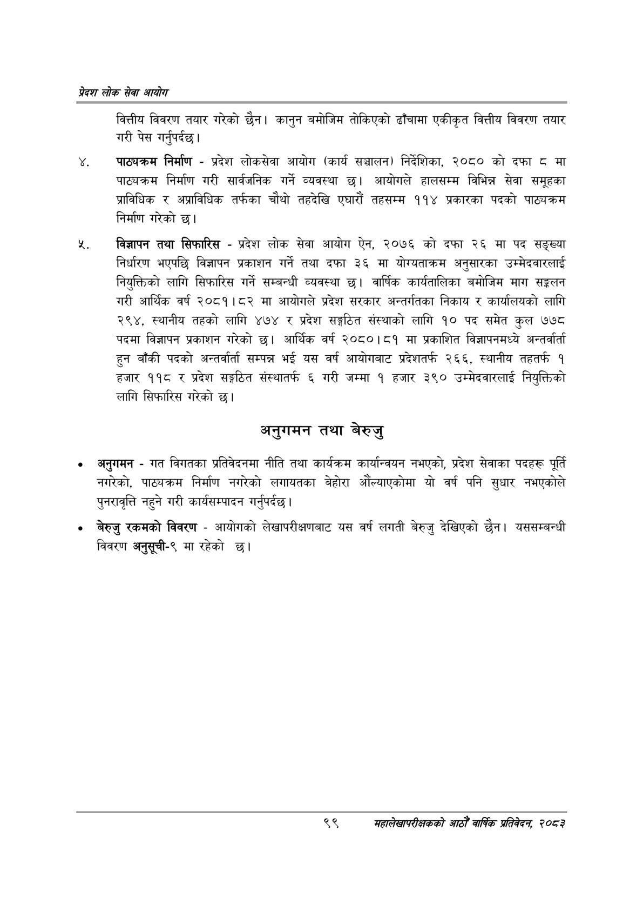

# Page 121 QA

## Rendered page


## Extracted text

```text
प्रेदश लोक सेवा आयोग
वित्तीय विवरण तयार गरेको छैन। कानुन बमोजिम तोकिएको ढाँचामा एकीकृत वित्तीय विवरण तयार गरी पेस गर्नुपर्दछ |
पाठ्यक्रम निर्माण -प्रदेश लोकसेवा आयोग (कार्य सञ्चालन) निर्देशिका, २०८० को दफा ८ मा पाठ्यक्रम निर्माण गरी सार्वजनिक गर्ने व्यवस्था छ। आयोगले हालसम्म विभिन्न सेवा समूहका प्राविधिक र अप्राविधिक तर्फका चौथो तहदेखि एघारौं तहसम्म ११४ प्रकारका पदको पाठ्यक्रम निर्माण गरेको छ।
विज्ञापन तथा सिफारिस -प्रदेश लोक सेवा आयोग ऐन, २०७६ को दफा २६ मा पद सङ्ख्या निर्धारण भएपछि विज्ञापन प्रकाशन गर्ने तथा दफा ३६ मा योग्यताक्रम अनुसारका उम्मेदवारलाई नियुक्तिको लागि सिफारिस गर्ने सम्बन्धी व्यवस्था छ। वार्षिक कार्यतालिका बमोजिम माग सङ्कलन गरी आर्थिक वर्ष २०८१।८२ मा आयोगले प्रदेश सरकार अन्तर्गतका निकाय र कार्यालयको लागि २९४, स्थानीय तहको लागि ४७४ र प्रदेश सङ्गठित संस्थाको लागि १० पद समेत कुल ७७८ पदमा विज्ञापन प्रकाशन गरेको छ। आर्थिक वर्ष २०८०।८१ मा प्रकाशित विज्ञापनमध्ये अन्तर्वार्ता हुन बाँकी पदको अन्तर्वार्ता सम्पन्न भई यस वर्ष आयोगबाट प्रदेशतर्फ २६६, स्थानीय तहतर्फ १ हजार ११८ र प्रदेश सङ्गठित संस्थातर्फ ६ गरी जम्मा १ हजार ३९० उम्मेदवारलाई नियुक्तिको लागि सिफारिस गरेको छ।
अनुगमन तथा बेरुजु
अनुगमन -गत विगतका प्रतिवेदनमा नीति तथा कार्यक्रम कार्यान्वयन नभएको, प्रदेश सेवाका पदहरू पूर्ति नगरेको, पाठ्यक्रम निर्माण नगरेको लगायतका बेहोरा औंल्याएकोमा यो वर्ष पनि सुधार नभएकोले पुनरावृत्ति नहुने गरी कार्यसम्पादन गर्नुपर्दछ |
० बेरुजु रकमको विवरण -आयोगको लेखापरीक्षणबाट यस वर्ष लगती बेरुजु देखिएको छैन। यससम्बन्धी विवरण अनुसूची-९ मा रहेको छ।
९९
महालेखापरीक्षकको आठौ वाषिकि प्रतिवेदन २०८२
```

## Flags
- None
