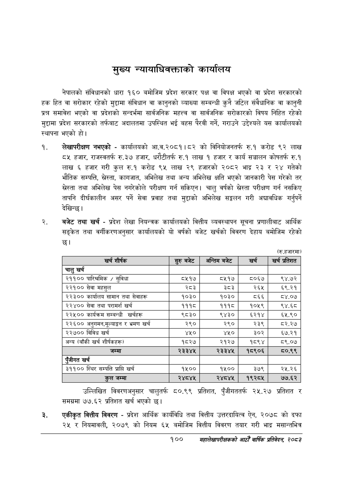

# Page 122 QA

## Rendered page


## Extracted text

```text
मुख्य न्यायाधिवक्ताको कार्यालय
नेपालको संविधानको धारा १६० बमोजिम प्रदेश सरकार पक्ष वा विपक्ष भएको वा प्रदेश सरकारको हक हित वा सरोकार रहेको मुद्दामा संविधान वा कानुनको व्याख्या सम्बन्धी कुनै जटिल संवैधानिक वा कानुनी प्रश्न समावेश भएको वा प्रदेशको सन्दर्भमा सार्वजनिक महत्त्व वा सार्वजनिक सरोकारको विषय निहित रहेको मुद्दामा प्रदेश सरकारको तर्फबाट अदालतमा उपस्थित भई बहस पैरवी गर्ने, गराउने उद्देश्यले यस कार्यालयको स्थापना भएको हो।
लेखापरीक्षण नभएको -कार्यालयको आ.व.२०८१।८२ को विनियोजनतर्फ रु.१ करोड ९२ लाख ८५ हजार, राजस्वतर्फ रु.३७ हजार, धरौटीतर्फ रु.१ लाख १ हजार र कार्य सञ्चालन कोषतर्फ रु.१ लाख ६ हजार गरी कुल रु.१ करोड ९५ लाख २९ हजारको २०८२ भाद्र २३ र २४ गतेको भौतिक सम्पत्ति, स्रेस्ता, कागजात, अभिलेख तथा अन्य अभिलेख क्षति भएको जानकारी पेस गरेको तर ख्रेस्ता तथा अभिलेख पेस नगरेकोले परीक्षण गर्न सकिएन। चालु वर्षको स्रेस्ता परीक्षण गर्न नसकिए तापनि दीर्घकालीन असर पर्ने सेवा प्रवाह तथा मुद्दाको अभिलेख सङ्कलन गरी अद्यावधिक गर्नुपर्ने देखिन्छ।
बजेट तथा खर्च -प्रदेश लेखा नियन्त्रक कार्यालयको वित्तीय व्यवस्थापन सूचना प्रणालीबाट आर्थिक सङ्केत तथा वर्गीकरणअनुसार कार्यालयको यो वर्षको बजेट खर्चको विवरण देहाय बमोजिम रहेको छ।
(रु.हजारमा)
उल्लिखित विवरणअनुसार चालुतर्फ ८०.९९ प्रतिशत, पुँजीगततर्फ २५.२७ प्रतिशत र समग्रमा ७७. ६२ प्रतिशत खर्च भएको छ।
एकीकृत वित्तीय विवरण -प्रदेश आर्थिक कार्यविधि तथा वित्तीय उत्तरदायित्व ऐन, २०७८ को दफा २५ र नियमावली, २०७९ को नियम ६५ बमोजिम वित्तीय विवरण तयार गरी भाद्र मसान्तभित्र
१००
महालेखापरीक्षकको आठौ वाषिकि प्रतिवेदन २०८२

| खर्च शीर्षक | सुरु बबेट | अन्तिम बजेट | खर्च | खर्च प्रतिशत |
| --- | --- | --- | --- | --- |
| चालु खर्च |  |  |  |  |
| २११०० पारिश्रमिक / सुविधा | ८५१७ | ८५१७ | ८०६७ | ९४.७२ |
| २२१०० सेवा महसुल | र्द३ | ३५३ | २६४५ | ६९.२१ |
| २३०० कार्ालष सामान तथा सेवाहरू | १०३० | १०३० | ८६६ | ८४.०७ |
| २२४०० सेवा तथा परामर्श खर्च | १११८ | १११८ | १०५९ | ९४.६८ |
| २२५०० कार्यक्रम सम्बन्धी खर्चहरू | ९८३० | ९४३० | ६२१४ | ६५.९० |
| २२६०० अनुभभन,मूल्वाङ्गा र भ्रमण खर्च | २९० | २९० | २३९ | ८२.२७ |
| २२७०० विविध खर्च | ४५० | ४५० | ३०२ | ६७.२१ |
| अन्य (बाँकी खर्च ₹)र्षकह) | १८२७ | २१२७ | १८९४ | ८९.०७ |
| जम्मा | २३३४४ | २३३४५ | १८९०६ | ८०.९९ |
| पूँजीगत खर्च |  |  |  |  |
| ३११०० स्थिर सम्पत्ति प्राप्ति खर्च | १५०० | १५०० | ३७९ | २५.२६ |
| कुल जम्मा | २४८४५ | २४८४५ | १९२८५ | ७७.६२ |
```

## Flags
- table_page
- medium_quality_table
