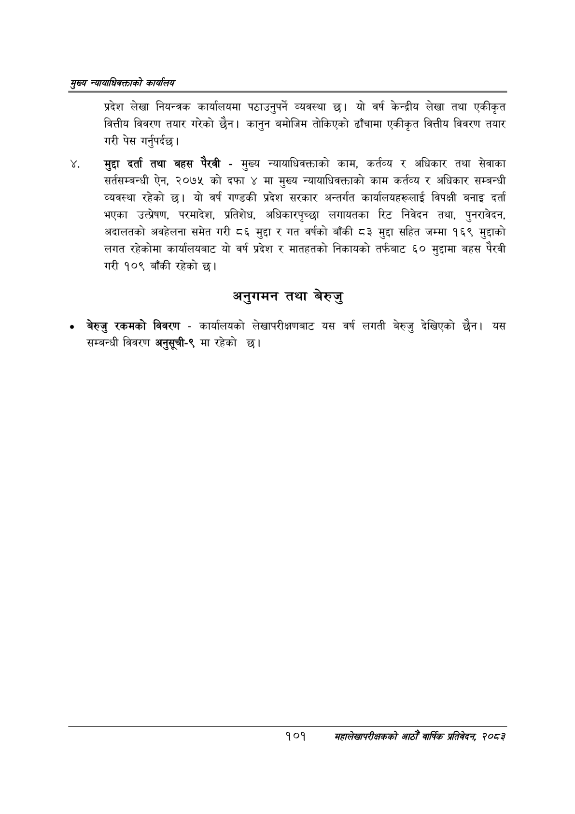

# Page 123 QA

## Rendered page


## Extracted text

```text
सृख्य न्यायाधिकक्ताको कायलिय
प्रदेश लेखा नियन्त्रक कार्यालयमा पठाउनुपर्ने व्यवस्था छ। यो वर्ष केन्द्रीय लेखा तथा एकीकृत वित्तीय विवरण तयार गरेको छैन। कानुन बमोजिम तोकिएको ढाँचामा एकीकृत वित्तीय विवरण तयार गरी पेस गर्नुपर्दछ।
मुद्दा दर्ता तथा बहस पैरवी -मुख्य न्यायाधिवक्ताको काम, कर्तव्य र अधिकार तथा सेवाका सर्तसम्बन्धी ऐन, २०७५ को दफा ४ मा मुख्य न्यायाधिवक्ताको काम कर्तव्य र अधिकार सम्बन्धी व्यवस्था रहेको छ। यो वर्ष गण्डकी प्रदेश सरकार अन्तर्गत कार्यालयहरूलाई विपक्षी बनाइ दर्ता भएका उत्प्रेषण, परमादेश, प्रतिशेध, अधिकारपृूच्छा लगायतका रिट निवेदन तथा, पुनरावेदन, अदालतको अवहेलना समेत गरी ८६ मुद्दा र गत वर्षको बाँकी ८३ मुद्दा सहित जम्मा १६९ मुद्दाको लगत रहेकोमा कार्यालयबाट यो वर्ष प्रदेश र मातहतको निकायको तर्फबाट ६० मुद्दामा बहस पैरवी गरी १०९ बाँकी रहेको छ।
अनुगमन तथा बेरुजु
० बेरुजु रकमको विवरण -कार्यालयको लेखापरीक्षणबाट यस वर्ष लगती बेरुजु देखिएको छैन। यस सम्बन्धी विवरण अनुसूची-९ मा रहेको छ।
१०१
महालेखापरीक्षकको आठौ वाषिकि प्रतिवेदन २०८२
```

## Flags
- None
