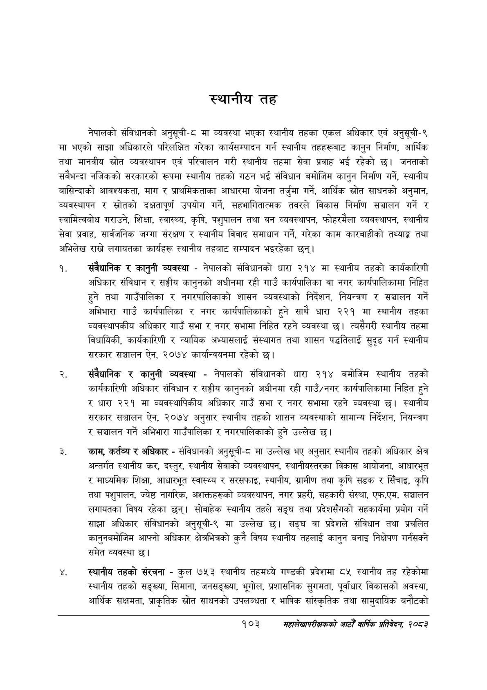

# Page 127 QA

## Rendered page


## Extracted text

```text
स्थानीय तह
नेपालको संविधानको अनुसूची-८ मा व्यवस्था भएका स्थानीय तहका एकल अधिकार एवं अनुसूची-९ मा भएको साझा अधिकारले परिलक्षित गरेका कार्यसम्पादन गर्न स्थानीय तहहरूबाट कानुन निर्माण, आर्थिक तथा मानवीय स्रोत व्यवस्थापन एवं परिचालन गरी स्थानीय तहमा सेवा प्रवाह भई रहेको छ। जनताको सबैभन्दा नजिकको सरकारको रूपमा स्थानीय तहको गठन भई संविधान बमोजिम कानुन निर्माण गर्ने, स्थानीय बासिन्दाको आवश्यकता, माग र प्राथमिकताका आधारमा योजना तर्जुमा गर्ने, आर्थिक स्रोत साधनको अनुमान, व्यवस्थापन र स्रोतको दक्षतापूर्ण उपयोग गर्ने, सहभागितात्मक तवरले विकास निर्माण सञ्चालन गर्ने र स्वामित्वबोध गराउने, शिक्षा, स्वास्थ्य, कृषि, पशुपालन तथा वन व्यवस्थापन, फोहरमैला व्यवस्थापन, स्थानीय सेवा प्रवाह, सार्वजनिक जग्गा संरक्षण र स्थानीय विवाद समाधान गर्ने, गरेका काम कारबाहीको तथ्याङ्क तथा अभिलेख राख्ने लगायतका कार्यहरू स्थानीय तहबाट सम्पादन भइरहेका छन्‌।
संवैधानिक र कानुनी व्यवस्था -नेपालको संविधानको धारा २१४ मा स्थानीय तहको कार्यकारिणी अधिकार संविधान र सङ्घीय कानुनको अधीनमा रही गाउँ कार्यपालिका वा नगर कार्यपालिकामा निहित हुने तथा गाउँपालिका र नगरपालिकाको शासन व्यवस्थाको निर्देशन, नियन्त्रण र सञ्चालन गर्ने अभिभारा गाउँ कार्यपालिका र नगर कार्यपालिकाको हुने साथै धारा २२१ मा स्थानीय तहका व्यवस्थापकीय अधिकार गाउँ सभा र नगर सभामा निहित रहने व्यवस्था छ। त्यसैगरी स्थानीय तहमा विधायिकी, कार्यकारिणी र न्यायिक अभ्यासलाई संस्थागत तथा शासन पद्धतिलाई सुदृढ गर्न स्थानीय सरकार सञ्चालन ऐन, २०७४ कार्यान्वयनमा रहेको |
संवैधानिक र कानुनी व्यवस्था -नेपालको संविधानको धारा २१४ बमोजिम स्थानीय तहको कार्यकारिणी अधिकार संविधान र सङ्घीय कानुनको अधीनमा रही गाउँ/नगर कार्यपालिकामा निहित हुने र धारा २२१ मा व्यवस्थापिकीय अधिकार गाउँ सभा र नगर सभामा रहने व्यवस्था छ। स्थानीय सरकार सञ्चालन ऐन, २०७४ अनुसार स्थानीय तहको शासन व्यवस्थाको सामान्य निर्देशन, नियन्त्रण र सञ्चालन गर्ने अभिभारा गाउँपालिका र नगरपालिकाको हुने उल्लेख छ।
काम, कर्तव्य र अधिकार -संविधानको अनुसूची-८ मा उल्लेख भए अनुसार स्थानीय तहको अधिकार क्षेत्र अन्तर्गत स्थानीय कर, दस्तुर, स्थानीय सेवाको व्यवस्थापन, स्थानीयस्तरका विकास आयोजना, आधारभूत र माध्यमिक शिक्षा, आधारभूत स्वास्थ्य र सरसफाइ, स्थानीय, ग्रामीण तथा कृषि सडक र सिँचाइ, कृषि तथा पशुपालन, ज्येष्ठ नागरिक, अशक्तहरूको व्यवस्थापन, नगर प्रहरी, सहकारी संस्था, एफ.एम. सञ्चालन लगायतका विषय रहेका छन्‌। सोबाहेक स्थानीय तहले सङ्घ तथा प्रदेशसँगको सहकार्यमा प्रयोग गर्ने साझा अधिकार संविधानको अनुसूची-९ मा उल्लेख छ। सङ्घ वा प्रदेशले संविधान तथा प्रचलित कानुनबमोजिम आफ्नो अधिकार क्षेत्रभित्रको कुनै विषय स्थानीय तहलाई कानुन बनाइ निक्षेपण गर्नसक्ने समेत व्यवस्था |
स्थानीय तहको संरचना -कुल ७५३ स्थानीय तहमध्ये गण्डकी प्रदेशमा ८५ स्थानीय तह रहेकोमा स्थानीय तहको सङ्ख्या, सिमाना, जनसङ्ख्या, भूगोल, प्रशासनिक सुगमता, पूर्वाधार विकासको अवस्था, आर्थिक सक्षमता, प्राकृतिक स्रोत साधनको उपलब्धता र भाषिक सांस्कृतिक तथा सामुदायिक बनौटको
१०३
महालेखापरीक्षकको आठौ वाषिकि प्रतिवेदन २०८२
```

## Flags
- None
