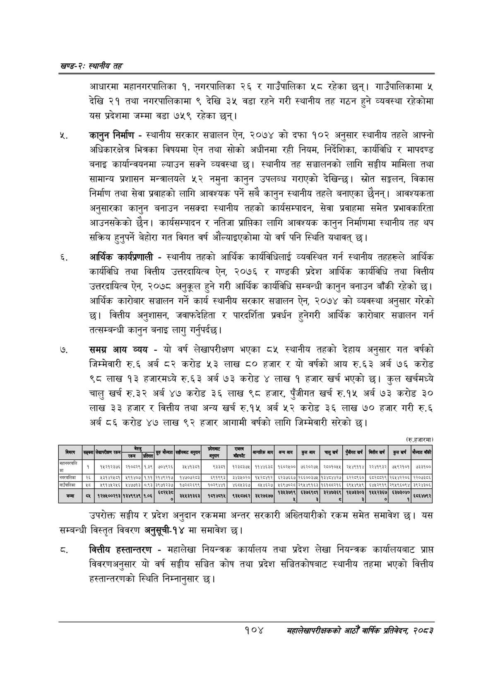

# Page 128 QA

## Rendered page


## Extracted text

```text
खण्ड-२स्थानीय तह
आधारमा महानगरपालिका १, नगरपालिका २६ र गाउँपालिका ५८ रहेका छन्‌। गाउँपालिकामा ५ देखि २१ तथा नगरपालिकामा ९ देखि ३५ वडा रहने गरी स्थानीय तह गठन हुने व्यवस्था रहेकोमा यस प्रदेशमा जम्मा वडा ७५९ रहेका छन्‌।
कानुन निर्माण -स्थानीय सरकार सञ्चालन ऐन, २०७४ को दफा १०२ अनुसार स्थानीय तहले आफ्नो अधिकारक्षेत्र भित्रका विषयमा ऐन तथा सोको अधीनमा रही नियम, निर्देशिका, कार्यविधि र मापदण्ड बनाइ कार्यान्वयनमा ल्याउन सक्ने व्यवस्था | स्थानीय तह सञ्चालनको लागि सङ्घीय मामिला तथा सामान्य प्रशासन मन्त्रालयले ५२ नमुना कानुन उपलब्ध गराएको देखिन्छ। स्रोत सङ्कलन, विकास निर्माण तथा सेवा प्रवाहको लागि आवश्यक पर्ने सबै कानुन स्थानीय तहले बनाएका छैनन्‌। आवश्यकता अनुसारका कानुन बनाउन नसक्दा स्थानीय तहको कार्यसम्पादन, सेवा प्रवाहमा समेत प्रभावकारिता आउनसकेको छैन। कार्यसम्पादन र नतिजा प्राप्तिका लागि आवश्यक कानुन निर्माणमा स्थानीय तह थप सक्रिय हुनुपर्ने बेहोरा गत विगत वर्ष औंल्याइएकोमा यो वर्ष पनि स्थिति यथावत्‌ छ।
आर्थिक कार्यप्रणाली -स्थानीय तहको आर्थिक कार्यविधिलाई व्यवस्थित गर्न स्थानीय तहहरूले आर्थिक कार्यविधि तथा वित्तीय उत्तरदायित्व ऐन, २०७६ र गण्डकी प्रदेश आर्थिक कार्यविधि तथा वित्तीय उत्तरदायित्व ऐन, २०७८ अनुकूल हुने गरी आर्थिक कार्यविधि सम्बन्धी कानुन बनाउन बाँकी रहेको छ। आर्थिक कारोबार सञ्चालन गर्ने कार्य स्थानीय सरकार सञ्चालन ऐन, २०७४ को व्यवस्था अनुसार गरेको छ। कित्तीय अनुशासन, जवाफदेहिता र पारदर्शिता प्रवर्धन हुनेगरी आर्थिक कारोबार सञ्चालन गर्न तत्सम्बन्धी कानुन बनाइ लागु गर्नुपर्दछ।
समग्र आय व्यय -यो वर्ष लेखापरीक्षण भएका ८५ स्थानीय तहको देहाय अनुसार गत वर्षको जिम्मेवारी रु.६ अर्ब ८२ करोड ५३ लाख ८० हजार र यो वर्षको आय रु.६३ अर्ब ७६ करोड ९८ लाख १३ हजारमध्ये रु.६३ अर्ब ७३ करोड लाख १ हजार खर्च भएको छ। कुल खर्चमध्ये चालु खर्च रु.३२ अर्ब ४७ करोड ३६ लाख ९८ हजार, पुँजीगत खर्च रु.१५ अर्ब ७३ करोड ३० लाख ३३ हजार र वित्तीय तथा अन्य खर्च रु.१५ अर्ब ५२ करोड ३६ लाख ७० हजार गरी रु.६ अर्ब ८६ करोड ४७ लाख ९२ हजार आगामी वर्षको लागि जिम्मेवारी सरेको छ।
उपरोक्त सङ्घीय र प्रदेश अनुदान रकममा अन्तर सरकारी अख्तियारीको रकम समेत समावेश छ। यस सम्बन्धी विस्तृत विवरण अनुसूची-१४ मा समावेश छ।
वित्तीय हस्तान्तरण -महालेखा नियन्त्रक कार्यालय तथा प्रदेश लेखा नियन्त्रक कार्यालयबाट प्राप्त विवरणअनुसार यो वर्ष सङ्घीय सञ्चित कोष तथा प्रदेश सञ्चितकोषबाट स्थानीय तहमा भएको वित्तीय हस्तान्तरणको स्थिति निम्नानुसार छ।
१०४
महालेखापरीक्षकको आठौ वाषिकि प्रतिवेदन २०८२

|  | ताङ्का | लेखापरीकग रकम | रकम | प्रतिशत | शुरु मैन्ात | सौकबाट बनुयन | पेशबाट बुदा | बाँडफाँट | अआानुरिक बाय | बन्य बाय | कु गाप | चारु खर्च | पुँजौपत खर्ष | मितीय खर्ष | कुल खर्ष | मोन्तत बाँकी |
| --- | --- | --- | --- | --- | --- | --- | --- | --- | --- | --- | --- | --- | --- | --- | --- | --- |
|  |  |  |  |  |  |  |  |  |  |  |  |  |  |  |  |  |
| नगरपालिका | २६ | १३१४२४८१ | ४९१४०४ | ९९९ | २१४९२१७ | १४७०७२८३ | ६९१६६३ | ३४३४०२० | १४२८४१२, | ६२३३६६७ | २६६००३७५ | १३४८४४२७ | ६२२८६६० | ६८२८०७१९ | २६४४२२०६ | २२०७३८६ |
|  |  |  |  |  |  |  |  |  |  |  |  |  |  |  |  |  |
| ब्रा | ६ | १२७४००२१३ | १३४१९४९ |  |  | ब३प३६३ | पना | १२४५७१२ | २१२७४७७ |  |  |  |  |  | ७१०४ | इएए४७९२ |
```

## Flags
- table_page
- low_quality_table
