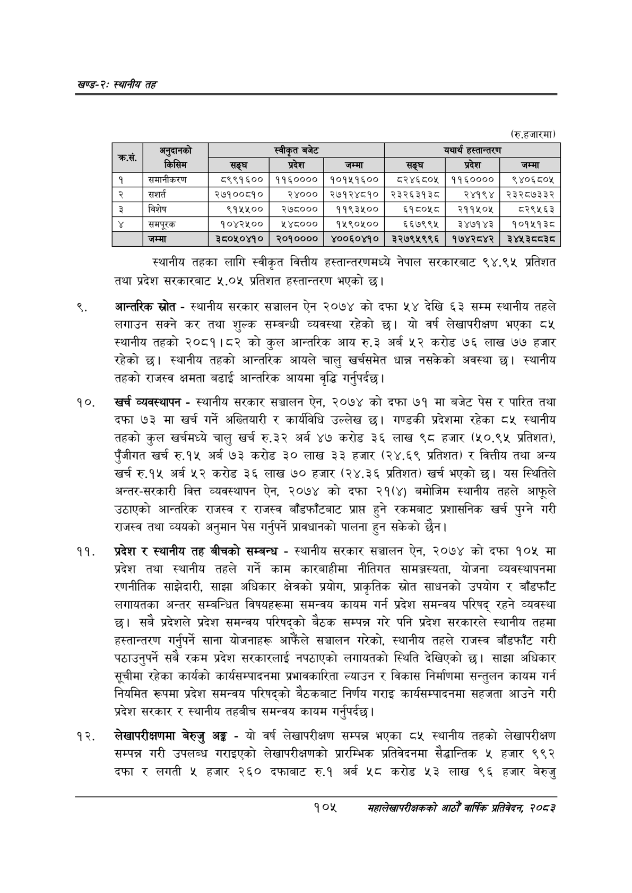

# Page 129 QA

## Rendered page


## Extracted text

```text
खण्ड-२स्थानीय तह
(रु.हजारमा)
स्थानीय तहका लागि स्वीकृत वित्तीय हस्तान्तरणमध्ये नेपाल सरकारबाट ९४.९५ प्रतिशत तथा प्रदेश सरकारबाट ५.०५४ प्रतिशत हस्तान्तरण भएको छ।
आन्तरिक स्रोत -स्थानीय सरकार सञ्चालन ऐन २०७४ को दफा ५४ देखि ६३ सम्म स्थानीय तहले लगाउन सक्ने कर तथा शुल्क सम्बन्धी व्यवस्था रहेको छ। यो वर्ष लेखापरीक्षण भएका ८५ स्थानीय तहको २०८१।८२ को कुल आन्तरिक आय रु.३ अर्ब ५२ करोड ७६ लाख ७७ हजार रहेको | स्थानीय तहको आन्तरिक आयले चालु खर्चसमेत धान्न नसकेको अवस्था छ। स्थानीय तहको राजस्व क्षमता बढाई आन्तरिक आयमा वृद्धि गर्नुपर्दछ |
खर्च व्यवस्थापन -स्थानीय सरकार सञ्चालन ऐन, २०७४ को दफा ७१ मा बजेट पेस र पारित तथा दफा ७३ मा खर्च गर्ने अख्तियारी र कार्यविधि उल्लेख छ। गण्डकी प्रदेशमा रहेका ८५ स्थानीय तहको कुल खर्चमध्ये चालु खर्च रु.३२ अर्ब ४७ करोड ३२६ लाख ९८ हजार (५०.९५ प्रतिशत), पुँजीगत खर्च रु.१५ अर्ब ७३ करोड ३० लाख ३३ हजार (२४.६९ प्रतिशत) र वित्तीय तथा अन्य खर्च रु.१५ अर्ब ५२ करोड ३६ लाख ७० हजार (२४.३६ प्रतिशत) खर्च भएको छ। यस स्थितिले अन्तर-सरकारी वित्त व्यवस्थापन ऐन, २०७४ को दफा २१(४) बमोजिम स्थानीय तहले आफूले उठाएको आन्तरिक राजस्व र राजस्व बाँडफाँटबाट प्राप्त हुने रकमबाट प्रशासनिक खर्च पुग्ने गरी राजस्व तथा व्ययको अनुमान पेस गर्नुपर्ने प्रावधानको पालना हुन सकेको छैन।
प्रदेश र स्थानीय तह बीचको सम्बन्ध -स्थानीय सरकार सञ्चालन ऐन, २०७४ को दफा १०५ मा प्रदेश तथा स्थानीय तहले गर्ने काम कारबाहीमा नीतिगत सामञ्जस्यता, योजना व्यवस्थापनमा रणनीतिक साझेदारी, साझा अधिकार क्षेत्रको प्रयोग, प्राकृतिक स्रोत साधनको उपयोग र बाँडफाँट लगायतका अन्तर सम्बन्धित विषयहरूमा समन्वय कायम गर्न प्रदेश समन्वय परिषद्‌ रहने व्यवस्था छ। सबै प्रदेशले प्रदेश समन्वय परिषद्को बैठक सम्पन्न गरे पनि प्रदेश सरकारले स्थानीय तहमा हस्तान्तरण गर्नुपर्ने साना योजनाहरू आफैंले सञ्चालन गरेको, स्थानीय तहले राजस्व बाँडफाँट गरी पठाउनुपर्ने सबै रकम प्रदेश सरकारलाई नपठाएको लगायतको स्थिति देखिएको छ। साझा अधिकार सूचीमा रहेका कार्यको कार्यसम्पादनमा प्रभावकारिता ल्याउन र विकास निर्माणमा सन्तुलन कायम गर्न नियमित रूपमा प्रदेश समन्वय परिषद्को बैठकबाट निर्णय गराइ कार्यसम्पादनमा सहजता आउने गरी प्रदेश सरकार र स्थानीय तहबीच समन्वय कायम गर्नुपर्दछ।
लेखापरीक्षणमा बेरुजु अङ्ग -यो वर्ष लेखापरीक्षण सम्पन्न भएका ८५ स्थानीय तहको लेखापरीक्षण सम्पन्न गरी उपलब्ध गराइएको लेखापरीक्षणको प्रारम्भिक प्रतिवेदनमा सैद्धान्तिक ५ हजार ९९२ दफा र लगती ५ हजार २६० दफाबाट रु.१ अर्ब ५८ करोड ५३ लाख ९६ हजार बेरुजु
१०५
महालेखापरीक्षकको आठौ वाषिकि प्रतिवेदन २०८२

| कस, | 'मनुष्ानको |  | स्वीकृत बजेट |  |  | यथार्थ हस्तान्तरण |  |
| --- | --- | --- | --- | --- | --- | --- | --- |
|  | 'किसिम | सङ्घ | प्रदेश | जम्मा | सङ्घ | प्रदेश | जम्मा |
| १ | समानीकरण | ८९९१६०० | ११६०००० | १०१५१६०० | ८२४६८०५ | ११६०००० | ९४०६८०४५ |
| २ | सशर्त | २७१००८१० | २४००० | २७१२४८१० | २३२६३१३८ | २४१९४ | २३२८७३३२ |
| ३ | विशेष | ९१५५०० | २७८००० | ११९३५०० | ६१८०५८ | २११५०४५ | ८२९५६३ |
|  | 'समपूरक | १०४२५०० | ४२४८००० | १४५९०५०० | ६६७९९५ | ३४७१४३ | १०१५१३८ |
|  | जम्मा | ३८०५०४१० | २०१०००० | ४००६०४१० | ३२७९५९९६ | १७४२८४२ | ३४४१३८०३८ |
```

## Flags
- table_page
- medium_quality_table
