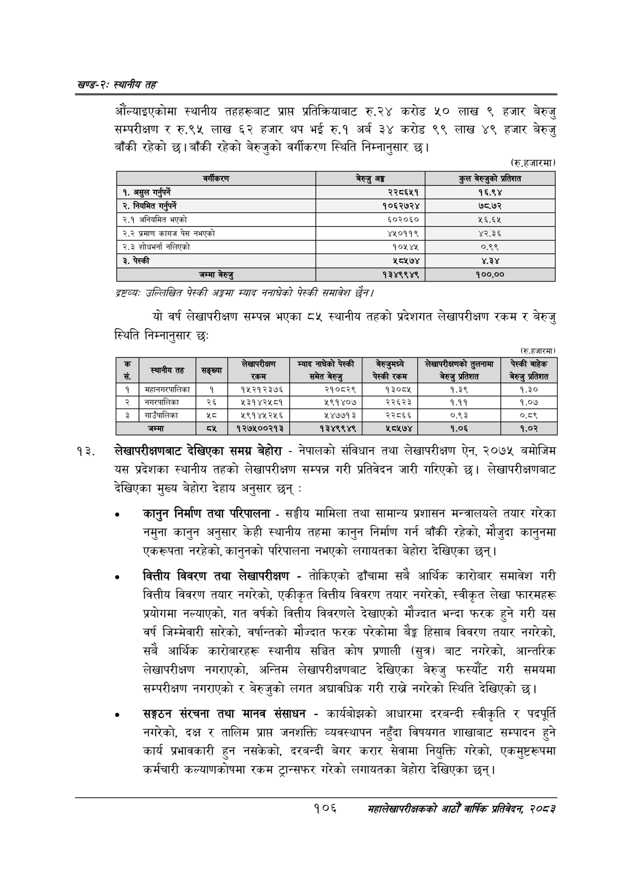

# Page 130 QA

## Rendered page


## Extracted text

```text
खण्ड-२स्थानीय तह
औंल्याइएकोमा स्थानीय तहहरूबाट प्राप्त प्रतिक्रियाबाट रु.२४ करोड ५० लाख ९ हजार बेरुजु सम्परीक्षण र रु.९५ लाख ६२ हजार थप भई रु.१ अर्ब ३४ करोड ९९ लाख ४९ हजार बेरुजु बाँकी रहेको | बाँकी रहेको बेरुजुको वर्गीकरण स्थिति निम्नानुसार छ।
(रु.हजारमा)
द्रष्टव्यः उल्लिखित पेटकी अङ्गमा स्याद ननाघेको पेस्की समावेश छैन।
यो वर्ष लेखापरीक्षण सम्पन्न भएका ८५ स्थानीय तहको प्रदेशगत लेखापरीक्षण रकम र बेरुजु स्थिति निम्नानुसार छः
(रु.हजारमा)
लेखापरीक्षणबाट देखिएका समग्र बेहोरा -नेपालको संविधान तथा लेखापरीक्षण ऐन, २०७५ बमोजिम यस प्रदेशका स्थानीय तहको लेखापरीक्षण सम्पन्न गरी प्रतिवेदन जारी गरिएको छ। लेखापरीक्षणबाट देखिएका मुख्य बेहोरा देहाय अनुसार छन्‌:
० कानुन निर्माण तथा परिपालना -सङ्घीय मामिला तथा सामान्य प्रशासन मन्त्रालयले तयार गरेका नमुना कानुन अनुसार केही स्थानीय तहमा कानुन निर्माण गर्न बाँकी रहेको, मौजुदा कानुनमा एकरूपता नरहेको, कानुनको परिपालना नभएको लगायतका बेहोरा देखिएका छन्‌।
० वित्तीय विवरण तथा लेखापरीक्षण -तोकिएको ढाँचामा सबै आर्थिक कारोबार समावेश गरी वित्तीय विवरण तयार नगरेको, एकीकृत वित्तीय विवरण तयार नगरेको, स्वीकृत लेखा फारमहरू प्रयोगमा नल्याएको, गत वर्षको वित्तीय विवरणले देखाएको मौज्दात भन्दा फरक हुने गरी यस वर्ष जिम्मेवारी सारेको, वर्षान्तको मौज्दात फरक परेकोमा ९३ हिसाब विवरण तयार नगरेको, सबै आर्थिक कारोबारहरू स्थानीय सञ्चित कोष प्रणाली (सुत्र) बाट नगरेको, आन्तरिक लेखापरीक्षण नगराएको, अन्तिम लेखापरीक्षणबाट देखिएका बेरुजु फस्यौट गरी समयमा सम्परीक्षण नगराएको र बेरुजुको लगत अद्यावधिक गरी राख्ने नगरेको स्थिति देखिएको छ।
० सङ्गठन संरचना तथा मानव संसाधन -कार्यबोझको आधारमा दरबन्दी स्वीकृति र पदपूर्ति नगरेको, दक्ष र तालिम प्राप्त जनशक्ति व्यवस्थापन नहुँदा विषयगत शाखाबाट सम्पादन हुने कार्य प्रभावकारी हुन नसकेको, दरबन्दी बेगर करार सेवामा नियुक्ति गरेको, एकमुष्टरूपमा कर्मचारी कल्याणकोषमा रकम ट्रान्सफर गरेको लगायतका बेहोरा देखिएका छन्‌।
१०६
महालेखापरीक्षकको आठौ वाषिकि प्रतिवेदन २०८२

| वर्गीकरण | बेरुजु अङ्ग | कुल बेरुजुको प्रतिशत |
| --- | --- | --- |
| १. असुल गर्नुपर्ने | २२८६५१ | १६.९४ |
| २. नियमित गरपर्ने | १०६२७२४ | ७८.७२ |
| २.१ अनियमित भएको | ६५०२०६० | ५६.६५ |
| २.२ प्रमाण कागज पेस नभएको | ४५०११९ | ४२.३६ |
| २.३ शोधभर्ना नलिएको | १०५४५ | ०.९९ |
| ३. पेस्की | ५८५७४ | ४३४ |
| जम्मा बेरुजु | १३४९९४९ | १००.०० |

| छ सं. | \| दलाल | सङ्घ्या | सखापरकाण 'रकम | म्याद नाघेको पेस्की समेत बेरुजु | बर्जुनन्ण चेस्की रकम | लेखापरीलनको तुलनामा बेरुजु प्रतिशत | पेस्की बाहेक बेरुजु प्रतिशत |
| --- | --- | --- | --- | --- | --- | --- | --- |
| १ | महानगरपालिका | १ | १५२१२३७६ | २१०८२९ | १३०८४५ | १.३९ | १.३० |
| २ | नमभरपालिका | २६ | ५३१४२४५८१ | १९१४०७ | २२६२३ | १.११ | १.०७ |
| ३ | नाउँपालिका | शर्ट | ५९१४५२५६ | ५४७७१३ | २२८६६ | ०.९३ | ०.८९ |
| ४ | जम्मा | ८५ | १२७५००२१३ | १३४९९४९ | ५८५७४ | १.०६ | १.०२ |
```

## Flags
- table_page
- medium_quality_table
