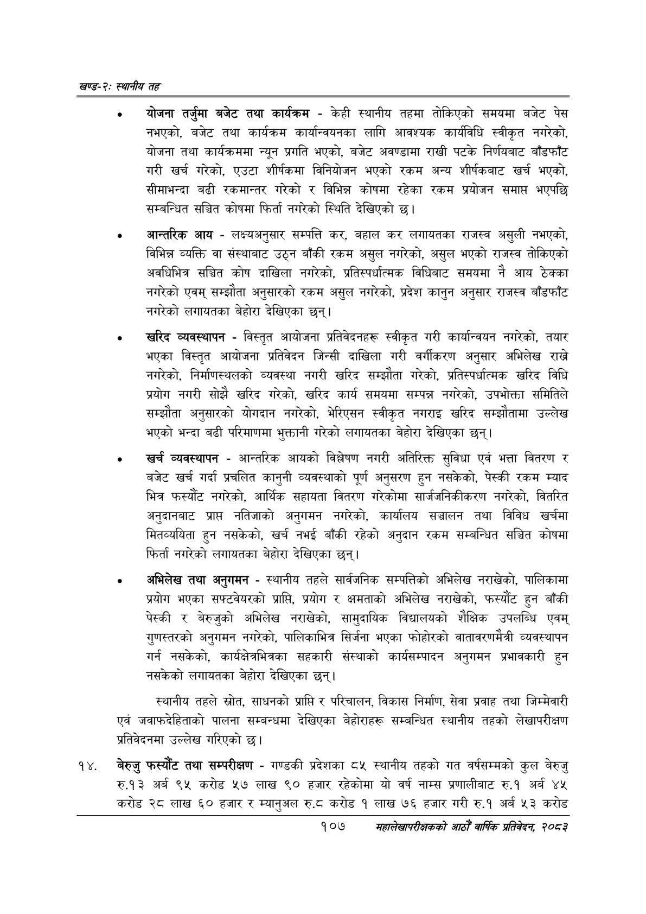

# Page 131 QA

## Rendered page


## Extracted text

```text
खण्ड-२स्थानीय तह
योजना तर्जुमा बजेट तथा कार्यक्रम -केही स्थानीय तहमा तोकिएको समयमा बजेट पेस नभएको, बजेट तथा कार्यक्रम कार्यान्वयनका लागि आवश्यक कार्यविधि स्वीकृत नगरेको, योजना तथा कार्यक्रममा न्यून प्रगति भएको, बजेट अवण्डामा राखी पटके निर्णयबाट बाँडफाँट गरी खर्च गरेको, एउटा शीर्षकमा विनियोजन भएको रकम अन्य शीर्षकबाट खर्च भएको, सीमाभन्दा बढी रकमान्तर गरेको र विभिन्न कोषमा रहेका रकम प्रयोजन समाप्त भएपछि सम्बन्धित सञ्चित कोषमा फिर्ता नगरेको स्थिति देखिएको छ।
आन्तरिक आय -लक्ष्यअनुसार सम्पत्ति कर, बहाल कर लगायतका राजस्व असुली नभएको, विभिन्न व्यक्ति वा संस्थाबाट उठ्न बाँकी रकम असुल नगरेको, असुल भएको राजस्व तोकिएको अवधिभित्र सञ्चित कोष दाखिला नगरेको, प्रतिस्पर्धात्मक विधिबाट समयमा नै आय ठेक्का नगरेको एवम्‌ सम्झौता अनुसारको रकम असुल नगरेको, प्रदेश कानुन अनुसार राजस्व बाँडफाँट नगरेको लगायतका बेहोरा देखिएका छन्‌।
खरिद व्यवस्थापन -विस्तृत आयोजना प्रतिवेदनहरू स्वीकृत गरी कार्यान्वयन नगरेको, तयार भएका विस्तृत आयोजना प्रतिवेदन जिन्सी दाखिला गरी वर्गीकरण अनुसार अभिलेख राखे नगरेको, निर्माणस्थलको व्यवस्था नगरी खरिद सम्झौता गरेको, प्रतिस्पर्धात्मक खरिद विधि प्रयोग नगरी सोझै खरिद गरेको, खरिद कार्य समयमा सम्पन्न नगरेको, उपभोक्ता समितिले सम्झौता अनुसारको योगदान नगरेको, भेरिएसन स्वीकृत नगराइ खरिद सम्झौतामा उल्लेख भएको भन्दा बढी परिमाणमा भुक्तानी गरेको लगायतका बेहोरा देखिएका छन्‌।
खर्च व्यवस्थापन -आन्तरिक आयको विश्लेषण नगरी अतिरिक्त सुविधा एवं भत्ता वितरण र बजेट खर्च गर्दा प्रचलित कानुनी व्यवस्थाको पूर्ण अनुसरण हुन नसकेको, पेस्की रकम म्याद भित्र फस्यौट नगरेको, आर्थिक सहायता वितरण गरेकोमा सार्जजनिकीकरण नगरेको, वितरित अनुदानबाट प्राप्त नतिजाको अनुगमन नगरेको, कार्यालय सञ्चालन तथा विविध खर्चमा मितव्ययिता हुन नसकेको, खर्च नभई बाँकी रहेको अनुदान रकम सम्बन्धित सञ्चित कोषमा फिर्ता नगरेको लगायतका बेहोरा देखिएका छन्‌।
अभिलेख तथा अनुगमन -स्थानीय तहले सार्वजनिक सम्पत्तिको अभिलेख नराखेको, पालिकामा प्रयोग भएका सफ्टवेयरको प्राप्ति, प्रयोग र क्षमताको अभिलेख नराखेको, फस्यौंट हुन बाँकी पेस्की र बेरुजुको अभिलेख नराखेको, सामुदायिक विद्यालयको शैक्षिक उपलब्धि एवम्‌ गुणस्तरको अनुगमन नगरेको, पालिकाभित्र सिर्जना भएका फोहोरको वातावरणमैत्री व्यवस्थापन गर्न नसकेको, कार्यक्षेत्रभित्रका सहकारी संस्थाको कार्यसम्पादन अनुगमन प्रभावकारी हुन नसकेको लगायतका बेहोरा देखिएका छन्‌।
स्थानीय तहले स्रोत, साधनको प्राप्ति र परिचालन, विकास निर्माण, सेवा प्रवाह तथा जिम्मेवारी एवं जवाफदेहिताको पालना सम्बन्धमा देखिएका बेहोराहरू सम्बन्धित स्थानीय तहको लेखापरीक्षण प्रतिवेदनमा उल्लेख गरिएको छ।
बेरुजु फस्यौट तथा सम्परीक्षण -गण्डकी प्रदेशका ८५ स्थानीय तहको गत वर्षसम्मको कुल बेरुजु रु.१३ अर्ब ९५ करोड ५२७ लाख ९० हजार रहेकोमा यो वर्ष नाम्स प्रणालीबाट रु.१ अर्ब ४४५ करोड २८ लाख ६० हजार र म्यानुअल.६ करोड १ लाख ७६ हजार गरी रु.१ अर्ब ५३ करोड
१०७
महालेखापरीक्षकको आठौ वाषिकि प्रतिवेदन २०८२
```

## Flags
- None
