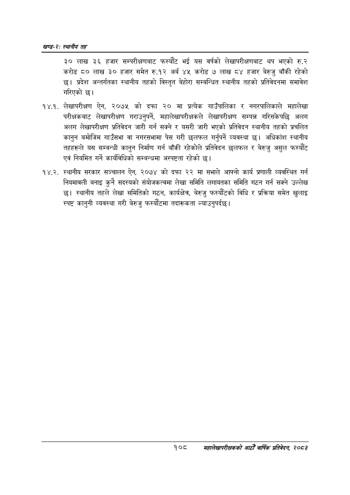

# Page 132 QA

## Rendered page


## Extracted text

```text
खण्ड-२स्थानीय तह
३० लाख ३६ हजार सम्परीक्षणबाट फस्यौट भई यस वर्षको लेखापरीक्षणबाट थप भएको रु.२ करोड ८० लाख ३० हजार समेत रु.१२ अर्ब ४५ करोड ७ लाख ८४ हजार बेरुजु बाँकी रहेको छ। प्रदेश अन्तर्गतका स्थानीय तहको विस्तृत बेहोरा सम्बन्धित स्थानीय तहको प्रतिवेदनमा समावेश गरिएको छ।
१४.१. लेखापरीक्षण ऐन, २०७५ को दफा २० मा प्रत्येक गाउँपालिका र नगरपालिकाले महालेखा परीक्षकबाट लेखापरीक्षण गराउनुपर्ने, महालेखापरीक्षकले लेखापरीक्षण सम्पन्न गरिसकेपछि अलग अलग लेखापरीक्षण प्रतिवेदन जारी गर्न सक्ने र यसरी जारी भएको प्रतिवेदन स्थानीय तहको प्रचलित कानुन बमोजिम गाउँसभा वा नगरसभामा पेस गरी छलफल गर्नुपर्ने व्यवस्था छ। अधिकांश स्थानीय तहहरूले यस सम्बन्धी कानुन निर्माण गर्न बाँकी रहेकोले प्रतिवेदन छलफल र बेरुजु असुल फस्यौंट एवं नियमित गर्ने कार्यविधिको सम्बन्धमा अस्पष्टता रहेको छ।
१४.२. स्थानीय सरकार सञ्चालन ऐन, २०७४ को दफा २२ मा सभाले आफ्नो कार्य प्रणाली व्यवस्थित गर्न नियमावली बनाइ कुनै सदस्यको संयोजकत्वमा लेखा समिति लगायतका समिति गठन गर्न सक्ने उल्लेख छ। स्थानीय तहले लेखा समितिको गठन, कार्यक्षेत्र, बेरुजु फस्यौटको विधि र प्रक्रिया समेत खुलाइ स्पष्ट कानुनी व्यवस्था गरी बेरुजु फस्यौटमा तदारूकता ल्याउनुपर्दछु।
१०८
महालेखापरीक्षकको आठौ वाषिकि प्रतिवेदन २०८२
```

## Flags
- None
