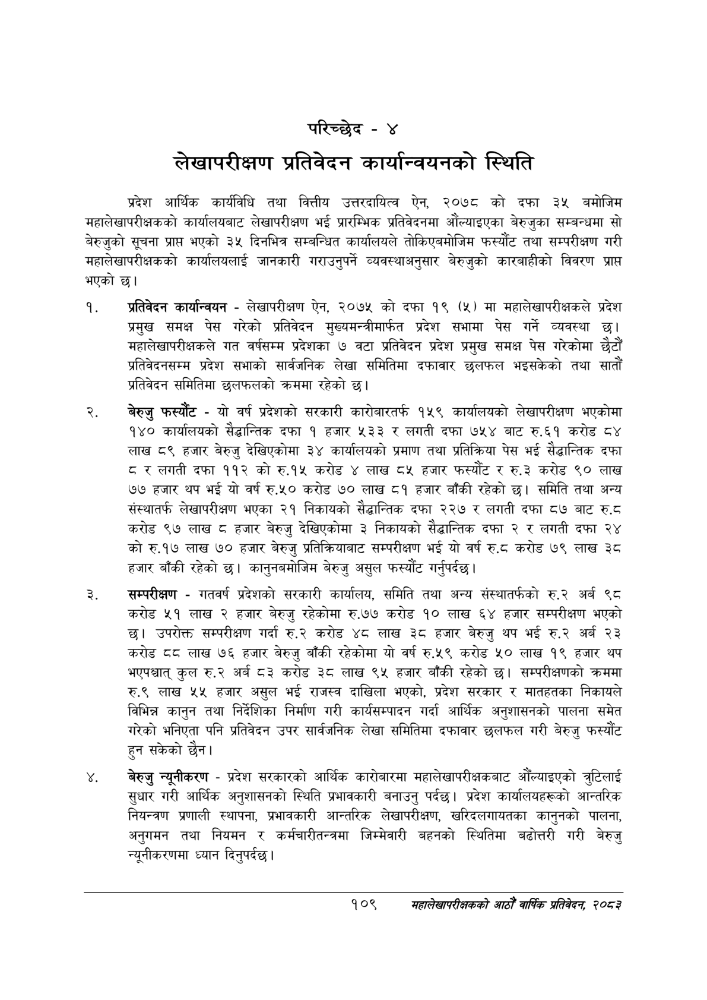

# Page 135 QA

## Rendered page


## Extracted text

```text
परिच्छेद -४
लेखापरीक्षण प्रतिवेदन कार्यान्वयनको स्थिति
प्रदेश आर्थिक कार्यविधि तथा वित्तीय उत्तरदायित्व ऐन, २०७८ को दफा ३५ बमोजिम महालेखापरीक्षकको कार्यालयबाट लेखापरीक्षण भई प्रारम्भिक प्रतिवेदनमा औंल्याइएका बेरुजुका सम्बन्धमा सो बेरुजुको सूचना प्रापत भएको ३५ दिनभित्र सम्बन्धित कार्यालयले तोकिएबमोजिम फस्यौट तथा सम्परीक्षण गरी महालेखापरीक्षकको कार्यालयलाई जानकारी गराउनुपर्ने व्यवस्थाअनुसार बेरुजुको कारबाहीको विवरण प्राप्त भएको छ।
प्रतिवेदन कार्यान्वयन -लेखापरीक्षण ऐन, २०७५ को दफा १९ (५) मा महालेखापरीक्षकले प्रदेश प्रमुख समक्ष पेस गरेको प्रतिवेदन मुख्यमन्त्रीमार्फत प्रदेश सभामा पेस गर्ने व्यवस्था छ। महालेखापरीक्षकले गत वर्षसम्म प्रदेशका ७ वटा प्रतिवेदन प्रदेश प्रमुख समक्ष पेस गरेकोमा छैटौं प्रतिवेदनसम्म प्रदेश सभाको सार्वजनिक लेखा समितिमा दफावार छलफल भइसकेको तथा सातौं प्रतिवेदन समितिमा छलफलको क्रममा रहेको छ।
बेरुजु फस्यौट -यो वर्ष प्रदेशको सरकारी कारोबारतर्फ १५९ कार्यालयको लेखापरीक्षण भएकोमा १४० कार्यालयको सैद्धान्तिक दफा १ हजार ५३३ लगती दफा ७५४ बाट रु.६१ करोड ८४ लाख ८९ हजार बेरुजु देखिएकोमा ३४ कार्यालयको प्रमाण तथा प्रतिक्रिया पेस भई सैद्धान्तिक दफा ८ र लगती दफा ११२ को रु.१५ करोड लाख ८५ हजार फस्यौट र रु.३ करोड ९० लाख ७७ हजार थप भई यो वर्ष रु.५० करोड ७० लाख ८१ हजार बाँकी रहेको छ। समिति तथा अन्य संस्थातर्फ लेखापरीक्षण भएका २१ निकायको सैद्धान्तिक दफा २२७ र लगती दफा ८७ बाट रु.८ करोड ९७ लाख ८ हजार बेरुजु देखिएकोमा ३ निकायको सैद्धान्तिक दफा २ र लगती दफा २४ को रु.१७ लाख ७० हजार बेरुजु प्रतिक्रियाबाट सम्परीक्षण भई यो वर्ष रु.ट करोड ७९ लाख ३८ हजार बाँकी रहेको छ। कानुनबमोजिम बेरुजु असुल फस्यौट गर्नुपर्दछ |
सम्परीक्षण -गतवर्ष प्रदेशको सरकारी कार्यालय, समिति तथा अन्य संस्थातर्फको रु.२ अर्ब ९८ करोड ५२१ लाख २ हजार बेरुजु रहेकोमा रु.७७ करोड १० लाख ६४ हजार सम्परीक्षण भएको छ। उपरोक्त सम्परीक्षण गर्दा रु.२ करोड ४८ लाख ३८ हजार बेरुजु थप भई रु.२ अर्ब २३ करोड दद लाख ७६ हजार बेरुजु बाँकी रहेकोमा यो वर्ष रु.५९ करोड ५० लाख १९ हजार थप भएपश्चात्‌ कुल रु.२ अर्ब ८३ करोड ३८ लाख ९५ हजार बाँकी रहेको छ। सम्परीक्षणको क्रममा रु.९ लाख ५५ हजार असुल भई राजस्व दाखिला भएको, प्रदेश सरकार र मातहतका निकायले विभिन्न कानुन तथा निर्देशिका निर्माण गरी कार्यसम्पादन गर्दा आर्थिक अनुशासनको पालना समेत गरेको भनिएता पनि प्रतिवेदन उपर सार्वजनिक लेखा समितिमा दफावार छलफल गरी बेरुजु फस्यौट हुन सकेको छैन।
बेरुजु न्यूनीकरण -प्रदेश सरकारको आर्थिक कारोबारमा महालेखापरीक्षकबाट औंँल्याइएको त्रुटिलाई सुधार गरी आर्थिक अनुशासनको स्थिति प्रभावकारी बनाउनु पर्दछ। प्रदेश कार्यालयहरूको आन्तरिक नियन्त्रण प्रणाली स्थापना, प्रभावकारी आन्तरिक लेखापरीक्षण, खरिदलगायतका कानुनको पालना, अनुगमन तथा नियमन र कर्मचारीतन्त्रमा जिम्मेवारी बहनको स्थितिमा बढोत्तरी गरी बेरुजु न्यूनीकरणमा ध्यान दिनुपर्दछ |
१०९
महालेखापरीक्षकको आठौ वाषिकि प्रतिवेदन २०८२
```

## Flags
- None
