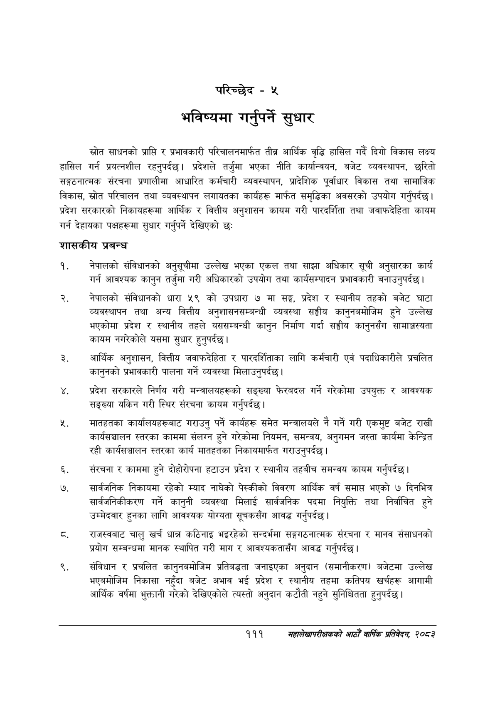

# Page 139 QA

## Rendered page


## Extracted text

```text
परिच्छेद -५
भविष्यमा गर्नुपर्ने सुधार
स्रोत साधनको प्राप्ति र प्रभावकारी परिचालनमार्फत तीब्र आर्थिक वृद्धि हासिल गर्दै दिगो विकास लक्ष्य हासिल गर्न प्रयत्नशील रहनुपर्दछ। प्रदेशले तर्जुमा भएका नीति कार्यान्वयन, बजेट व्यवस्थापन, छरितो सङ्गठनात्मक संरचना प्रणालीमा आधारित कर्मचारी व्यवस्थापन, प्रादेशिक पूर्वाधार विकास तथा सामाजिक विकास, स्रोत परिचालन तथा व्यवस्थापन लगायतका कार्यहरू मार्फत समृद्धिका अवसरको उपयोग गर्नुपर्दछ। प्रदेश सरकारको निकायहरूमा आर्थिक र वित्तीय अनुशासन कायम गरी पारदर्शिता तथा जवाफदेहिता कायम गर्न देहायका पक्षहरूमा सुधार गर्नुपर्ने देखिएको छः
शासकीय प्रबन्ध
नेपालको संविधानको अनुसूचीमा उल्लेख भएका एकल तथा साझा अधिकार सूची अनुसारका कार्य गर्न आवश्यक कानुन तर्जुमा गरी अधिकारको उपयोग तथा कार्यसम्पादन प्रभावकारी बनाउनुपर्दछ |
नेपालको संविधानको धारा ५९ को उपधारा ७ मा सङ्ग, प्रदेश र स्थानीय तहको बजेट घाटा व्यवस्थापन तथा अन्य वित्तीय अनुशासनसम्बन्धी व्यवस्था सङ्घीय कानुनबमोजिम हुने उल्लेख भएकोमा प्रदेश र स्थानीय तहले यससम्बन्धी कानुन निर्माण गर्दा सङ्घीय कानुनसँग सामाञ्जस्यता कायम नगरेकोले यसमा सुधार हुनुपर्दछ |
आर्थिक अनुशासन, वित्तीय जवाफदेहिता र पारदर्शिताका लागि कर्मचारी एवं पदाधिकारीले प्रचलित कानुनको प्रभावकारी पालना गर्ने व्यवस्था मिलाउनुपर्दछ।
प्रदेश सरकारले निर्णय गरी मन्त्रालयहरूको सङ्ख्या फेरबदल गर्ने गरेकोमा उपयुक्त र आवश्यक सङ्ख्या यकिन गरी स्थिर संरचना कायम गर्नुपर्दछ |
मातहतका कार्यालयहरूबाट गराउनु पर्ने कार्यहरू समेत मन्त्रालयले नै गर्ने गरी एकमुष्ट बजेट राखी कार्यसञ्चालन स्तरका काममा संलग्न हुने गरेकोमा नियमन, समन्वय, अनुगमन जस्ता कार्यमा केन्द्रित रही कार्यसञ्चालन स्तरका कार्य मातहतका निकायमार्फत गराउनुपर्दछ।
संरचना र काममा हुने दोहोरोपना हटाउन प्रदेश र स्थानीय तहबीच समन्वय कायम गर्नुपर्दछ |
सार्वजनिक निकायमा रहेको म्याद नाघेको पेस्कीको विवरण आर्थिक वर्ष समाप्त भएको ७ दिनभित्र सार्वजनिकीकरण गर्ने कानुनी व्यवस्था मिलाई सार्वजनिक पदमा नियुक्ति तथा निर्वाचित हुने उम्मेदवार हुनका लागि आवश्यक योग्यता सूचकसँग आवद्ध गर्नुपर्दछ |
राजस्वबाट चालु खर्च धान्न कठिनाइ भइरहेको सन्दर्भमा सङ्गगठनात्मक संरचना र मानव संसाधनको प्रयोग सम्बन्धमा मानक स्थापित गरी माग र आवश्यकतासँग आवद्ध गर्नुपर्दछ |
संविधान र प्रचलित कानुनबमोजिम प्रतिबद्धता जनाइएका अनुदान (समानीकरण) बजेटमा उल्लेख भएबमोजिम निकासा नहुँदा बजेट अभाव भई प्रदेश र स्थानीय तहमा कतिपय खर्चहरू आगामी आर्थिक वर्षमा भुक्तानी गरेको देखिएकोले त्यस्तो अनुदान कटौती नहुने सुनिश्चितता हुनुपर्दछ।
१११
महालेखापरीक्षकको आठौ वाषिकि प्रतिवेदन २०८२
```

## Flags
- None
