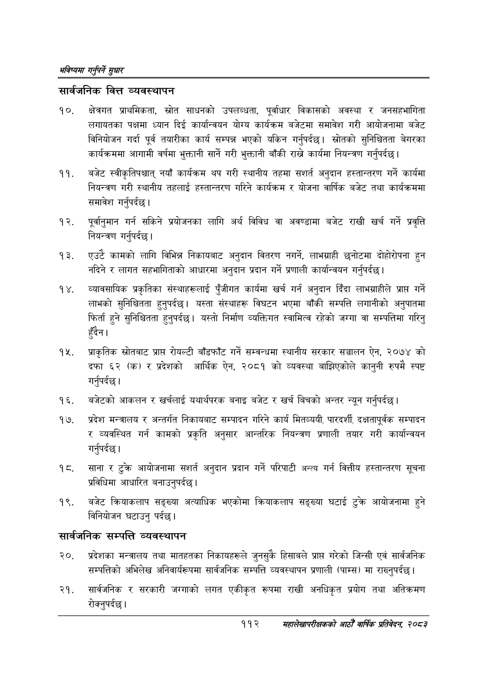

# Page 140 QA

## Rendered page


## Extracted text

```text
भविष्यमा गर्नुपर्ने सुक्षार
सार्वजनिक वित्त व्यवस्थापन
क्षेत्रगत प्राथमिकता, स्रोत साधनको उपलब्धता, पूर्वाधार विकासको अवस्था र जनसहभागिता लगायतका पक्षमा ध्यान दिई कार्यान्वयन योग्य कार्यक्रम बजेटमा समावेश गरी आयोजनामा बजेट विनियोजन गर्दा पूर्व तयारीका कार्य सम्पन्न भएको यकिन गर्नुपर्दछ। स्रोतको सुनिश्चितता बेगरका कार्यक्रममा आगामी वर्षमा भुक्तानी सार्ने गरी भुक्तानी बाँकी राख्ने कार्यमा नियन्त्रण गर्नुपर्दछ |
बजेट स्वीकृतिपश्चात्‌ नयाँ कार्यक्रम थप गरी स्थानीय तहमा सशर्त अनुदान हस्तान्तरण गर्ने कार्यमा नियन्त्रण गरी स्थानीय तहलाई हस्तान्तरण गरिने कार्यक्रम र योजना वार्षिक बजेट तथा कार्यक्रममा समावेश गर्नुपर्दछ |
पूर्वानुमान गर्न सकिने प्रयोजनका लागि अर्थ विविध वा अवण्डामा बजेट राखी खर्च गर्ने प्रवृत्ति नियन्त्रण गर्नुपर्दछ |
एउटै कामको लागि विभिन्न निकायबाट अनुदान वितरण नगर्ने, लाभग्राही छनोटमा दोहोरोपना हुन नदिने र लागत सहभागिताको आधारमा अनुदान प्रदान गर्ने प्रणाली कार्यान्वयन गर्नुपर्दछ |
व्यावसायिक प्रकृतिका संस्थाहरूलाई पुँजीगत कार्यमा खर्च गर्न अनुदान दिँदा लाभग्राहीले प्राप्त गर्ने लाभको सुनिश्चितता हुनुपर्दछ। यस्ता संस्थाहरू विघटन भएमा बाँकी सम्पत्ति लगानीको अनुपातमा फिर्ता हुने सुनिश्चितता हुनुपर्दछ। यस्तो निर्माण व्यक्तिगत स्वामित्व रहेको जग्गा वा सम्पत्तिमा गरिनु हुँदैन।
प्राकृतिक स्रोतबाट प्राप्त रोयल्टी बाँडफाँट गर्ने सम्वन्धमा स्थानीय सरकार सञ्चालन ऐन, २०७४ को दफा ६२ (क) र प्रदेशको आर्थिक ऐन, २०८१ को व्यवस्था बाझिएकोले कानुनी रुपमै स्पष्ट गर्नुपर्दछ |
बजेटको आकलन र खर्चलाई यथार्थपरक बनाइ बजेट र खर्च बिचको अन्तर न्यून गर्नुपर्दछ |
प्रदेश मन्त्रालय र अन्तर्गत निकायबाट सम्पादन गरिने कार्य मितव्ययी, पारदर्शी, दक्षतापूर्वक सम्पादन र व्यवस्थित गर्न कामको प्रकृति अनुसार आन्तरिक नियन्त्रण प्रणाली तयार गरी कार्यान्वयन गर्नुपर्दछ |
साना आयोजनामा संशर्त अनुदान प्रदान गर्ने परिपाटी अन्त्य गर्न वित्तीय हस्तान्तरण सूचना प्रविधिमा आधारित बनाउनुपर्दछ |
बजेट क्रियाकलाप सङ्ख्या अत्याधिक भएकोमा क्रियाकलाप सङ्ख्या घटाई टुक्रे आयोजनामा हुने विनियोजन घटाउनु पर्दछ।
सार्वजनिक सम्पत्ति व्यवस्थापन
प्रदेशका मन्त्रालय तथा मातहतका निकायहरूले जुनसुकै हिसावले प्राप्त गरेको जिन्सी एवं सार्वजनिक सम्पत्तिको अभिलेख अनिवार्यरुपमा सार्वजनिक सम्पत्ति व्यवस्थापन प्रणाली (पाम्स) मा राख्नुपर्दछ |
सार्वजनिक र सरकारी जग्गाको लगत एकीकृत रूपमा राखी अनधिकृत प्रयोग तथा अतिक्रमण रोक्नुपर्दछ।
११२ सहालेखापरीक्षकको आठौँ वाषिकि प्रतिवेदन २०८२
```

## Flags
- None
