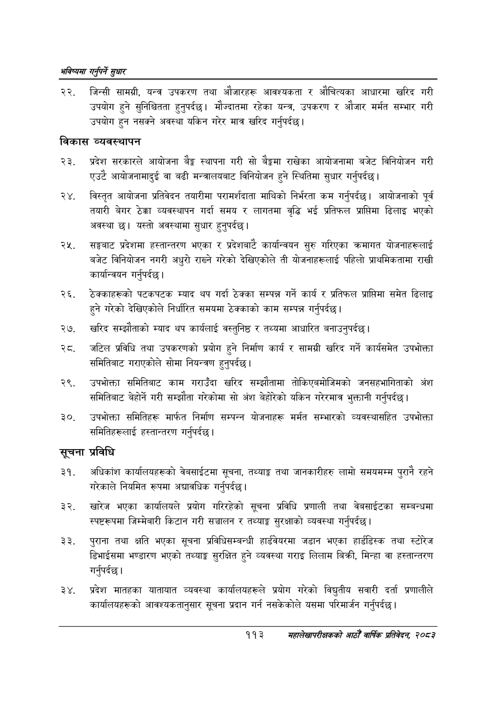

# Page 141 QA

## Rendered page


## Extracted text

```text
भविष्यमा गर्नुपर्ने सुक्षार
जिन्सी सामग्री, यन्त्र उपकरण तथा औजारहरू आवश्यकता र औचित्यका आधारमा खरिद गरी उपयोग हुने सुनिश्चितता हुन्‌पर्दछ। मौज्दातमा रहेका यन्त्र, उपकरण र औजार मर्मत सम्भार गरी उपयोग हुन नसक्ने अवस्था यकिन गरेर मात्र खरिद गर्नुपर्दछु।
विकास व्यवस्थापन
प्रदेश सरकारले आयोजना बेङ्ग स्थापना गरी सो बैङ्कमा राखेका आयोजनामा बजेट विनियोजन गरी एउटै आयोजनामादुई वा बढी मन्त्रालयबाट विनियोजन हुने स्थितिमा सुधार गर्नुपर्दछ।
२४, विस्तृत आयोजना प्रतिवेदन तयारीमा परामर्शदाता माथिको निर्भरता कम गर्नुपर्दछ। आयोजनाको पूर्व तयारी बेगर ठेक्का व्यवस्थापन गर्दा समय र लागतमा वृद्धि भई प्रतिफल प्राप्तिमा ढिलाइ भएको अवस्था | यस्तो अवस्थामा सुधार हुनुपर्दछ |
सङ्घबाट प्रदेशमा हस्तान्तरण भएका र प्रदेशबाट कार्यान्वयन सुरु गरिएका क्रमागत योजनाहरूलाई बजेट विनियोजन नगरी अधुरो राख्ने गरेको देखिएकोले ती योजनाहरूलाई पहिलो प्राथमिकतामा राखी कार्यान्वयन गर्नुपर्दछ |
रेक्काहरूको पटकपटक म्याद थप गर्दा ठेक्का सम्पन्न गर्ने कार्य र प्रतिफल प्राप्तिमा समेत ढिलाइ हुने गरेको देखिएकोले निर्धारित समयमा ठेक्काको काम सम्पन्न गर्नुपर्दछ |
खरिद सम्झौताको म्याद थप कार्यलाई वस्तुनिष्ठ र तथ्यमा आधारित बनाउनुपर्दछ |
२्ट. जटिल प्रविधि तथा उपकरणको प्रयोग हुने निर्माण कार्य र सामग्री खरिद गर्ने कार्यसमेत उपभोक्ता समितिबाट गराएकोले सोमा नियन्त्रण हुनुपर्दछ |
उपभोक्ता समितिबाट काम गराउँदा खरिद सम्झौतामा तोकिएबमोजिमको जनसहभागिताको अंश समितिबाट बेहोर्ने गरी सम्झौता गरेकोमा सो अंश बेहोरेको यकिन गरेरमात्र भुक्तानी गर्नुपर्दछ।
उपभोक्ता समितिहरू मार्फत निर्माण सम्पन्न योजनाहरू मर्मत सम्भारको व्यवस्थासहित उपभोक्ता समितिहरूलाई हस्तान्तरण गर्नुपर्दछ |
सूचना प्रविधि
अधिकांश कार्यालयहरूको वेबसाईटमा सूचना, तथ्याङ्क तथा जानकारीहरु लामो समयमम्म पुरानै रहने गरेकाले नियमित रूपमा अद्यावधिक गर्नुपर्दछ |
खारेज भएका कार्यालयले प्रयोग गरिरहेको सूचना प्रविधि प्रणाली तथा वेबसाईटका सम्बन्धमा स्पष्टरूपमा जिम्मेबारी किटान गरी सञ्चालन र तथ्याङ्क सुरक्षाको व्यवस्था गर्नुपर्दछ |
पुराना तथा क्षति भएका सूचना प्रविधिसम्बन्धी हार्डववेयरमा जडान भएका हार्डडिस्क तथा स्टोरेज डिभाईसमा भण्डारण भएको तथ्याङ्क सुरक्षित हुने व्यवस्था गराइ लिलाम बिक्री, मिन्हा वा हस्तान्तरण गर्नुपर्दछ |
प्रदेश मातहका यातायात व्यवस्था कार्यालयहरूले प्रयोग गरेको विद्युतीय सवारी दर्ता प्रणालीले कार्यालयहरूको आवश्यकतानुसार सूचना प्रदान गर्न नसकेकोले यसमा परिमार्जन गर्नुपर्दछ |
११३
सहालेखापरीक्षकको आठौँ वाषिकि प्रतिवेदन २०८२
```

## Flags
- None
