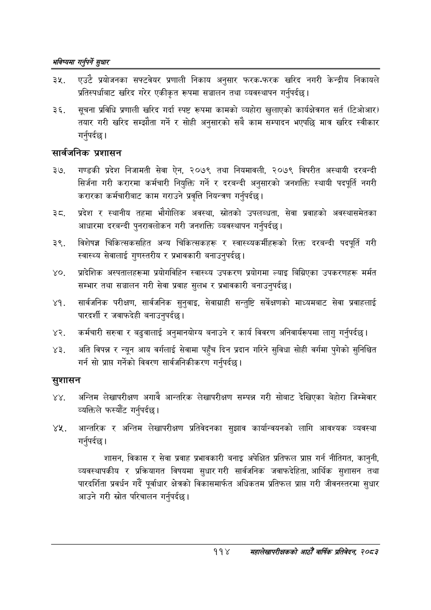

# Page 142 QA

## Rendered page


## Extracted text

```text
भविष्यमा गर्नुपर्ने सुक्षार
एउटै प्रयोजनका सफ्टवेयर प्रणाली निकाय अनुसार फरक-फरक खरिद नगरी केन्द्रीय निकायले प्रतिस्पर्धाबाट खरिद गरेर एकीकृत रूपमा सञ्चालन तथा व्यवस्थापन गर्नुपर्दछ |
सूचना प्रविधि प्रणाली खरिद गर्दा स्पष्ट रूपमा कामको व्यहोरा खुलाएको कार्यक्षेत्रगत सर्त (टिओआर) तयार गरी खरिद सम्झौता गर्ने र सोही अनुसारको सबै काम सम्पादन भएपछि मात्र खरिद स्वीकार गर्नुपर्दछ |
सार्वजनिक प्रशासन
३७, गण्डकी प्रदेश निजामती सेवा ऐन, २०७९ तथा नियमावली, २०७९ विपरीत अस्थायी दरबन्दी सिर्जना गरी करारमा कर्मचारी नियुक्ति गर्ने र दरबन्दी अनुसारको जनशक्ति स्थायी पदपूर्ति नगरी करारका कर्मचारीबाट काम गराउने प्रवृत्ति नियन्त्रण गर्नुपर्दछ |
प्रदेश र स्थानीय तहमा भौगोलिक अवस्था, स्रोतको उपलब्धता, सेवा प्रवाहको अवस्थासमेतका आधारमा दरबन्दी पुनरावलोकन गरी जनशक्ति व्यवस्थापन गर्नुपर्दछ |
विशेषज्ञ चिकित्सकसहित अन्य चिकित्सकहरू र स्वास्थ्यकर्मीहरूको रिक्त दरबन्दी पदपूर्ति गरी स्वास्थ्य सेवालाई गुणस्तरीय र प्रभावकारी बनाउनुपर्दछ |
प्रादेशिक अस्पतालहरूमा प्रयोगविहिन स्वास्थ्य उपकरण प्रयोगमा ल्याइ बिग्रिएका उपकरणहरू मर्मत सम्भार तथा सञ्चालन गरी सेवा प्रवाह सुलभ र प्रभावकारी बनाउनुपर्दछ |
सार्वजनिक परीक्षण, सार्वजनिक सुनुवाइ, सेवाग्राही सन्तुष्टि सर्वेक्षणको माध्यमबाट सेवा प्रवाहलाई पारदर्शी र जवाफदेही बनाउनुपर्दछ |
कर्मचारी सरुवा र बढुवालाई अनुमानयोग्य बनाउने र कार्य विवरण अनिवार्यरूपमा लागु गर्नुपर्दछ।
अति विपन्न र न्यून आय वर्गलाई सेवामा पहुँच दिन प्रदान गरिने सुविधा सोही वर्गमा पुगेको सुनिश्चित गर्न सो प्राप्त गर्नेको विवरण सार्वजनिकीकरण गर्नुपर्दछ |
सुशासन
अन्तिम लेखापरीक्षण अगावै आन्तरिक लेखापरीक्षण सम्पन्न गरी सोबाट देखिएका बेहोरा जिम्मेवार व्यक्तिले फस्यौट गर्नुपर्दछ |
आन्तरिक र अन्तिम लेखापरीक्षण प्रतिवेदनका सुझाव कार्यान्वयनको लागि आवश्यक व्यवस्था गर्नुपर्दछ |
शासन, विकास र सेवा प्रवाह प्रभावकारी बनाइ अपेक्षित प्रतिफल प्राप्त गर्न नीतिगत, कानुनी, व्यवस्थापकीय र प्रक्रियागत विषयमा सुधार गरी सार्वजनिक जवाफदेहिता, आर्थिक सुशासन तथा पारदर्शिता प्रवर्धन गर्दै पूर्वाधार क्षेत्रको विकासमार्फत अधिकतम प्रतिफल प्राप्त गरी जीवनस्तरमा सुधार आउने गरी स्रोत परिचालन गर्नुपर्दछ |
११४
सहालेखापरीक्षकको आठौँ वाषिकि प्रतिवेदन २०८२
```

## Flags
- None
