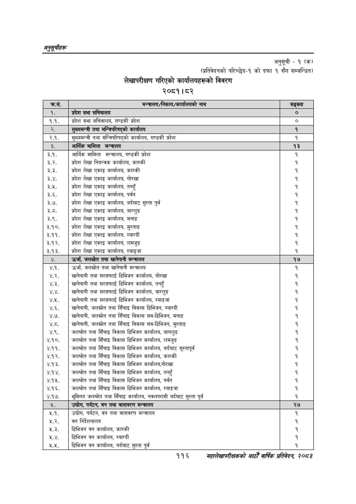

# Page 146 QA

## Rendered page


## Extracted text

```text
अनुतूचीहरू
अनुसूची -१ (क)
(प्रतिवेदनको परिच्छेद-१ को दफा १ सँग सम्बन्धित)
लेखापरीक्षण गरिएको कार्यालयहरूको विवरण
२०८१।८२
११६
सहालेखापरीक्षकको आठौँ वाषिकि प्रतिवेदन २०८२

| क्रस. | 'मन्त्रालय/निकाय/ कालको नाम | सङ्ख्या |
| --- | --- | --- |
| ९. | प्रदेश सभा | ० |
| १.१. | प्रदेश सभा सचिवाल५, गण्डकी प्रदेश | ० |
| २. | शुषख्यबन्त्रा तथा भन्निपरिजद्‌को कार्यालय | १ |
| २.१. | सुल्चभन्त्री तथा भन्त्रिपरिषद्को कार्यालय, गण्डकी प्रदेश | १ |
| डे. | आर्थिक मामिला मन्त्रालय | १३ |
| ३.१. ३.२. ३.३. ३.४. ३.५. ३.६. ३.७. ३.८. ३.९. ३.१०. ३.११. ३.१२. ३.१३. | आर्थिक मामिला मन्त्रालय, गण्डकी प्रदेश प्रदेश लेखा नियन्त्रक कार्यालय, कास्की प्रदेश लेखा एकाइ कार्यालय, कास्की प्रदेश लेखा एकाइ कार्यालय, गोरखा प्रदेश लेखा एकाइ कार्यालय, तनहुँ प्रदेश लेखा एकाइ कार्यालय, पर्वत प्रदेश लेखा एकाइ कार्यालय, वर्दघाट सुस्ता पुर्व प्रदेश लेखा एकाइ कार्यालय, बाग्लुङ प्रदेश लेखा एकाइ कार्यालय, मनाङ प्रदेश लेखा एकाइ कार्यालय, मुस्ताङ प्रदेश लेखा एकाइ कार्यालय, म्याग्दी प्रदेश लेखा एकाइ कार्यालय, लमजुङ प्रदेश लेखा एकाइ कार्यालय, स्याङ्जा | १ १ १ १ १ १ १ १ १ १ |
|  | उर्जा, जलस्रोत तथा खानेपानी मन्त्रालय | १७ |
| ४.१. ४.२. ४.३. ४.४. ४.५. ४.६. ४.७. थ्व. ४.९. ४.१०. ४.११. ४.१२. ४.१३. ४.१४. ४.१४५. ४.१६. ४.१७. | उर्जा, जलस्रोत तथा खानेपानी मन्त्रालय 'खानेपानी तथा सरसफाई डिभिजन कार्यालय, गोरखा खानेपानी तथा सरसफाई डिभिजन कार्यालय, तनहुँ 'खानेपानी तथा सरसफाई डिभिजन कार्यालय, बाग्लुङ्ग खानेपानी तथा सरसफाई डिभिजन कार्यालय, स्याङ्गजा 'खानेपानी, जलस्रोत तथा सिँचाइ विकास डिभिजन, म्याग्दी 'खानेपानी, जलस्रोत तथा सिँचाइ विकास सव-डिभिजन, मनाङ खानेपानी, जलस्रोत तथा सिँचाइ विकास सव-डिभिजन, मुस्ताङ जलश्रोत तथा सिँचाइ विकास डिभिजन कार्यालय, बागलुङ जलश्रोत तथा सिँचाइ विकास डिभिजन कार्यालय, लमजुङ जलश्रोत तथा सिँचाइ विकास डिभिजन कार्यालय, वर्दघाट सूस्तापूर्व जलश्रोत तथा सिँचाइ विकास डिभिजन कार्यालय, कास्की 'जलश्रोत तथा सिँचाइ विकास डिभिजन कार्यालय,गोरखा जलश्रोत तथा सिँचाइ विकास डिभिजन कार्यालय, तनहुँ 'जलश्रोत तथा सिँचाइ विकास डिभिजन कार्यालय, पर्वत जलश्रोत तथा सिँचाइ विकास डिभिजन कार्यालय, स्याङ्गजा भूमिगत जलश्रोत तथा सिँचाइ कार्यालय, १५०१५२।७ वर्दघाट सुस्ता पूर्व | १ १ १ १ १ १ १ १ १ १ १ १ १ |
| ५. | उद्योग, पर्यटन, वन तथा वातावरण मन्त्रालय | २७ |
| ५.१. ५.२. ५.३. २.४, ५.५, | उद्योग, पर्यटन, वन तथा वातावरण मन्त्रालय वन निर्देशनालय डिभिजन वन कार्यालय, कास्की डिभिजन वन कार्यालय, म्याग्दी डिभिजन वन कार्यालय, वर्दघाट सुस्ता पुर्व | १ १ १ १ |
```

## Flags
- table_page
- medium_quality_table
