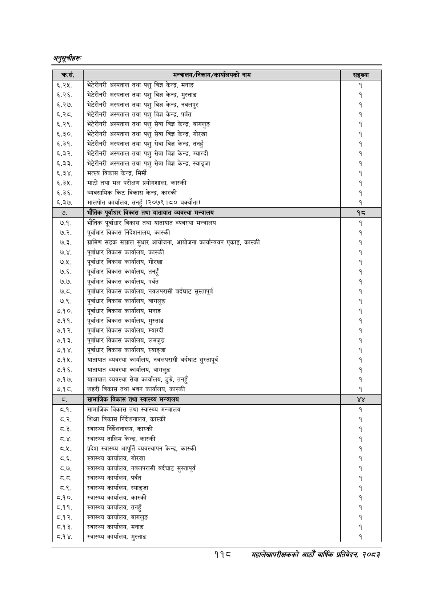

# Page 148 QA

## Rendered page


## Extracted text

```text
अनुतूचीहरू
११८
सहालेखापरीक्षकको आठौँ वाषिकि प्रतिवेदन २०८२

| क्रस. | 'मन्त्रालय/निकाय/ कालको नाम | सङ्ख्या |
| --- | --- | --- |
| ६.२५. ६.२६, ६.२७. ६.२८ ६.२९. ६.३०. ६.३१. ६.३२. ६.३३. ६.३४. ६.३५. ६.३६, ६.३७. | भेटेरीनरी अस्पताल तथा पशु विज्ञ केन्द्र, मनाङ भेटेरीनरी अस्पताल तथा पशु विज्ञ केन्द्र, मुस्ताङ भेटेरीनरी अस्पताल तथा पशु विज्ञ केन्द्र, नवलपुर भेटेरीनरी अस्पताल तथा पशु विज्ञ केन्द्र, पर्वत भेटेरीनरी अस्पताल तथा पशु सेवा विज्ञ केन्द्र, बागलुङ भेटेरीनरी अस्पताल तथा पशु सेवा विज्ञ केन्द्र, गोरखा भेटेरीनरी अस्पताल तथा पशु सेवा विज्ञ केन्द्र, तनहुँ भेटेरीनरी अस्पताल तथा पशु सेवा विज्ञ केन्द्र, म्याग्दी भेटेरीनरी अस्पताल तथा पशु सेवा विज्ञ केन्द्र, स्याङ्जा मत्स्य विकास केन्द्र, मिर्मी माटो तथा मल परीक्षण भ्रयोगशाला, कास्की न्ववसाथिक किट विकास केन्द्र, कास्की मालपोत कार्यालय, तनहुँ (२०७९।८० बक्यौता) | १ १ १ १ १ १ १ १ १ १ १ |
| ७. | भौतिक पूर्वाधार विकास तथा यातायात व्यवस्था मन्त्रालय | १८ |
| ७.१. ७.२. ७.३. ७.४. ७.५. ७.६. ७.७. ७.८. ७.९. ७.१०. ७.११. ७.१२. ७.१३. ७.१४. ७.१५. ७.१६. ७.१७. ७.१८. | भौतिक पूर्वाधार विकास तथा यातायात व्यवस्था मन्त्रालय पूर्वाधार विकास निर्देशनालय, कास्की ग्रामिण सडक सञ्जाल सुधार आयोजना, आयोजना %१४/-५४न एकाइ, कास्की पूर्वाधार विकास कार्यालय, कास्की पूर्वाधार विकास कार्यालय, गोरखा पूर्वाधार विकास कार्यालय, तनहुँ पूर्वाधार विकास कार्यालय, पर्वत पूर्वाधार विकास कार्यालय, नवलराध्ी बर्दघाट सुस्तापूर्व पूर्वाधार विकास कार्यालय, बागलुङ पूर्वाधार विकास कार्यालय, मनाङ पूर्वाधार विकास कार्यालय, मुस्ताङ पूर्वाधार विकास कार्यालय, म्याग्दी पूर्वाधार विकास कार्यालय, लमजुङ पूर्वाधार विकास कार्यालय, स्याङ्जा यातायात व्यवस्था कार्यालय, नषल५९।४ बर्दघाट सुस्तापूर्व यातायात व्यवस्था कार्यालय, बागलुङ यातायात व्यवस्था सेवा कार्यालय, डुमे, तनहुँ शहरी विकास तथा भवन कार्यालय, कास्की | १ १ १ १ १ १ १ १ १ १ १ १ १ १ १ १ १ |
| व. | सामाजिक विकास तथा स्वास्थ्य मन्त्रालय |  |
```

## Flags
- table_page
- medium_quality_table
