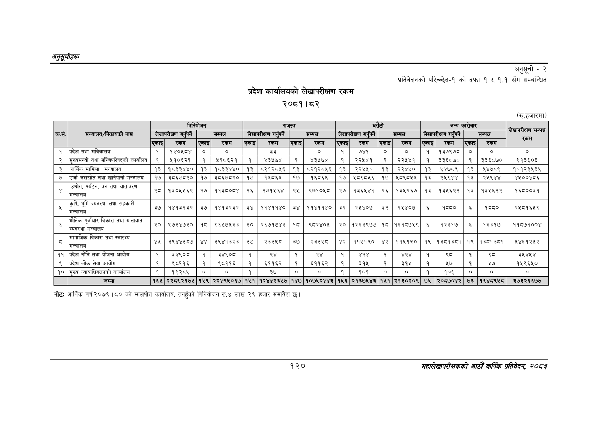

# Page 150 QA

## Rendered page


## Extracted text

```text
अनुतूचीहरू
प्रदेश कार्यालयको लेखापरीक्षण रकम २०८१। ८२
अनुसूची -२
प्रतिवेदनको परिच्छेद-१ को दफा १ र १.१ सँग सम्बन्धित
(रु.हजारमा)
नोटः आर्थिक वर्ष २०७९ |५० को मालपोत कार्यालय, तनहुँको विनियोजन रु.४ लाख २९ हजार समावेश छ।
१२०
सहालेखापरीक्षकको आठौँ वाषिकि प्रतिवेदन २०८२

|  |  |  | विनियोजन |  |  |  | राजस्व |  |  |  |  | धरटी |  |  | अन्य | कारोबार |  |  |
| --- | --- | --- | --- | --- | --- | --- | --- | --- | --- | --- | --- | --- | --- | --- | --- | --- | --- | --- |
| कस. | 'मन्त्रालय/निकायको नाम |  | लेखापरीक्षण गर पर्ने |  | सम्पन्न |  | लेखापरीक्षण गर पर्ने |  | सम्पन्न |  | लेखापरीक्षण गर पर्ने |  | सम्पन्न |  | लेखापरीक्षण गन पर्ने |  | सम्पन्न | सेखापरीक्षण सम्पन्न हा |
|  |  | एकाइ | रकम | एकाइ | रकम | एकाइ | रकम | एकाइ | रकम | एकाइ | रकम | एकाइ | रकम | एकाइ | रकम | एकाइ | रकम |  |
| १ | प्रदेश सभा सचिवालय | १ | १४०५८४ | ० | ० |  | ३३ |  | ० | १ | ७४१ | ० | ० | १ | १३७९७८ | ० | ० | ० |
| २ | मुख्यमन्त्री तथा मन्त्रिपरिषद्को कार्यालय | १ | ५१०६२१ | १ | १०६२१ | १ | ४३१७४ | १ | ४३७४ | १ |  | १ | २२४४१ | १ | इ३३६८७० | १ | ३३६८७० | ९१३६०६ |
| ३ | आर्थिक मामिला मन्त्रालय | १३ | १८३३४४० | १३ | १८३३४४० | १३ | ८२१२८५६ | १३ | ८२१२८४५६ | १३ | २२४५० | १३ | २२४५० | १३ | ४७८९ | १३ | ४७८९ | १०१२३५३५ |
| ७ | उर्जा जलस्रोत तथा खानेपानी मन्त्रालय | १७ | ३८६७८२० | १७ | ३८६७८२० | १७ | १६८६६ | १७ | १६८६६ | १७ | भ८९८५६ | १७ | १८९८५६ | १३ | २५९४४ | १३ | २१९४४ | ४५००४८६ |
| ४ | उद्योग, पर्यटन, वन तथा वातावरण मन्त्रालय | ३६ | १३०५५६२ | २७ | ११३८०८४ | २६ | २७१५६४ | २५ | २७१०१८ | २७ | १३६५४१ | २६ | १३५२६७ | १३ | १३५६२२ | १३ | १३४१६२२ | १६८००३१ |
| ५ | कृषि, भूमि व्यवस्था तथा सहकारी अन्तालय | ३७ | १४१३२३२ | ३७ | १४१३२३२ | ३४ | ११४११४० | ३४ | ११४११४० | ३२ | २४४०७ | ३२ | २४५४०७ | ६ | १० | ६ | १ेद८० | २५८१६५९ |
|  | भौतिक पूर्वाधार विकास तथा यातायात व्यवस्था मन्त्रालय | २० | ९७२४७२० | १८ | ९६५७५२३ | २० | २६७१७४३ | १८ | ९८२४०५ | २० | १२२३९७७ | १८ | १२१८७५९ | ६ | १२३१७ | ६ | १२३१७ | ११८७१००४ |
| ८ | सामाजिक विकास तथा स्वास्थ्य मन्त्रालय | ४५ | ३९४४३८७ | ४४ | ३९४१३२३ | ३७ |  | ३७ | २३३४८ | ४२ | ११५१९० |  | ११५१९० | १९ | १३८१३८१ | १९ | १३८१३८१ | १५४६१२५२ |
| ११ | प्रदेश नीति तथा योजना आयोग | १ | ३४९६०० | १ | ३४९०८ | १ | २४ | १ |  | १ |  | १ |  | १ | २५ | १ | ्द | ३५४५४ |
| ९ | प्रदेश लोक सेवा आयोग | १ | ९८११६ | १ | ९८११६ | १ | ११६२ | १ | ६११६२ | १ | ३१५ | १ | ३१५ | १ | ५७ | १ | ५७ | १५९६५० |
| १० | मुख्य न्यायाधिवक्ताको कार्यालय | १ | १९२८५ | ० | ० | १ | ३७ | ० | ० | १ | १०१ | ० |  | १ | १०६ | ० | ० | ० |
```

## Flags
- table_page
- medium_quality_table
