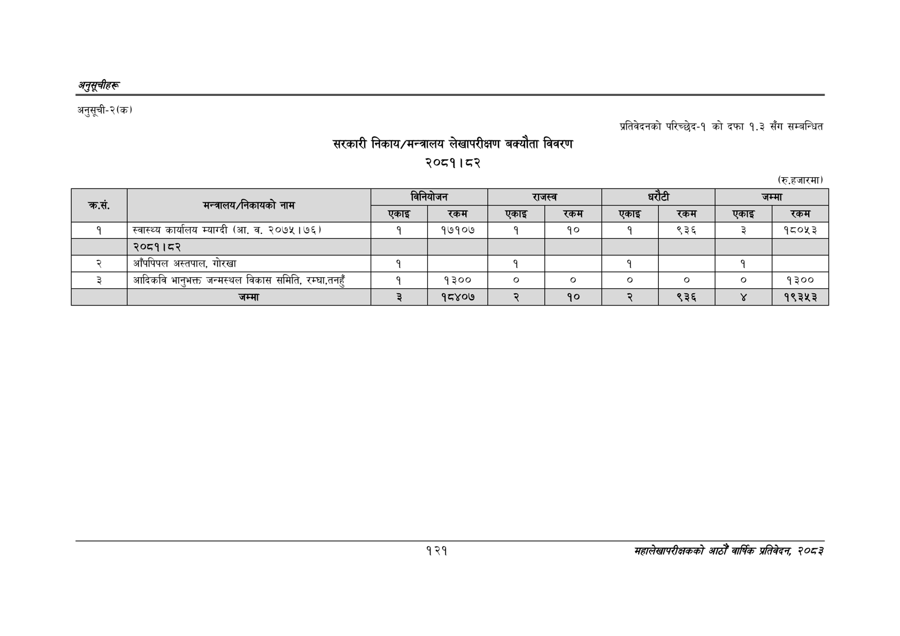

# Page 151 QA

## Rendered page


## Extracted text

```text
अनुतूचीहरू
अनुसूची-२(क)
सरकारी निकाय/मन्त्रालय लेखापरीक्षण बक्यौता विवरण २०८१।८२
प्रतिवेदनको परिच्छेद-१ को दफा १.३ सँग सम्बन्धित
(रु.हजारमा)
१२१
सहालेखापरीक्षकको आठौँ वाषिकि प्रतिवेदन २०८२

|  | मन्त्रालय/नेकायको |  | विनियोजन | राजस्व |  | धरटी |  |  | जम्मा |
| --- | --- | --- | --- | --- | --- | --- | --- | --- | --- |
| क्रस. | नाम | एकाइ | रकम | एकाइ | रकम | एकाइ | 'रकम | एकाइ | रकम |
| १ | स्वास्थ्य कार्यालय म्याग्दी (आ. व. २०७५ \| ७६) | १ | १७१०७ | १ | १० | १ | ९३६ | ३ | १८०५३ |
|  | २०८१।८२ |  |  |  |  |  |  |  |  |
| २ | आँपपिपल अस्तपाल, गोरखा | १ |  | १ |  | १ |  | १ |  |
| ३ | आदिकवि भानुभक्त जन्मस्थल विकास समिति, रम्घा,तनहुँ |  | १३०० | ० |  | ० | ० |  | १३०० |
|  | जम्मा | ३ | १८४०७ | २ | १० |  | ९३६ |  | १९३५३ |
```

## Flags
- table_page
- medium_quality_table
