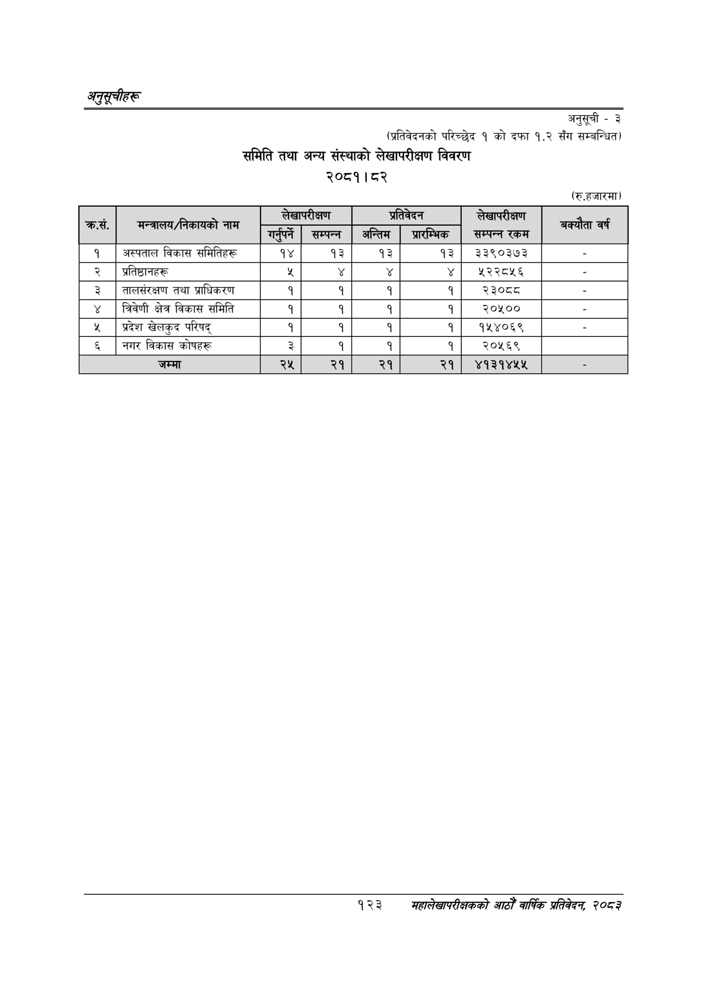

# Page 153 QA

## Rendered page


## Extracted text

```text
अनुकूचीहरू
अनुसूची -३
(प्रतिवेदनको परिच्छेद १ को दफा १.२ सँग सम्बन्धित)
समिति तथा अन्य संस्थाको लेखापरीक्षण विवरण
२०८१। ८२
(रु.हजारमा)
१२३
मंहालेखापरीक्षकको आठौँ वाषिकि प्रतिवेदन २०८२

|  | सन्तालक/निकावको |  | लिड |  | का |  | ब्क्यता वर्ष |
| --- | --- | --- | --- | --- | --- | --- | --- |
| क्रस. | नाम | गर्रपर्ने | सम्पन्न | अन्तिम | श्रारन्मिक | सम्पन्न रकम |  |
| १ | अस्पताल विकास समितिहरू | १४ | १३ | १३ | १३ | ३३९०३७३ |  |
| २ | प्रतिष्ठानहरू |  |  |  | ४ | १२२८५६ |  |
| ३ | तालसंरक्षण तथा श्राधिकरण | १ | १ | १ | १ | २३०८८ |  |
| ४ | चतिवेणी क्षेत्र विकास समिति | १ | १ | १ | १ | र२०१०० |  |
| ५ | प्रदेश खेलकुद परिषद्‌ | १ | १ | १ | १ | १४१४०६९ |  |
| ६ | नगर विकास कोषहरू | ३ | १ | १ | १ | २०५६९ |  |
|  | जम्मा | २५ | २१ | २१ | २१ | ४१३१४५४५ |  |
```

## Flags
- table_page
- medium_quality_table
