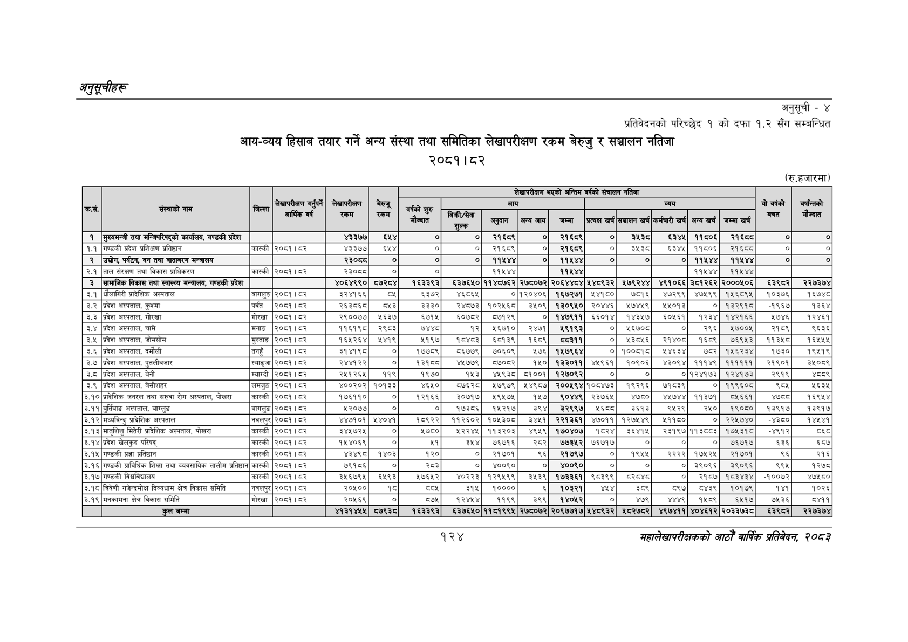

# Page 154 QA

## Rendered page


## Extracted text

```text
अनुकूचीहरू
अनुसूची -४
प्रतिवेदनको परिच्छेद १ को दफा १.२ सँग सम्बन्धित
आय-व्यय हिसाब तयार गर्ने अन्य संस्था तथा समितिका लेखापरीक्षण रकम बेरुजु र सञ्चालन नतिजा २०८१। ८२
(रु.हजारमा)
सहालेखापरीक्षकको आठौँ वाषिकि प्रतिवेदन २०५३
१२४

|  |  |  |  |  |  |  |  |  | लेखापरीक्षण | भएको अन्तिम | वर्षको | संचालन नतिजा |  |  |  |  |  |
| --- | --- | --- | --- | --- | --- | --- | --- | --- | --- | --- | --- | --- | --- | --- | --- | --- | --- |
|  |  |  |  |  | सस |  |  |  |  |  |  |  |  |  |  |  |  |
|  | सस्थाको नाम |  | भि |  |  | बेगर मौज्दात | नक/सेच शुल्क | छ\| अनुदान | अन्य आय | जम्मा | प्रत्यक्ष खर्च | सञ्चालन खर्च | कर्मचारी खर्च | अन्य खर्च | जम्मा खर्च |  |  |
| १ | मुख्यमन्त्री तथा मन्त्रिपरिषद्को कार्यालय, गण्डकी प्रदेश |  |  | ४३३७७ | ६५४ | ० | ० | २१६९ | ० | २१६९ | ० | इे८३ड | ६३४५ | ११८०६ | २१६८ | ० | ० |
| १.१ | गण्डकी प्रदेश प्रशिक्षण प्रतिष्ठान | कास्की | २०८१।८२ | ४३३७७ | ६४५४ |  | ० | ८ | ० | २१६९ | ० |  | ६३४५ | ११५०६ | २१६६८ | ० | ० |
| २ | , पर्यटन, बन तथा वातावरण |  |  | २३०८ | ० | ० | ० | ११४४४ | ० | ११४४४ | ० | ० | ० | ११४४४ | ११४५४४ | ० | ० |
| २.१ | ताल संरक्षण तथा विकास प्राधिकरण | कास्की | २०८१।८२ | २३०८८ | ० |  |  | ११४४४ |  | ११४४४ |  |  |  | ११५४४ | ११५४४ |  |  |
| ३ | सामाजिक विकास तथा स्वास्थ्य मन्त्रालय, गण्डकी प्रदेश |  |  | ४०६४९९० | ७२८४ | १६३३९३ | ६३७६५० | ११४८७६२ | २७८०७२ | २०६४४८४ | ५४८९३२ | ५७९२४४ | ४९१०६६ | ३८१२६२ | २०००४०६ | ६३९८२ | २२७३७४ |
| ३.१ | घाँलागिरी प्रादिशिक अस्पताल | बागलुङ | २०८१। ८२ | ३२४१६६ | ०५ | ६३७२, | ४६८६५ |  | ०१२०४०६ | १६७२७१ | ५४१८० | ७८१६ | ४७२९९ | ४७५९९ | १५६८९४ | १०३७६ | १६७४८ |
| ३.२ | प्रदेश अस्पताल, कुश्मा | पर्वत | २०६१।८२ | २६३५६४८ | ८४५३ | ३३३० | २४८७३ | १०२१६८ | ३५०९ | १३०९५० | २०४४६ | १५७४५९ | २४५०१३ | ० | १३२९१८ | -१९६७ | १३६४ |
| ३.३ | प्रदेश अस्पताल, गोरखा | गोरखा | २०८१। ८२ | २९००७४ | ४६३७ | ६७१५ | ०७८२ | ८०७१२९ | ० | १४७९११ | ६६०१४ | १४३४५७ | ६०५६१ | १२३४ | १४२१६६ | १७४६ | १२४६१ |
| ३.४ | प्रदेश अस्पताल, चामे | मनाङ | २०८१।८२ | ११६१९८ | २९८३ | ७४४८ | १२ | ५६७१० | २४७१ | ९१९३ | ० | ६७०८ | ० | २९६ | ५७०० | २१५५ | ९६३६ |
| ३.४ | प्रदेश अस्पताल, जोमसोम | मुस्ताङ | २०८१।८२ | १६५२६४ | ५४१९ | ५१९७ | ८४८३ | इ८१३९ | १६८९ | ब५३११ | ० | ३८५६ | २१४० | १६८९ | ७६९४५३ | १३५८ | १६५५५ |
| ३.६ | प्रदेश अस्पताल, दमौली | तनहुँ | २०८१।८२ | ३१४१९८ | ० | १७७८९ | ८६७७९ | ७०६०९ | १७६ | १५७९६४ | ० | १००६१८ | श४६३४ | ७८२ | १५६२३४ | १७३० | १९५१९ |
| ३.७ | प्रदेश अस्पताल, पुतलीबजार | स्याङ्जा | २०८१।८२ | २४४१२२ | ० | बइ१दङ | ४७७९ | ०७०५२ | १५० | १३३०११ | ४४५९६१ | १०९०६ | ४३०९४ | १११४९ | ११११११ | २१९०१ |  |
| ३.८ | प्रदेश अस्पताल, वेनी | म्याग्दी | २०८१। ८२ | २४५१२६४५ | ११९ | १९७०, | १४३ | ४९३८ | ५१००१ | १२७०९२ | ० | ० |  | ०१२४१७३ | १२४१७३ | २९१९ | अशर |
| ३.९ | प्रदेश अस्पताल, बेसीशहर | लमजुङ | २०८१।८२ | ४००२०२ | १०१३३ | ४६५० | ८७६२८ | ४७९७९ | अ४९८७ |  | २००४९४१०८४७३ | १९२९६ | ७१३९ | ० | १९९६०८ | ९८४ | १६३४ |
| ३.१० | प्रादेशिक जनरल तथा सरुवा रोग अस्पताल, पोखरा | कास्की | २०८१।८२ | १७६११० | ० | १२१६६ | ३०७१७ | १२९५७४५ | १५७ | ९०४४९ | २३७६५ | ४७८० | ४५७४४ | ११३७१ | ८५६६१ |  | १६९५४ |
| ३.११ | बुर्तिबाङ अस्पताल, बाग्लुङ | बागलुङ | २०८१।८२ | ५२०७७ | ० | ० | १७३८६ | १५२१७ | ३९४ | २९९७ | ६०८ | ३६१३ | ९५२९ | र२५० | १९०८० | १३९१७ | १३९१७ |
| ३.१२ | मध्यविन्दु प्रादेशिक अस्पताल | नवलपुर | २०८१। ८२ | ४४७१०१ | २४०४७१३ | ०९२२ | ११२६०२ | १०४५३०८ | ३४५१ | २२१३६१ | ४७०११ | १२७५४९ | ५११८० | ० | २२४७४० | -४३६० | १४४५४१ |
| ३.१३ | मातृशिशु मितेरी प्रादिशिक अस्पताल, पोखरा | कास्की | २०८१।८२ | ३४५७२४५ | ० | २७८० | २२४५ | ११३२०३ | ४९५९ | १७०४०७ | १८२४ | ३६४१५ |  | २३१९७११३८८३ | १७५३१८ | -४९१२ | ८६८ |
| ३.१४ | प्रदेश खेलकुद परिषद्‌ | कास्की | २०८१।८२ | १५४०६९ | ० | ३ |  | ७६७१६ | २८२ | ७७३४२ | ७६७१७ | ० |  | ० | ७६७१७ | ६३६ | ६५७ |
| ३.१५ | गण्डकी प्रतिष्ठान | कास्की | २०८१। ८२ | ४३४९८ | १४०३ | १२० | ० | २१७०१ | ९६ | २१७९७ | ० | १९५५ | २२२२ | १७४२५ | २१७०१ | ९६ | २१६ |
| ३.१६ | गण्डकी प्राविधिक शिक्षा तथा व्यवसायिक तालीम प्रतिष्ठान | कास्की | २०८१। ८२ | ७९१८६ | ० | २८३ | ० | ४००९० | ० | ४००९० | ० | ० | ० | ३९०९६ | ३९०९६ | ६९५ | १२७८ |
| ३.१७ | गण्डकी विश्वविद्यालय | कास्की | २०८१। ८२ | इ५६७९५ | ६५९३ | ७६५२
```

## Flags
- table_page
- medium_quality_table
