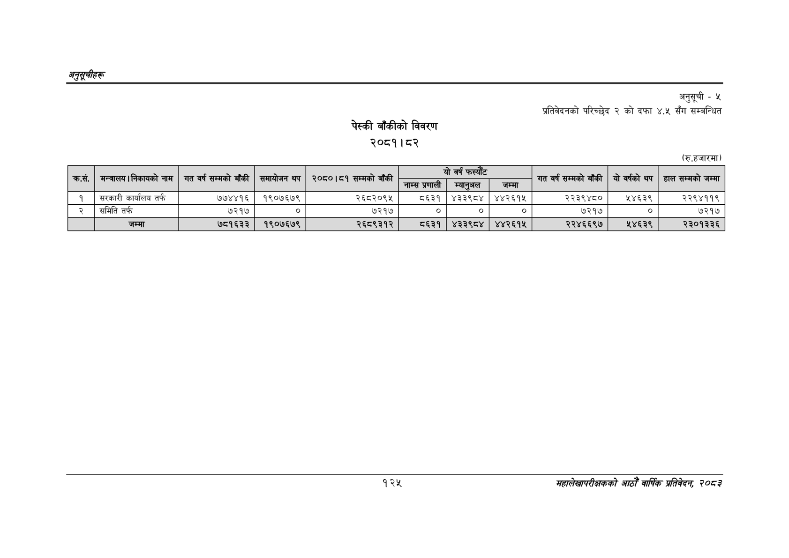

# Page 155 QA

## Rendered page


## Extracted text

```text
अनुतूचीहरू
पेस्की बाँकीको विवरण
२०८१। ८२
अनुसूची -५
प्रतिवेदनको परिच्छेद २ को दफा ४.५ सँग सम्बन्धित
(रु.हजारमा)
१२५
सहालेखापरीक्षकको आठौँ वाषिकि प्रतिवेदन २०८२

| क.सं. | मन्त्रालय।निकायको नाम | गत वर्ष सम्मको बाँकी | समायोजन थप | २०८०।८१ सम्मको बाँकी | जाम्स प्रणाली | सा | जम्मा | गत वर्ष सम्मको बाँकी | यो वर्षको थप | हाल सम्मको जम्मा |
| --- | --- | --- | --- | --- | --- | --- | --- | --- | --- | --- |
| १ | सरकारी कार्यालय तर्फ | ७७४४१६ | १९०७६७९ | २६८२०९५ | ८६३१ | ४३३९८४ | ४४२६१५ | २२३९४८० | २४६३९ | २२९४११९ |
| २ | समिति तर्फ | ७२१७ | ० | ७२१७ |  |  |  | ७२१७ |  | ७२१७ |
|  | जम्मा | ७८१६३३ | १९०७६७९ | २६८९३१२ | ८६३१ | ४३३९८४ | ४४२६१५ | २२४६६९७ | ५४६३९ | २३०१३३६ |
```

## Flags
- table_page
- medium_quality_table
