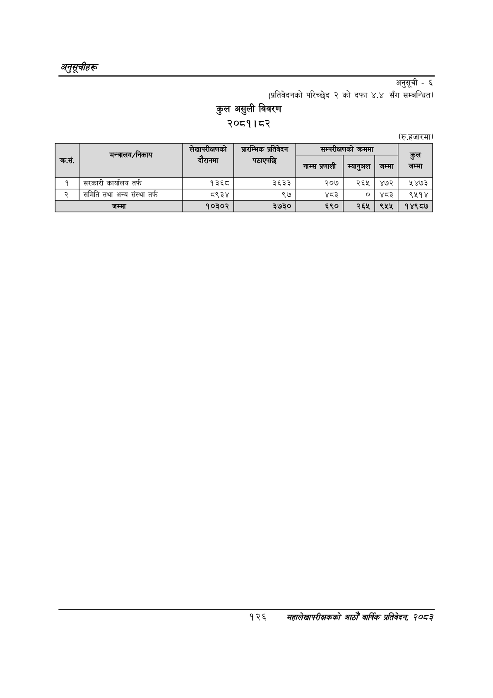

# Page 156 QA

## Rendered page


## Extracted text

```text
अनुकूचीहरू
अनुसूची -६ (प्रतिवेदनको परिच्छेद २ को दफा ४.४ सँग सम्बन्धित)
कुल असुली विवरण २०८१। ८२
(रु.हजारमा)
१२६
महालेखापरीक्षकको आठौ वाषिकि प्रतिवेदन २०८२

| छै कसे. | 'मन्त्रालय/निकाय | लेखापरीक्षणको दौरानमा | प्रारम्भिक प्रतिवेदन बठाएकछि | 'सन्परीक्षणको नाम्स प्रणाली | क्रममा म्यानुअल | जम्मा | कुल जम्मा |
| --- | --- | --- | --- | --- | --- | --- | --- |
| १ | सरकारी कार्यालय तर्फ | १३६८ | ३६३३ | २०७ | २६५ | ४७२ | १४७३ |
| २ | समिति तथा अन्य संस्था तर्फ | ८९३४ | ९७ | श्द३ | ० | ४८३ | ९४१४ |
|  | जम्मा | १०३०२ | ३७३० | ६९० | २६५ | ९५५ | १४९८७ |
```

## Flags
- table_page
- medium_quality_table
