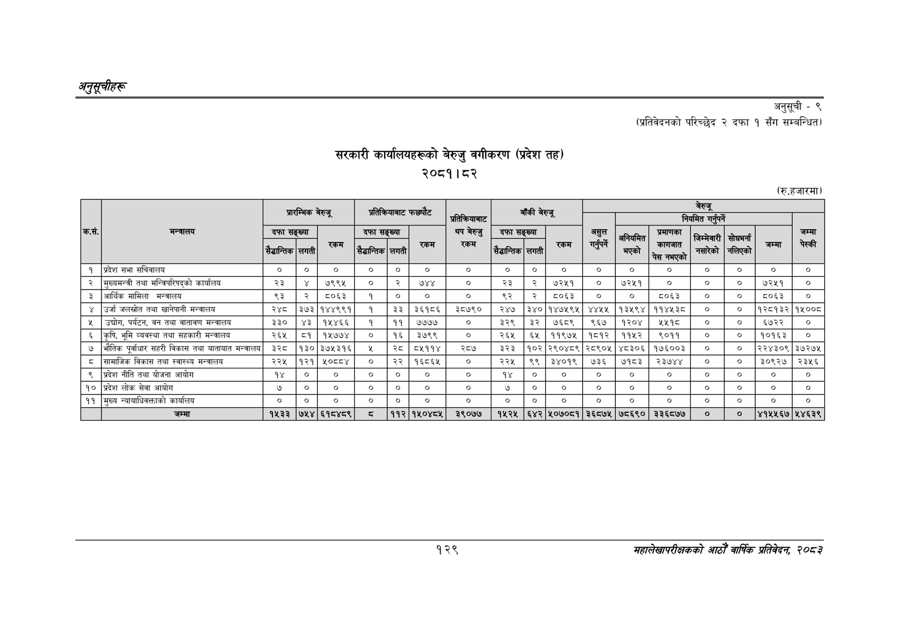

# Page 159 QA

## Rendered page


## Extracted text

```text
अनुकूचीहरू
सरकारी कार्यालयहरूको बेरुजु वगीकरण (प्रदेश तह) २०८१।८२
अनुसूची -९
(प्रतिवेदनको परिच्छेद २ दफा १ सँग सम्बन्धित)
(रु.हजारमा)
१२९
सहालेखापरीक्षकको आठौँ वाषिकि प्रतिवेदन २०८२

|  |  |  | प्रारम्भिक | बेरुजू |  | प्रतिक्रियाबाट | फछ्यौट | प्रतिकरियाबाट |  | बाँकी | बेरुजू |  |  |  | बेरुजू नियमित गर्ने |  |  |  |
| --- | --- | --- | --- | --- | --- | --- | --- | --- | --- | --- | --- | --- | --- | --- | --- | --- | --- | --- |
| कस. | मन्त्रालय | दफा ैडान्तिक | सङ्ख्या लगती | र्म | दफा सैद्धान्तिक | सङ्ख्या सगती | रम | थप बेरुजु एकम | दफा सेढान्तिक | सङ्ख्या लगती | रकम | असुल गरने | अनियमित भएको | प्रमाणका —— | जिम्मेवारी सारेको | सोधमना नलिएको |  | जम्मा पेस्की |
| १ | प्रदेश सभा सचिवालय | ० | ० | ० |  | ० | ० | ० | ० | ० | ० | ० | ० | ० | ० | ० | ० | ० |
| २ | मुख्यमन्त्री तथा मन्त्रिपरिषद्को कार्यालय | २३ | ४ | ७९९५ | ० | २ | ७४४ | ० | २३ | २ | ७२५१ | ० | ५२५१ | ० | ० | ० | ७२५१ | ० |
| ३ | आर्थिक मामिला मन्त्रालय | ६३ | २ | ८०६३ | १ | ० |  | ० | ९२ | २ | ५०६३ | ० | ० | ५०६३ | ० | ० | ५०६३ | ० |
| ४ | उर्जा जलस्रोत तथा खानेपानी मन्तालय | २४८ | ३७३ | १४४९९१ | १ | इ३ | ३६१८६ | ३८७९० | २४७ | ३४० | १४७५९५ | ४४५५ | १३१९४ | ११४५३८ | ० | ० | १२८१३२ | १५००८ |
| ५ | उद्योग, पर्यटन, वन तथा वातावण मन्त्रालय | ३३० | ४३ | १५४६६ | १ | ११ | ७७७७ | ० | ३२९ | ३२ | ७६८९ | ९६७ | १२०४ | १४१८ | ० | ० | ६७२२ | ० |
| ६ | कृषि, भूमि व्यवस्था तथा सहकारी मन्त्रालय | २६५ | ८१ | १५७७४ | ० | १६ | ३७९९ | ० | २६५ | ६५ | ११९७५ | १८१२ | ११५२ | ९०११ | ० | ० | १०१६३ | ० |
| ७ | भौतिक पूर्वाधार सहरी विकास तथा यातायात मन्त्रालय | ३२८ | ४३० | ३७५३१६५ |  | ३५ | ८५११४ | २८७ | ३२३ | १०२ | २९०४८९ | २८९०५ | ४८३०६ | १७६००३ | ० | ० | २२४३०९ | ३७२७५ |
| ८ | सामाजिक विकास तथा स्वास्थ्य मन्त्रालय | २२५ | १२१ | १०६८४ | ० | २२ | १६८६४५ | ० | २२५ | ९९ | ३४०१९ | ७३६ | ७१८३ | २३७४४ | ० | ० | ३०९२७ | २३५६ |
| ९ | प्रदेश नीति तथा योजना आयोग | १४ | ० | ९० | ० | ० | ० |  | १४ | ० | ९० |  |  |  | ० | ० |  |  |
| १० | प्रदेश लोक सेवा आयोग | ७ | ० | ० | ० | ० | ० | ० | ७ | ० | ० | ० | ० | ० | ० | ० | ० | ० |
| ११ | मुख्य न्यायाधिवक्ताको कार्यालय | ० | ० | ० | ० | ० | ० | ० | ० | ० | ० | ० | ० | ० | ० | ० | ० | ० |
|  | जम्मा | १५३३ | ७५४ | ६१८४८९ | ८ | ११२ | १५०४८५ | ३९०७७ | १५२५ | ६४२ | ५०७०८१ | ३६८७५ | ७८६९० | ३३६८७७ | ० | ० | ४१५५६७ | ५४६३९ |
```

## Flags
- table_page
- medium_quality_table
