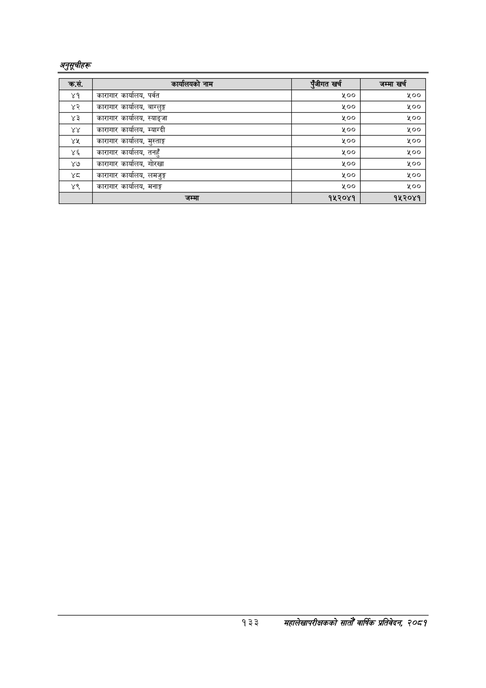

# Page 163 QA

## Rendered page


## Extracted text

```text
अनुतूचीहरू
१३३
महालेखापरीक्षकको सातौ वार्षिक प्रतिवेदन २०८१

| क्रस. | नाम | रंजीगत खर्च | जम्मा खर्च |
| --- | --- | --- | --- |
| ४१ | कारागार कार्यालय, पर्वत | ५०० | ५०० |
| ४२ | कारागार कार्यालय, बाग्लुङ्ग | ५०० | ५०० |
| ४३ | कारागार कार्यालय, स्याङ्जा | १०० | ५०० |
| ४४ | कारागार कार्यालय, म्याग्दी | ५०० | ५०० |
| ४५ | कारागार कार्यालय, मुस्ताङ्ग | १०० | ५०० |
| ४६ | कारागार कार्यालय, तनहुँ | ५०० | १०० |
| ४७ | कारागार कार्यालय, गोरखा | १०० | ५०० |
| ४८ | कारागार कार्यालय, लमजुङ्ग | १०० | ५०० |
| ४९ | कारागार कार्यालय, मनाङ्ग | १०० | ५०० |
|  | जम्मा | १५२०४१ | १५२०४१ |
```

## Flags
- table_page
- medium_quality_table
