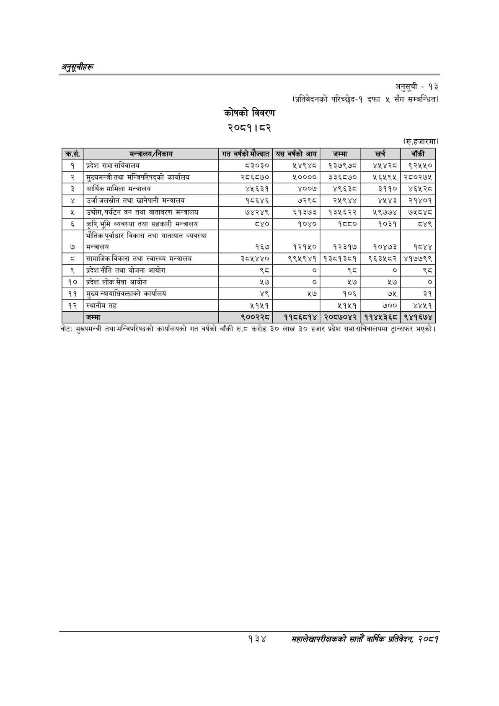

# Page 164 QA

## Rendered page


## Extracted text

```text
अनुतूचीहरू
कोषको विवरण २०८१। ८२
अनुसूची -१३
(प्रतिवेदनको परिच्छेद-१ दफा ५ सँग सम्बन्धित)
(रु.हजारमा)
नोट: मुख्यमन्त्री तथा मन्त्रिपरिषदको कार्यालयको गत वर्षको बाँकी रु.ट करोड ३० लाख ३० हजार प्रदेश सभा सचिवालयमा ट्रान्सफर भएको |
१३४
महालेखापरीक्षकको सातौ वार्षिक प्रतिवेदन २०८१

| कस. | 'मन्त्रालय/निकाय | वर्षको मौज्दात | यस वर्षको आय | जम्मा | खर्च | बाँकी |
| --- | --- | --- | --- | --- | --- | --- |
| १ | प्रदेश सभा क्षचिवालय | ८३०३० | १४९४८ठ | १३७९७८ | ४४४२८ | ९२४५५० |
| २ | मुल्यमन्त्रीतया मन्त्रिपरिषद्को कार्यालय | २८६८७० | ५०००० | ३३६८७० | ४६४५९५ | २८०२७५ |
| ३ | आर्थिक मामिला मन्त्रालय | ४५६३१ | ४००७ | ४९६३८ | ३११० | ४६५२८ |
| ४ | उर्जा जलस्रोत तथा खानेपानी मन्त्रालय | १८६४६ | ७२९८ | र२४५९४४ | ४५४३ | २१४०१ |
| ५ | उद्योग,पर्यटन बन तथा वातावरण मन्त्रालय | ७४२४९ | ६१३७३ | १३५६२२ | १५९७७४ | ७१५८४८ |
| ६ | कृषि,भूमि व्यवस्था तथा सहकारी मन्त्रालय | ८४० | १०४० | १८८० | १०३१ | ८४९ |
| ७ | भौतिक पूर्वाधार विकास तथा यातायात व्यवस्था मन्त्रालय | १६४ | १२१५० | १२३१७ | १०४७३ | १ैठ४४ |
| ८ | विकास तथा स्वास्थ्य मन्त्रालय | ३८५४४० | ९९५९४१ | १३८१३८१ | ९६३५८२ | ४१७७९९ |
| ९ | प्रदेशनीति तथा योजना आयोग |  | ० | ९८ |  | ९८ |
| १० | प्रदेश लोक सेवा आयोग | ५७ | ० | ५७ | ५७ | ० |
| ११ | मुख्य न्याधाधिवक्ताको कार्यालय | ४९ | २७ | १०६ | ७५ | ३१ |
| १२ | स्थानीय तह | ५१५१ |  | ५१५१ | ७०० | ४४५१ |
| १३ | जम्मा | ९००२२८ | ११८६८१४ | २०८७०४२ | ११४४५३६८ | ९४१६७४ |
```

## Flags
- table_page
- medium_quality_table
