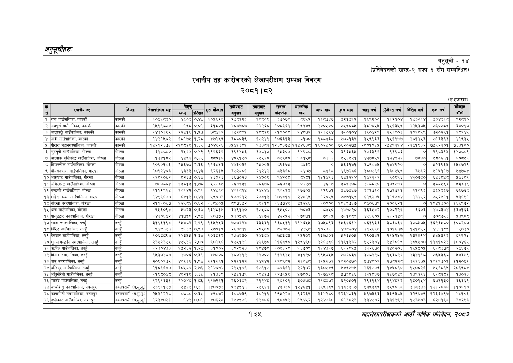

# Page 165 QA

## Rendered page


## Extracted text

```text
अनुकूचीहरू
स्थानीय तह कारोबारको लेखापरीक्षण सम्पन्न विवरण २०८१।८२
अनुसूची -१४
(प्रतिवेदनको खण्ड-२ दफा ६ सँग सम्बन्धित)
(रु.हजारमा)
१३५
महालेखापरीक्षकको आठोँ वार्षिक प्रतिवेकक २०५३

| ङ्‌ | स्थानीय तह | जिल्ला | लेखापरीक्षण अङ्ग | एक | तिरत | सुरु मौज्दात | चैहुशबाट | अनुदान | का |  | अन्य आय | कुल आय | चालुखर्च | पुँजीगत खर्च | बित्तिय खर्ब | कुल खर्च | जैन्यत |
| --- | --- | --- | --- | --- | --- | --- | --- | --- | --- | --- | --- | --- | --- | --- | --- | --- | --- |
| १ | रुपा गाउँपालिका, कास्की | कास्की | १०५४१८३० | ४६०३ |  | १०५६२६ | २५८२२६ | १५५०९ | ६७०७८ | ०६५२ | १६०७४७ | २२१५१२ | २६९२०० | ११२१०४ | १५३०१४ | श३४३१८ | ९२८२० |
| २ | अन्नपूर्ण गाउँपालिका, कास्की | कास्की | १५१९८७४ | १९८ | ०.०१ | ३१८०१ | ४०७७०७ | २२२६० | १०८६६९ | १९९४९ | २००५०० | ७५९०८५ | ३८४०५५ | १५१३५९ | २२५३७५ | ७६०७८९ | ३००९७ |
| ३ | माछापुछ्नै गाउँपालिका, कास्की | कास्की | १४३०३९४५ | २२४१६ | १,४५७ | ७८४३२ | इ३५२८०१ | १६८८२९ | ११०००८ | १४८७२ | २१३५९४ | ७१०१०४ | इ३६०४२९ | १४५३००३ | २०६८४९ | ७२०२९१ | ६८२४५ |
| ४ | मादी गाउँपालिका, कास्की | कास्की | १४२१५०२ | १८१७५ | १.२८ | ४७१५९ | इ३८५०३९ | १७२४९ | १०६३१३ | १०० | १८८४३८ | ७०८१३९ | इ३४५९९३३ | १४५१९७७ | २०१४५३ | ७१३३६३ | ४१९३५ |
| ५ | पोखरा महानगरपालिका, कास्की | कास्की | १५२१२३७६ | २१०८२९ | १.३९ | ७०४९२६ | ३५४१३८१ | ९३३८१ | १२३८३७५ | ११४४६३८ | १६०२५०० | ७६२०२७५ | २८०१०५५ | २४४९११४ | २२४१९३२ | ७४९२१०१ | ७३३१०० |
| ६ | चुमनुत्री गाउँपालिका, गोरखा | गोरखा | ६१४० | २४९४ | ० | १२९६३९ | १९१४५६ | १४८१७ | ९४५३०४ | १४९८८ | ० | इ१६४५६५ | २०६३२९ | ९१९८६ | ० | २९८३१५ | १४७८८९ |
| ७ | बारपाक सुलिकोट गाउँपालिका, गोरखा | गोरखा | ११३४१८२ | ४४५२ | ०.३९ | ५५०१६ | ४०५१५० | र२४५२० | १०२५८० | १०१५८ | १०११३ | १५३५२१ | ४३७८५९ | १३४९३२ | ७८७० | १८०६६१ | ६०८७ |
| ८ | सिरानचोक गाउँपालिका, गोरखा | 'गोरखा | १०६०१०६ | २५६७७ | २.३६ | ११६५५३ | ४४३०३१ | २५००३ | ८९३७५ | ८७३२ | ० | १६६१४१ | ३७९०४५ | १४४९२० | ० | ४२३९६५ | १५८७२९ |
| ९ | भीमसेनथापा गाउँपालिका, गोरखा | गोरखा | १०१२४०३ | ४३३३ | ०.४३ | ९२६१५ | ३७२८०१ | र२४२४२ |  | ८४०७ |  | ४९७२६८६ | ३८०७९६ | १३०५५९ | ३७६२ | ४५१५११७ | ७४७८४ |
| १० | आरुघाट गाउँपालिका, गोरखा | 'गोरखा | १२८६०६२ | ८२३७ | ०.६४ | थ२३०२३ | ३६७०२३ | २४००९ | ९४२०८ | ८१ | १५१४६३ | ६४५२१४ | १४२११२ | ९०९६९६ | ४१०७४० | ६४३८४८ | १४३८९ |
| ११ | अजिरकोट गाउँपालिका, गोरखा | गोरखा | ७७७८०४ | १३८१३ | १.७ | २७३७ | २६७९३१ | २०३७० | ८६०६३ | १०२२७ | ४६१७ | ३८९२०८ | २७६८२० | १०९७७६ | ० | ३८८५९६ | ३३४९ |
| १२ | गण्डकी गाउँपालिका, गोरखा | गोरखा | १११२९१४ | १०१४२ | ०.९१ | ९४९८ | ४०१५१४ | रष्टष्ट | ९०४१३ | १७७०५ | १२९७१ | १४७४४७ | ३८१७६० | १७१७११ | ११५९६ | १६५३६७ | ७६७७८ |
| १३ | शहिद लखन गाउँपालिका, गोरखा | 'गोरखा | १४९९६७० | ६४१३ | ०.३ | ४१९००३ | ५७७६१२ | र२७८१३ | १०४८१४ | २४८६५ | १२०५५ | ७४७१५९ | ६१९२७५ | ११९७८४ | १३४५२ | ७५२४११ | ३६५१ |
| १४ | गोरखा नगरपालिका, गोरखा | गोरखा | २१११०६७ | १२९८४ | ०.६२ | १३८५०५ | ८०७६४२ | ३९११० | १६७७४९ | ४६२१६ | १०००० | १०६९७६७ | ८४०६७९ | २००६२१ | ० | १०४१३०० | १६६९७२ |
| १५ | धार्चे गाउँपालिका, गोरखा | 'गोरखा | ६५६०६९४ | २७२३ | ०.६० | १३४८१७ | ३४९१४० | १७५८० | ९५५०७ | ७०४३ | ८४५० | ४७७७२० | ३६३५४२ | १०८२२९ | ६६०३ | ४७८३७४ | १३४१६३ |
| १६ | पालुङटार नगरपालिका, गोरखा | 'गोरखा | १४२०६४२ | ४१७५० | २.९४ | १५०७७२ | ५१०५२९ | ३४१७२ | १४२२५२ | १७०७१ | ७८६५ | ७११५८९ | ४९६६०५ | २१२१४८ | ० | ७०८७५३ | १२३९०८ |
| १७ | व्यास नगरपालिका, तनहुँ | तनहुँ | ३१९६१९४ | ९४५४८२ | २.९९ | १६४२४३ | ७७७२२४ | ३३३३१ | १६८४११ | २१४६४४५ | ३७४८९३ | १४६९६१४ | ८६१९३६ | ३८६०६९ | ३७०४७४५ | १६२६४८० | १०८२८७ |
| १८ | घिरिङ गाउँपालिका, तनहुँ | तनहुँ | ९४४३९३ | द१इ४ | ०,१९७ | २७०१५ | २६७८११ | २०४०० | ८२७७२ |  | १०२७६३ | ४७८२०४ | २४२६६० | १०१६३७ | १२१८९२ | ४६६१८९ | इ९०३० |
| १९ | देवघाट गाउँपालिका, तनहुँ | तनहुँ | १०६८८९७ | १४३४५ | १.३४ | १०३८१२ | २७७९३० | १४३८४ | ७८३८३ | १४५१०२ | १३७३०६ | २३५०४५ | २९०३४१ | ११५२४७ | १३९७९४ | १४४३९२ | ५१९२५ |
| २० | शुक्लागण्डकी नगरपालिका, तनहुँ | तनहुँ | २३७२३५४५ | ४७५३२ | २.०० | ९०१५६ | ४५७५१९६ | ४२९७० | ११६८९० | १२९४९० | इ२६७८६ | ११९१३३२ | भ५५२३०४ | इ४३०१९ | २८४७०० | ११८१०२३ | १००४६५ |
| २१ | च्रपिङ गाउँपालिका, तनहुँ | तनहुँ | १२३०४३३ | १५२३२ | १.२४ | ३१००२ | ३०२९२३ | ८४७८ | १०९६२८ | १६७०९ | १६४३१७ | ६१२०५५ |
```

## Flags
- table_page
- medium_quality_table
