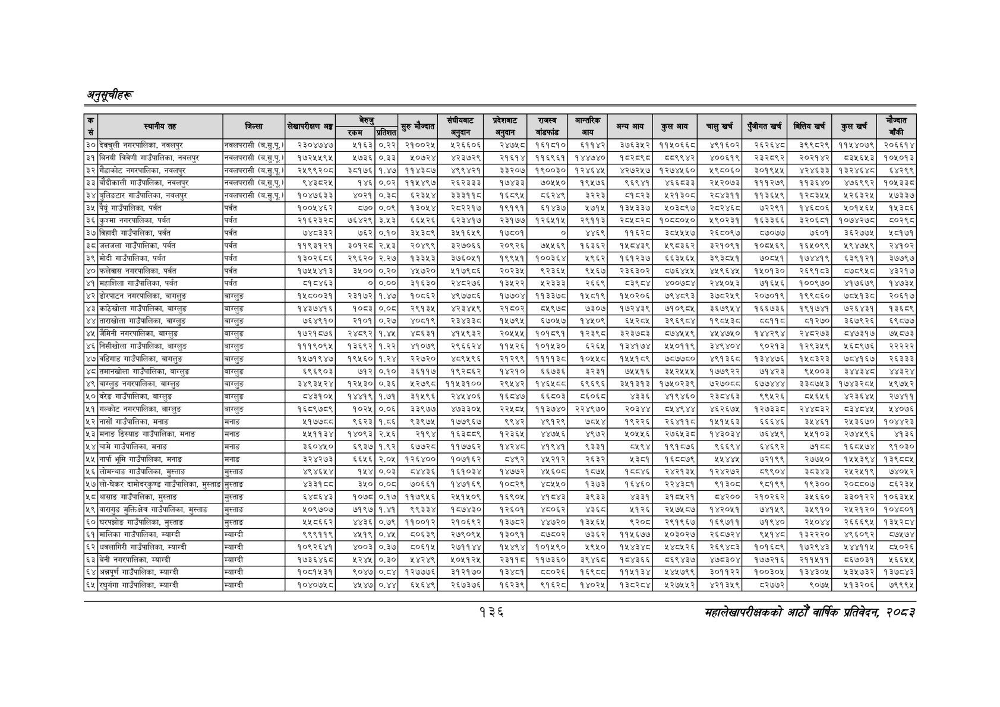

# Page 166 QA

## Rendered page


## Extracted text

```text
अनुतूचीहरू
१३६
महालेखापरीक्षकको आठोँ वार्षिक प्रतिवेकक २०५३

| [न | स्थानीय तह | जिल्ला | लेखापरीक्षण अङ्ग | का |  | सुरु मौज्दात | हुक | कबाट | जकाढ | आय | अन्य आय | कुल आय | चालुखर्च | पुँजीगत खर्च | बित्तिय खर्ब | कुल खर्च | ैन्यात |
| --- | --- | --- | --- | --- | --- | --- | --- | --- | --- | --- | --- | --- | --- | --- | --- | --- | --- |
| ३० | देक्चुली नगरपालिका, नवलपुर | नवलपरासी (ब.सु.पू)] | २३०४७४७ | ५१६३ | ०,२२ | २१००२४ | ५२६६०६ | २४७४८ | १६१८१० | ६११४२ | ३७६३४२ | ११४०६६८ | ४९१६०२ | २६२६४८ | ३९९८२९ | ११४४०७९ | २०६६१४ |
| ३१ | बिनयी गाउँपालिका, नबलपुर | नवलपरासी (ब.सु.पू) | १७२४५४५९५ | २७३६ | ०३३ | ५०७२४ | ४२३७२९ | २१६१४ | ११६९६१ | १४४७४० | पट२८९८ | ५५९९४२ | ४००६१९ | २३२८९२ | २०२१४२ | ८३५६४५३ | १०५०१३ |
| ३२ | गैँडाकोट नगरपालिका, नवलपुर | नवलपरासी (ब.सु.पू.) | २५९९२०८ | ३८१७६ | १.४७ | ११४३८७ | ४९९४२१ | ३३२०७ | १९००३० | १२४६४५ | ४२७२५७ | १२७४५६० | १९८०६० | ३०१९५५ | ४२४६३३ | १३२४६४८ | ५६४२९९ |
| ३३ | बाँदीकाली गाउँपालिका, नवलपुर | नवलपरासी (ब.सु.पू) | ९४३८२५ | १४६ | ०.०२ | ११५४९७ | २६२३३३ | १७४३३ | ७०५५० | १९४७६ | ६९४१ | ४६६८३३ | २४२०७३ | १११२७९ | ११३६४० | ४७६९९२ | १०५३३८ |
| ३४ | बुलिङटार गाउँपालिका, नवलपुर | नवलपरासी () | १०४७६३३ | ४०२१ | ०३८ | ६२३४४ | ३३३११५ | १६८९५ | ८६२४९ | ३२२३ | ५१२३ | २१३० | २८०४३११ | ११३६४९ | १२८३५५ | १२६३२५ | १७३३७ |
| ३५ | ७ गाउँपालिका, पर्वत | पर्वत | १००५४६२ | ८७० | ०.०९ | १इ०५४ | २८२२१७ | १९१९१ | ६१४३७ | १७१५ | १३५३३७ | १५०३८९७ | २८२४६८ | ७२२९१ | १४६८०६ | ४५०१५६५ | १५३८६ |
| ३६ | कुश्मा नगरपालिका, पर्वत | पर्वत | २१६२३२८ | ७६४२९ | ३,४५३ | ६६५२६ | ६२३४१७ | २३१७७ | १२६४५१५ | २९११३ | २०५८२८ | १०६५०५० | ४९०२३१ | १६३३६६ | ३२०६०१ | १०७४२७८ | ५०२९८ |
| ३७ | विहादी गाउँपालिका, पर्वत | पर्वत | ७४८३३२ | ७६२ | ०.१० | ३५३८९ | ३५१६५९ | १७८०१ |  | ४४६९ | ११६२८ | ३८५५५७ | २६८०९७ | ८७०७७ | ७६०१ | ३६२७७५ | २८०१७१ |
| ३५ | जलजला गाउँपालिका, पर्वत | पर्वत | ११९३१२१ | ३०१२८ | २४३ | २०४९९ | ३२७०६६ | २०६२६ | ७४५६९ | १६३६२ | १५८४३९ | ५९८३६२ | ३२१०९१ | १०८४६९ | १६४०९९ | १९४७५९ | २४१०२ |
| ३९ | मोदी गाउँपालिका, पर्वत | पर्वत | १३०२६८६ | २९६२० | २.२७ | १३३४५३ | ३७६०५१ | १९९४५१ | १००३६४ | ९६२ | १६१२३७ | ब६६३४५६५ | ३९३०४५१ | ७०८४१ | १७४४१९ | ६३९१२१ | ३७७९ |
|  | फलेवास नगरपालिका, पर्वत | पर्वत | १७५४५४१३ | इ५०००.२० |  | ४४७२० | ४१७९८६ | र२०२३५ | ९२३६५ | ९४६७ | २३६३०२ | ८७६४५५ | ४४९६४५ | १५०१३० | २६९१८३ | ८७८९५८ | ४३२१७ |
| ४१ | महाशिला गाउँपालिका, पर्वत | पर्वत | ८१८४६३ |  | ००.०० | ३१६३० | २४८२७६ | १३४५२२ | २३३३ | २६६९ |  | ४००७८४ | २४५०५३ | ७१६५६ | १००९७० | ४१७६७९ | १४७३५ |
| ४२ | ढोरपाटन नगरपालिका, बागलुङ | बाग्लुङ | १५८००३१ | २३१७२ | १,४४७ | १०८६२ | ४९७७८६ | १७७०४ | ११३३७८ | ५८१९ | १४५०२०६ | ७९४८९३ | इ७८२५९ | २०७०१९ | १९९८६० | ७८५१३८ | २०६१७ |
| ४३ | काठेखोला गाउँपालिका, बाग्लुङ | बाग्लुङ | १४३७४१६ | १०८३ | ०.०८ | २९१३४५ | ४२३४५९ | २१८०२ | ०४९७ | ७३०७ | १७२४३९ | ७१०९०४ | ३६७९५४ | १६६७३६ | १९१७४१ | ७२६४३१ | १३६८९ |
|  | ताराखोला गाउँपालिका, बाग्लुङ | बाग्लुङ | ७६४९१० | २१०१ | ०.२७ | ४०८१९ | रइ४इइङ | ५७९५ | इ७०५७ | ४५०९ | ४२०५ | इ९६९८४ | १९०४३८ | बद११पड | १२७० | ३६७९२६ | ६९८७७ |
| ४५ | जैमिनी नगरपालिका, बाग्लुङ | बाग्लुङ | १७२१८७६ | २४८९२ | १.४५ | ४८६३१ | ४१५९३२ | २०५५५ | १०१८९१ |  | इरइ७८३ | ०७४५५९ | ४५४७५० | १४४२९४ | २४८२७३ | ८४७३१७ | ७५८७३ |
| ४६ | निसीखोला गाउँपालिका, बाग्लुङ | बाग्लुङ | १११९०९५ | १३६९२ | १.२२ | ४१०७९ | २९६६२४ | ११४५२६ | १०१५३० | ६२६५ | १३४१७४ | ५४१०११९ | इ३४९४०४ | ९०२१३ | १२९३५९ | ४६८९७६ | २२२२२ |
|  | वडिगाड गाउँपालिका, बागलुङ | बाग्लुङ | १४५७१९४७ | १९५६० | १.२४ | २२७२० | ४८९४५९६ | २१२९९ | ११११३८ | १०५८ | १५४१५९ | ७८७७८० | ४९१३६८ | १३४४७६ | १५८३२३ | ७८४१६७ | २६३३३ |
| ४८ | तमानखोला गाउँपालिका, बाग्लुङ | बाग्लुङ | ६९६९०३ | ७१२ | ०.१० | ३६११७ | १९२८६२ | १४२१० | ६६७३६ | ३२३१ | ७४५१६ | ३४५२४५५५ | १७७९२२ | ७१४२३ | ९५००३ | इ४४३श्ट | ४४३२४ |
| ४९ | बाग्लुङ नगरपालिका, बाग्लुङ | बाग्लुङ | ३४९३४२४ | १२४३० | ०.३६ | २७९८ | ११४५३१०० | २९४४२ | १४४८ | ६९६९६ | इ५१३१३ | १७४०२३९ | ७२७०६ड | इ७७४४४ | इ३३८७५३ | १७४३२८५ | १९७५२ |
| ५० | वरेङ गाउँपालिका, बाग्लुङ | बाग्लुङ | ८४३१०५ | १४४१९ | १७१ | ३१५९६ | २४५४०६ | १६८४७ | ६६८०३ | ८६०६८ | ४३३६ | ४१९४६० | २३८४६३ | ब९४२६ | ०६५६ | ४२३६४५ | र२७४११ |
| ५१ | गल्कोट नगरपा
```

## Flags
- table_page
- medium_quality_table
