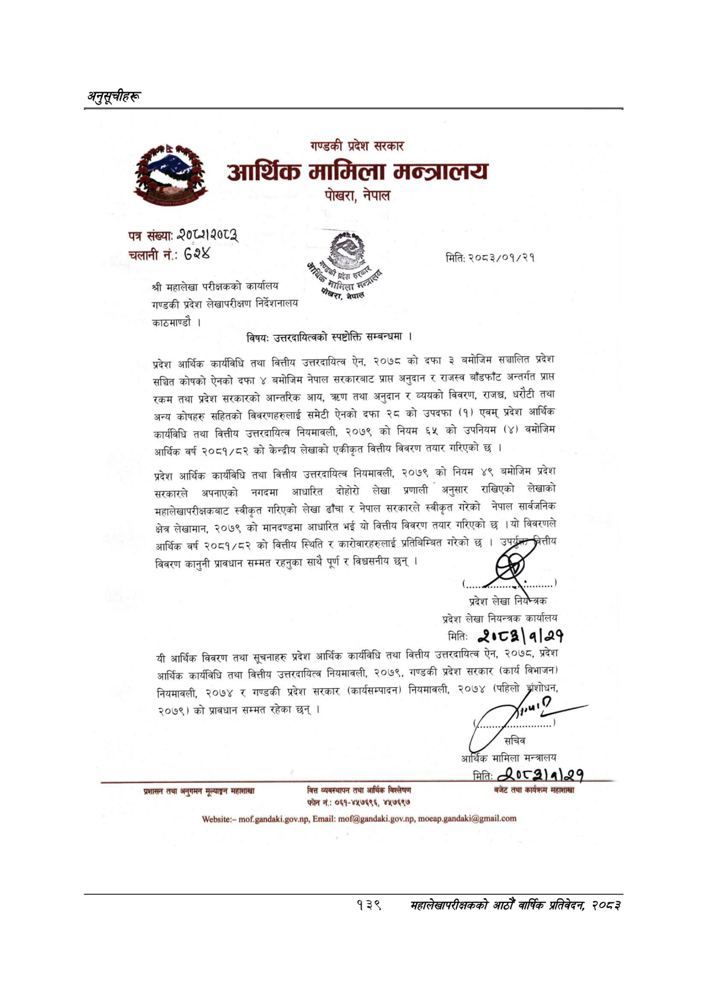

# Page 169 QA

## Rendered page


## Extracted text

```text
अनुदूचीहरू
२
हु
गण्डकी प्रदेश सरकार
आर्शिक मामिला मन्त्रालय
पोखरा, नेपाल
पत्र संख्याः
०१२१२००३
चलानी नं.:
६
श्री महालेखा परीक्षकको कार्यालय शाण्डकी प्रदेश लेखापरीक्षण निर्देशनालय काठमाण्डौ |
रि
९
प्रदेश
सर्छ
क्षटरनिका
२
विषय:
उत्तरदायित्वको स्पष्टोक्ति सम्बन्धमा |
प्रदेश आर्थिक कार्यविधि तथा वित्तीय उत्तरदायित्व ऐन, २०७८ को दफा ३ बमोजिम सञ्चालित प्रदेश सञ्चित कोषको ऐनको दफा ४ बमोजिम नेपाल सरकारबाट प्राप्त अनुदान र राजस्व बाँडफाँट अन्तर्गत प्रास रकम तथा प्रदेश सरकारको आन्तरिक आय, त्ररण तथा अनुदान र व्ययको विवरण, ९, धरौटी तथा अन्य कोषहरु सहितको विवरणहरुलाई समेटी ऐनको दफा २८ को उपदफा (१) एवम्‌ प्रदेश आर्थिक कार्यविधि तथा वित्तीय उत्तरदायित्व नियमावली, २०७९ को नियम ६५ को उपनियम (४) वमोजिम आर्थिक वर्ष २०८१/८२ को केन्द्रीय लेखाको एकीकृत वित्तीय विवरण तयार गरिएको छ।
प्रदेश आर्थिक कार्यविधि तथा वित्तीय उत्तरदायित्व नियमावली, २०७९ को नियम ४९ बमोजिम प्रदेश सरकारले अपनाएको नगदमा आधारित दोहोरो लेखा प्रणाली _ अनुसार राखिएको लेखाको महालेखापरीक्षकबाट स्वीकृत गरिएको लेखा ढाँचा र नेपाल सरकारले स्वीकृत गरेको नेपाल सार्वजनिक क्षेत्र लेखामान, २०७९ को मानदण्डमा आधारित भई यो वित्तीय विवरण तयार गरिएको छ। यो विवरणले आर्थिक वर्ष २०८१/८२ को वित्तीय स्थिति र कारोवारहरुलाई प्रतिविम्बित गरेको छ शा बिवरण कानुनी प्रावधान सम्मत रहनुका साथै पूर्ण र विश्वसनीय छन्‌। प्रदेश लेखा
प्रदेश लेखा नियन्त्रक कार्यालय
मितिः
«१०८२ १|२१
यी आर्थिक विवरण तथा सूचनाहरु प्रदेश आर्थिक कार्यविधि तथा वित्तीय उत्तरदायित्व ऐन, २०७८, प्रदेश आर्थिक कार्यविधि तथा वित्तीय उत्तरदायित्व नियमावली, २०७९, गण्डकी प्रदेश सरकार (कार्य विभाजन) नियमावली, २०७४ र गण्डकी प्रदेश सरकार (कार्यसम्पादन) नियमावली, २०७४ (पहिलो अ्ंशोधन, २०७९) को प्रावधान सम्मत रहेका छन्‌।
प्रशासन तथा अनुगमन मूल्याङ्न महाशाखा
वित्त व्यवस्थापन तथा आर्थिक विश्तेषण फोने नं.: ०६१-४४७६९६, ४५७६९७
बजेट तथा कार्यक्रम महाशाखा
मिति: २०८३/०१/२१
१३९
मृहालेखापरीक्षकको प्रतिवेदन २०८२
```

## Flags
- None
