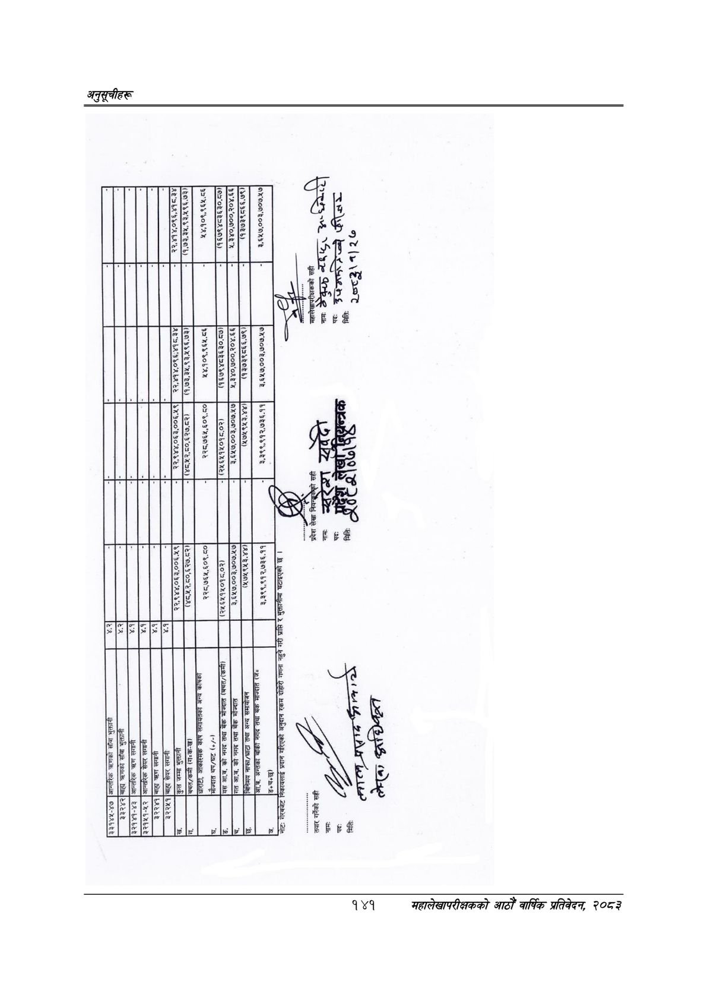

# Page 171 QA

## Rendered page


## Extracted text

```text
३२२५१
बैडे१४४-४७
[ुभान्तरिक
जलको
सं
भुक्तानी
दुलालले
बै
२४
हि
आन्तरिक
ब्लग
लामा;
ता
लि
जिला
सिजनल
लिना
[छि
न्लच्ललाक
३३,९४४,०६३,००६.५९
२२,१४४,०६३,००६.४९|
रर,भवणठ्दकखब््णा
गु
२े२७१४०६६,४१८-३४
(४८.१२.८०,६२७.८२।
तथ
२,००,६२७.८२ा
१,७३,३५,९३,५९६.७३।
जु
ल.७३,३५,९३,५९६.७३)
२२८,७६५,६०९.८०
२२८,७६५,६०९.८०|
४४,१०९,९६५.८६
५४,१०९,९६५.८६
[मौज्दात
थप/घट
यस
आ.व.
को
नगद
तथा
बैंक
म
(बचत,
(२५६५१५०१८.०२।
(२५६५१४५०१८.०२)
१६७९४८३६३०.८७)|
(१६७९४८३६३०.८७।|
र
डरै
शव
३
छ
शर
४
छ|
३,६१७.००३,७०७.५७
३,६४५७,००३,७०७.५७]
१,३४०,७००,२०४.६६
५,३४०,७००,२०४.६६
छो
री
प्राप्ति
र
भुक्तानीमा
घटाइएको
छ
(१३७३९८६६.७९)
नोटः
निकायलाई
प्रदान
गरिएको
अनुदान
रकम
दोहोरी
गणना
९
नामः
नामः
५
“४७
पद:
टा
पदः
पदः
कररो)पन्यै
फिर
नत
उ
मितिः
क
६७
मितिः
चै
ल्लाव्न्‌
२७८३५१]
२७
२०% अक ७६४७ [
```

## Flags
- None
