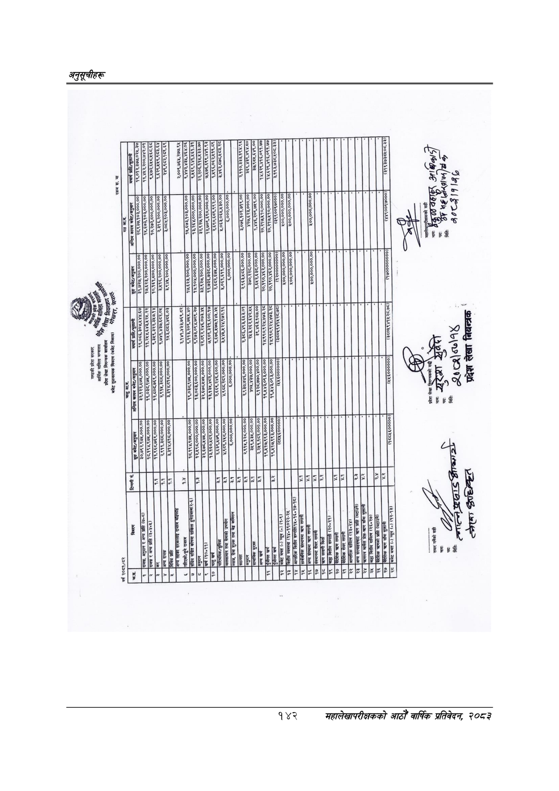

# Page 172 QA

## Rendered page


## Extracted text

```text
८५५४
८२०९ २२८४ ( %/४७०/७७७/७४

| १,९६८७६९,०००.००] २,२११,३८६.०००.००&#124; २,९१५,३८ब,०००.००] इ,३१४,८१८०००.००।&#124; 3.31¥,615,000,00 R G e २११०,३बेब,बर ९] S NG [T atsewseed] T ०2 AR I 1 ISR LA B %60,000,000,00)] इद्इ३,४८६,०००.००&#124; इ७०,२३८,०००.००&#124; i & 21: , छै W a2 है मश्ट्य]१।न५   |
|-----------------------------------------------------------------------------------------------------------------------------------------------------------------------------------------------------------------------------------------------------------------|
```

## Flags
- table_page
- medium_quality_table
