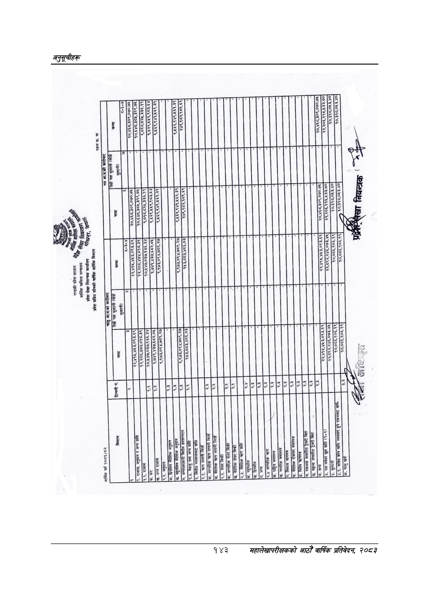

# Page 173 QA

## Rendered page


## Extracted text

```text
गण्डकी
प्रदेश
सरकार
४)
आर्थिक
मामिला
मन्त्रालय
लेखा
नियन्त्रण
प्रदेश
लेखा
नियन्त्रक
कार्यालय
कखरा,
प्रदेश
संचित
कोषको
वार्षिक
आर्थिक
विवरण
२
आर्थिक
वर्ष
२०८१/८२
रकम
रू.
मा
तेस्रो
पक्ष
भु
करका
-२-
तेस्रो
पक्ष
भु
करका:
क”
न.
सट
अनुदान
र
अन्य
गा
ना
पसामरााकाररकाा
२१५२७२
ब०,१४७,०३७.१३६.३४
ज्याक:
०,४४७,०३७,१३६.३४|
९,०१८८२५,३३६.११
हु
९,०१८.८२५,३३६.११
१
५५
५२
न
छि
चि.
ब्याजमा
आधारित
टर
[--ाा
जाना
१
ललल
छा
मम
मि
२२०५
४
इठश्बृदबठर०उ०उर
मि
२२:२७
२७
छा
इइठब
१,
रइ३उ०
२५५३
छ
नमम
मि
बढाउन
छा
१
१११७
६५७
८२०८ २२८४ ४७०९ [ २२४%८२००/७२/२४
```

## Flags
- None
