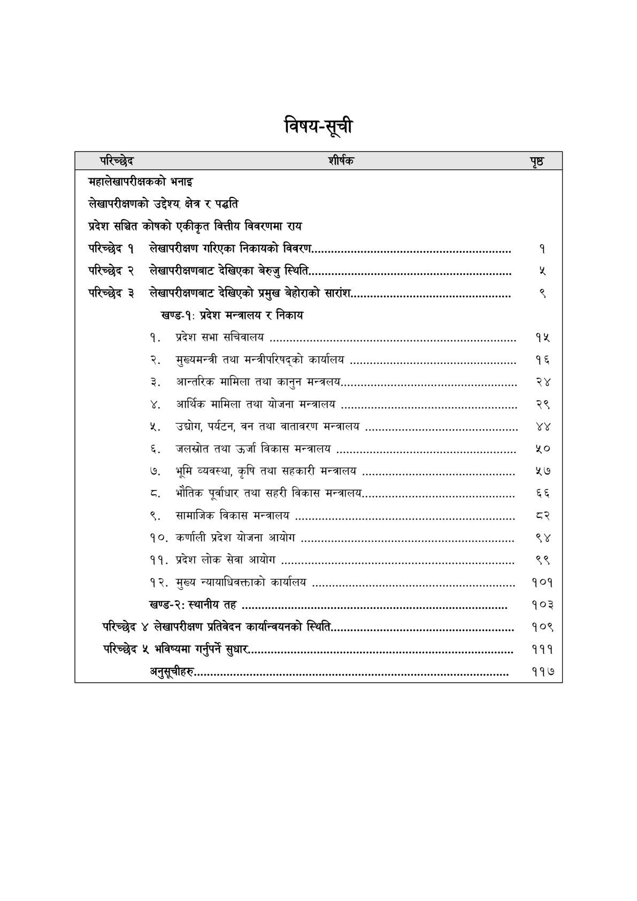

# Page 7 QA

## Rendered page


## Extracted text

```text
विषय-सूची

| परिच्छेद शीर्षक                                                                                            | पृष्ठ    |
|------------------------------------------------------------------------------------------------------------|----------|
| महालेखापरीक्षकको भनाइ                                                                                      |          |
| एकीकृत वित्तीय विवरणमा राय                                                                                 |          |
| परिच्छेद १ लेखापरीक्षण गरिएका निकायको विवरण................................,444-47777777774777777775       | १        |
| परिच्छेद २ लेखापरीक्षणबाट देखिएका बेरुजु स्थिति..............                                              | प्र      |
| परिच्छेद ३ लेखापरीक्षणबाट देखिएको प्रमुख बेहोराको सारांश..................................7.771777777777   | ९        |
| खण्ड-१: प्रदेश मन्त्रालय र निकाय                                                                           |          |
| १. प्रदेश सभा सचिवालय .................... 4. न नन कननकननननमनममननममनमत                                     | १५       |
| २. मुख्यमन्त्री तथा मन्त्रीपरिषद्को कार्यालय ...............,..4,, नन, पपन पनन                             | १६       |
| ३. आन्तरिक मामिला तथा कानुन मन्त्रलय..........................नन44,,नन44421नन ककन कककन                     | २४       |
| ४. आर्थिक मामिला तथा योजना मन्त्रालय ....................न 44, नन                                          | neees २९ |
| ४. उद्योग, पर्यटन, वन तथा वातावरण मन्त्रालय OO                                                             | XY       |
| ६. जलस्रोत तथा उर्जा विकास मन्त्रालय ©.oocvoererereneeseceesesesensesessesessesessnens                     | ५०       |
| ७. भूमि व्यवस्था, कृषि तथा सहकारी मन्त्रालय ..................44.,नन444447न41कगकककककन                      | ५७       |
| ८. भौतिक पूर्वाधार तथा सहरी विकास Ao                                                                       | ६६       |
| ९. सामाजिक विकास मन्त्रालय ............... 4. नन ककन                                                       | et =]    |
| १०. कर्णाली प्रदेश योजना आयोग .................. 4.4, नन नपन नकम                                           | ९४       |
| ११. प्रदेश लोक सेवा आयोग Lot                                                                               | ९९       |
| १२. मुख्य न्यायाधिवक्ताको कार्यालय OO RON                                                                  | १०१      |
| खण्ड-२: स्थानीय तह ....................444444ननन क ननकपनननमममननमममनमममपमममतममममगबनन                        | १०३      |
| परिच्छेद ४ लेखापरीक्षण प्रतिवेदन कार्यान्वयनको ..o                                                         | १०९      |
| परिच्छेद ५ भविष्यमा गर्नुपर्ने सुधार..................................,,,4444,त लक ककममममममममलततमममममममगना | १११      |
| अनुसूचीहरु.............................44444444 नपन ननननननननमममममममनमगनगमगनलतललनलललगगाा                    | ११७      |
```

## Flags
- table_page
