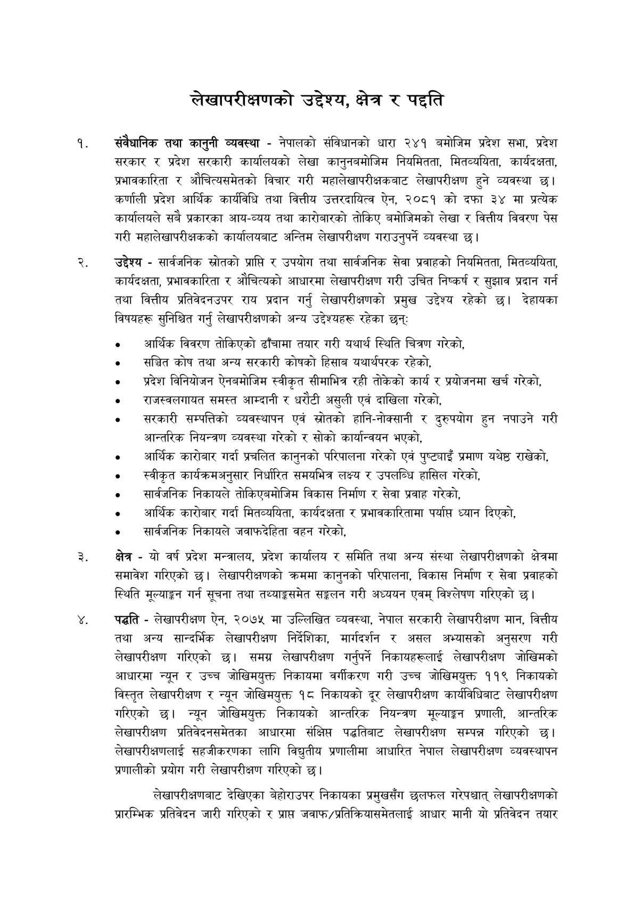

# Page 11 QA

## Rendered page


## Extracted text

```text
लेखापरीक्षणको उद्देश्य, क्षेत्र र पद्दति
संवैधानिक तथा कानुनी व्यवस्था -नेपालको संविधानको धारा २४१ बमोजिम प्रदेश सभा, प्रदेश सरकार र प्रदेश सरकारी कार्यालयको लेखा कानुनबमोजिम नियमितता, मितव्ययिता, कार्यदक्षता, प्रभावकारिता र औचित्यसमेतको विचार गरी महालेखापरीक्षकबाट लेखापरीक्षण हुने व्यवस्था छ। कर्णाली प्रदेश आर्थिक कार्यविधि तथा वित्तीय उत्तरदायित्व ऐन, २०८१ को दफा ३४ मा प्रत्येक कार्यालयले सबै प्रकारका आय-व्यय तथा कारोबारको तोकिए बमोजिमको लेखा र वित्तीय विवरण पेस गरी महालेखापरीक्षकको कार्यालयबाट अन्तिम लेखापरीक्षण गराउनुपर्ने व्यवस्था छु।
उद्देश्य -सार्वजनिक स्रोतको प्राप्ति र उपयोग तथा सार्वजनिक सेवा प्रवाहको नियमितता, मितव्ययिता, कार्यदक्षता, प्रभावकारिता र औचित्यको आधारमा लेखापरीक्षण गरी उचित निष्कर्ष र सुझाव प्रदान गर्न तथा वित्तीय प्रतिवेदनउपर राय प्रदान गर्नु लेखापरीक्षणको प्रमुख उद्देश्य रहेको छ। देहायका विषयहरू सुनिश्चित गर्नु लेखापरीक्षणको अन्य उद्देश्यहरू रहेका छन्‌ः
आर्थिक विवरण तोकिएको ढाँचामा तयार गरी यथार्थ स्थिति चित्रण गरेको,
संञ्चित कोष तथा अन्य सरकारी कोषको हिसाब यथार्थपरक रहेको,
प्रदेश विनियोजन ऐनबमोजिम स्वीकृत सीमाभित्र रही तोकेको कार्य र प्रयोजनमा खर्च गरेको,
० राजस्वलगायत समस्त आम्दानी र धरौटी असुली एवं दाखिला गरेको,
सरकारी सम्पत्तिको व्यवस्थापन एवं स्रोतको हानि-नोक्सानी र दुरुपयोग हुन नपाउने गरी आन्तरिक नियन्त्रण व्यवस्था गरेको र सोको कार्यान्वयन भएको,
० आर्थिक कारोबार गर्दा प्रचलित कानुनको परिपालना गरेको एवं पुष्ट्याइँ प्रमाण यथेष्ठ राखेको,
० स्वीकृत कार्यक्रमअनुसार निर्धारित समयभित्र लक्ष्य र उपलब्धि हासिल गरेको,
० सार्वजनिक निकायले तोकिएबमोजिम विकास निर्माण र सेवा प्रवाह गरेको,
आर्थिक कारोबार गर्दा मितव्ययिता, कार्यदक्षता र प्रभावकारितामा पर्याप्त ध्यान दिएको,
० सार्वजनिक निकायले जवाफदेहिता वहन गरेको,
क्षेत्र -यो वर्ष प्रदेश मन्त्रालय, प्रदेश कार्यालय र समिति तथा अन्य संस्था लेखापरीक्षणको क्षेत्रमा समावेश गरिएको छ। लेखापरीक्षणको क्रममा कानुनको परिपालना, विकास निर्माण र सेवा प्रवाहको स्थिति मूल्याङ्कन गर्न सूचना तथा तथ्याङ्कसमेत सङ्कलन गरी अध्ययन एवम्‌ विश्लेषण गरिएको |
पद्धति -लेखापरीक्षण ऐन, २०७५ मा उल्लिखित व्यवस्था, नेपाल सरकारी लेखापरीक्षण मान, वित्तीय तथा अन्य सान्दर्भिक लेखापरीक्षण निर्देशिका, मार्गदर्शन र असल अभ्यासको अनुसरण गरी लेखापरीक्षण गरिएको छ। समग्र लेखापरीक्षण गर्नुपर्ने निकायहरूलाई लेखापरीक्षण जोखिमको आधारमा न्यून र उच्च जोखिमयुक्त निकायमा वर्गीकरण गरी उच्च जोखिमयुक्त ११९ निकायको विस्तृत लेखापरीक्षण र न्यून जोखिमयुक्त १८ निकायको दूर लेखापरीक्षण कार्यविधिबाट लेखापरीक्षण गरिएको छ। न्यून जोखिमयुक्त निकायको आन्तरिक नियन्त्रण मूल्याङ्कन प्रणाली, आन्तरिक लेखापरीक्षण प्रतिवेदनसमेतका आधारमा संक्षिप्त पद्धतिबाट लेखापरीक्षण सम्पन्न गरिएको छ। लेखापरीक्षणलाई सहजीकरणका लागि विद्युतीय प्रणालीमा आधारित नेपाल लेखापरीक्षण व्यवस्थापन प्रणालीको प्रयोग गरी लेखापरीक्षण गरिएको छ।
लेखापरीक्षणबाट देखिएका बेहोराउपर निकायका प्रमुखसँग छलफल गरेपश्चात्‌ लेखापरीक्षणको प्रारम्भिक प्रतिवेदन जारी गरिएको र प्राप्त जवाफ/प्रतिक्रियासमेतलाई आधार मानी यो प्रतिवेदन तयार
```

## Flags
- None
