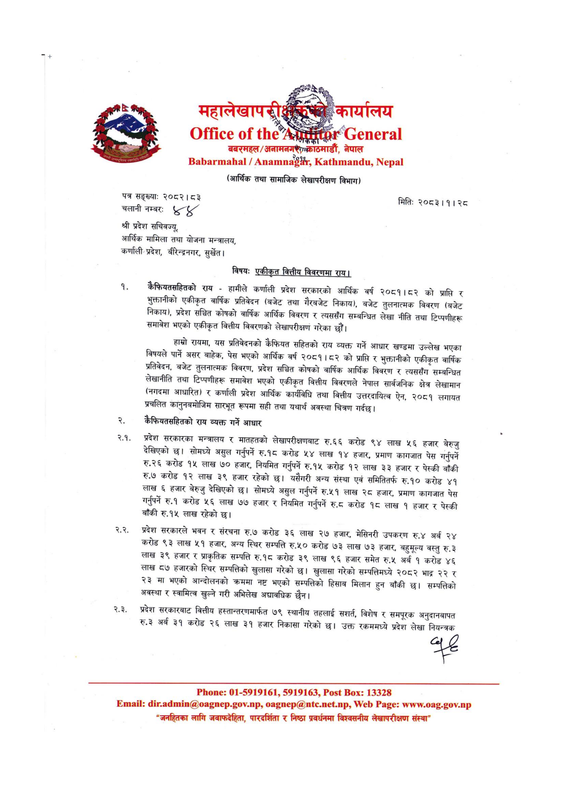

# Page 13 QA

## Rendered page


## Extracted text

```text
(आर्थिक तथा सामाजिक लेखापरीक्षण विभाग)
पत्र सङ्ख्या:
२०८२। ८३
चलानी नम्बर: श्री प्रदेश सचिवज्यु, आर्थिक मामिला तथा योजना मन्त्रालय, कर्णाली-प्रदेश, बीरेन्द्रनगर, सुर्खेत।
विषय:
एकीकृत वित्तीय विवरणमा राय।
कैफियतसहितको राय -हामीले कर्णाली प्रदेश सरकारको आर्थिक वर्ष २०८१।८२ को प्राप्ति र भुक्तानीको एकीकृत वार्षिक प्रतिवेदन (बजेट तथा गैरबजेट निकाय), बजेट तुलनात्मक विवरण (बजेट निकाय), प्रदेश सञ्चित कोषको वार्षिक आर्थिक विवरण र त्यससँग सम्बन्धित लेखा नीति तथा टिप्पणीहरू समावेश भएको एकीकृत वित्तीय विवरणको लेखापरीक्षण गरेका छौं।
हाम्रो रायमा, यस प्रतिवेदनको कैफियत सहितको राय व्यक्त गर्ने आधार खण्डमा उल्लेख भएका विषयले पार्ने असर बाहेक, पेस भएको आर्थिक वर्ष २०८१।८२ को प्राप्ति र भुक्तानीको एकीकृत वार्षिक प्रतिवेदन, बजेट तुलनात्मक विवरण, प्रदेश सञ्चित कोषको वार्षिक आर्थिक विवरण र त्यससँग सम्बन्धित लेखानीति तथा टिप्पणीहरू समावेश भएको एकीकृत वित्तीय विवरणले नेपाल सार्वजनिक क्षेत्र लेखामान (नगदमा आधारित) र कर्णाली प्रदेश आर्थिक कार्यविधि तथा वित्तीय उत्तरदायित्व ऐन, २०८१ लगायत प्रचलित कानुनबमोजिम सारभूत रूपमा सही तथा यथार्थ अवस्था चित्रण गर्दछ |
कैफियतसहितको राय व्यक्त गर्ने आधार
% प्रदेश सरकारका मन्त्रालय र मातहतको लेखापरीक्षणबाट रु.६६ करोड ९४ लाख ५ ६ हजार बेरुजु देखिएको छ। सोमध्ये असुल गर्नुपर्ने रु.१८ करोड ५४ लाख १४ हजार, प्रमाण कागजात पेस गर्नुपर्ने रु.२६ करोड १५ लाख ७० हजार, नियमित गर्नुपर्ने रु.१५ करोड १२ लाख ३३ हजार र पेस्की बाँकी रु.७ करोड १२ लाख ३९ हजार रहेको छ। यसैगरी अन्य संस्था एवं समितितर्फ रु.१० करोड ४१ लाख ६ हजार बेरुजु देखिएको छु। सोमध्ये असुल गर्नुपर्ने रु.५१ लाख २८ हजार, प्रमाण कागजात पेस गर्नुपर्ने रु.१ करोड ५६ लाख ७७ हजार र नियमित गर्नुपर्ने रुट करोड १८ लाख १ हजार र पेस्की बाँकी रु.१५ लाख रहेको
कक प्रदेश सरकारले भवन र संरचना रु.७ करोड ३६ लाख २७ हजार, मेसिनरी उपकरण रु.४ अर्ब २४ करोड ९३ लाख ५१ हजार, अन्य स्थिर सम्पत्ति रु.५० करोड ७३ लाख ७३ हजार, बहुमूल्य वस्तु रु.३ लाख ३९ हजार र प्राकृतिक सम्पत्ति रु.१८ करोड ३९ लाख ९६ हजार समेत रु.५ अर्ब १ करोड ४६ 'लाख ८७ हजारको स्थिर सम्पत्तिको खुलासा गरेको छ। खुलासा गरेको सम्पत्तिमध्ये २०८२ भाद्र २२ र २३ मा भएको आन्दोलनको क्रममा नष्ट भएको सम्पत्तिको हिसाब मिलान हुन बाँकी छ। सम्पत्तिको अवस्था र स्वामित्व खुल्ने गरी अभिलेख अद्यावधिक छैन।
०३, प्रदेश सरकारबाट वित्तीय हस्तान्तरणमार्फत ७९ स्थानीय तहलाई सशर्त, विशेष र समपूरक अनुदानबापत रु.३ अर्ब ३१ करोड २६ लाख ३१ हजार निकासा गरेको छ। उक्त रकममध्ये प्रदेश लेखा नियन्त्रक
मितिः
२०८३।१। २८
: ..., .., : ... : ०१-५९१९१६१, ५९१९१६३, : १३३२८
```

## Flags
- None
