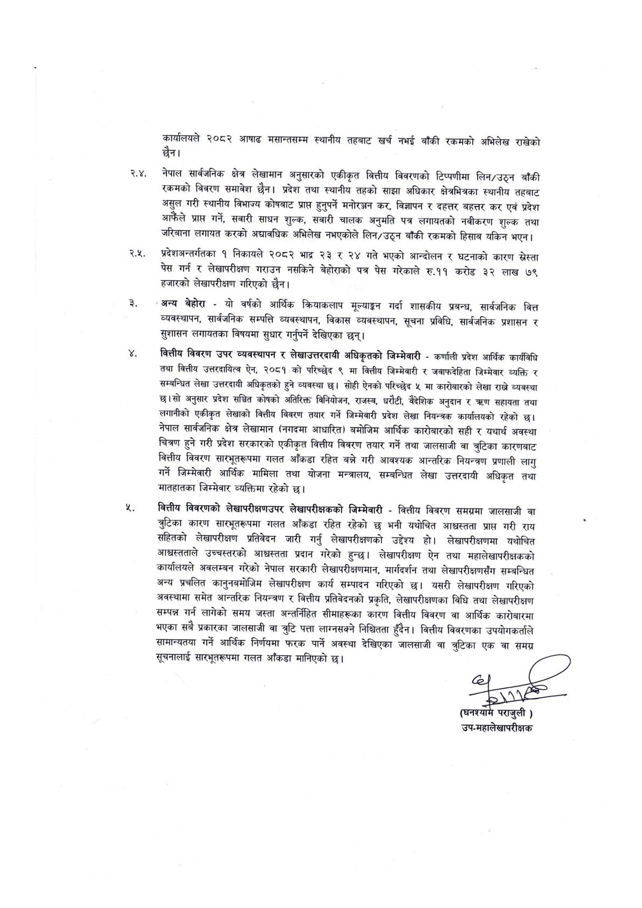

# Page 14 QA

## Rendered page


## Extracted text

```text
कार्यालयले २०८२ आषाढ मसान्तसम्म स्थानीय तहबाट खर्च नभई बाँकी रकमको अभिलेख राखेको छैन।
२.४, नेपाल सार्वजनिक क्षेत्र लेखामान अनुसारको एकीकृत वित्तीय विवरणको टिप्पणीमा लिन/उठ्न बाँकी रकमको विवरण समावेश छैन। प्रदेश तथा स्थानीय तहको साझा अधिकार क्षेत्रभित्रका स्थानीय तहबाट असुल गरी स्थानीय विभाज्य कोषबाट प्राप्त हुनुपर्ने मनोरञ्जन कर, विज्ञापन र दहत्तर बहत्तर कर एवं प्रदेश आफैंले प्राप्त गर्ने, सवारी साधन शुल्क, सवारी चालक अनुमति पत्र लगायतको नवीकरण शुल्क तथा जरिबाना लगायत करको अद्यावधिक अभिलेख नभएकोले लिन/उठ्न बाँकी रकमको हिसाब यकिन भएन।
२०४५ प्रदेशअन्तर्गतका १ निकायले २०८२ भाद्र २३ र २४ गते भएको आन्दोलन र घटनाको कारण सस्ता पेस गर्न र लेखापरीक्षण गराउन नसकिने बेहोराको पत्र पेस गरेकाले रु.११ करोड ३२ लाख ७९ हजारको लेखापरीक्षण गरिएको छैन।
अन्य बेहोरा -यो वर्षको आर्थिक क्रियाकलाप मूल्याङ्कन गर्दा शासकीय प्रबन्ध, सार्वजनिक वित्त व्यवस्थापन, सार्वजनिक सम्पत्ति व्यवस्थापन, विकास व्यवस्थापन, सूचना प्रविधि, सार्वजनिक प्रशासन र सुशासन लगायतका विषयमा सुधार गर्नुपर्ने देखिएका छन्‌।
वित्तीय विवरण उपर व्यवस्थापन र लेखाउत्तरदायी अधिकृतको जिम्मेवारी -कर्णाली प्रदेश आर्थिक कार्यविधि तथा वित्तीय उत्तरदायित्व ऐन, २०८१ को परिच्छेद ९ मा वित्तीय जिम्मेवारी र जवाफदेहिता जिम्मेवार व्यक्ति र्‌ सम्बन्धित लेखा उत्तरदायी अधिकृतको हुने व्यवस्था छ। सोही ऐनको परिच्छेद ५ मा कारोबारको लेखा राख्ने व्यवस्था छ।सो अनुसार प्रदेश सञ्चित कोषको अतिरिक्त विनियोजन, राजस्व, धरौटी, बैदेशिक अनुदान र त्रण सहायता तथा लगानीको एकीकृत लेखाको वित्तीय विवरण तयार गर्ने जिम्मेवारी प्रदेश लेखा नियन्त्रक कार्यालयको रहेको छ। नेपाल सार्वजनिक क्षेत्र लेखामान (नगदमा आधारित) बमोजिम आर्थिक कारोबारको सही र यथार्थ अवस्था चित्रण हुने गरी प्रदेश सरकारको एकीकृत वित्तीय विवरण तयार गर्ने तथा जालसाजी वा त्रुटिका कारणबाट बित्तीय विवरण सारभूतरूपमा गलत आँकडा रहित बन्ने गरी आवश्यक आन्तरिक नियन्त्रण प्रणाली लागु गर्ने जिम्मेवारी आर्थिक मामिला तथा योजना मन्त्रालय, सम्बन्धित लेखा उत्तरदायी अधिकृत तथा मातहातका जिम्मेवार व्यक्तिमा रहेको |
बित्तीय विवरणको लेखापरीक्षणउपर लेखापरीक्षकको जिम्मेवारी -वित्तीय विवरण समग्रमा जालसाजी वा कारण सारभूतरूपमा गलत आँकडा रहित रहेको छ भनी यथोचित आशध्चस्तता प्राप्त गरी राय सहितको लेखापरीक्षण प्रतिवेदन जारी गर्नु लेखापरीक्षणको उद्देश्य हो। लेखापरीक्षणमा यथोचित आध्चस्तताले उच्चस्तरको आध्चस्तता प्रदान गरेको हुन्छ। लेखापरीक्षण ऐन तथा महालेखापरीक्षकको कार्यालयले अवलम्बन गरेको नेपाल सरकारी लेखापरीक्षणमान, मार्गदर्शन तथा लेखापरीक्षणसँग सम्बन्धित अन्य प्रचलित कानुनबमोजिम लेखापरीक्षण कार्य सम्पादन गरिएको छ। यसरी लेखापरीक्षण गरिएको अवस्थामा समेत आन्तरिक नियन्त्रण र वित्तीय प्रतिवेदनको प्रकृति, लेखापरीक्षणका विधि तथा लेखापरीक्षण सम्पन्न गर्न लागेको समय जस्ता अन्तर्निहित सीमाहरूका कारण वित्तीय विवरण वा आर्थिक कारोबारमा भएका सबै प्रकारका जालसाजी वा त्रुटि पत्ता लाग्नसक्ने निश्चितता हुँदैन। वित्तीय विवरणका उपयोगकर्ताले सामान्यतया गर्ने आर्थिक निर्णयमा फरक पार्ने अवस्था देखिएका जालसाजी वा ज्रुटिका एक वा समग्र सूचनालाई सारभूतरूपमा गलत आँकडा मानिएको |
खुल्छ
) उप-महालेखापरीक्षक
```

## Flags
- None
