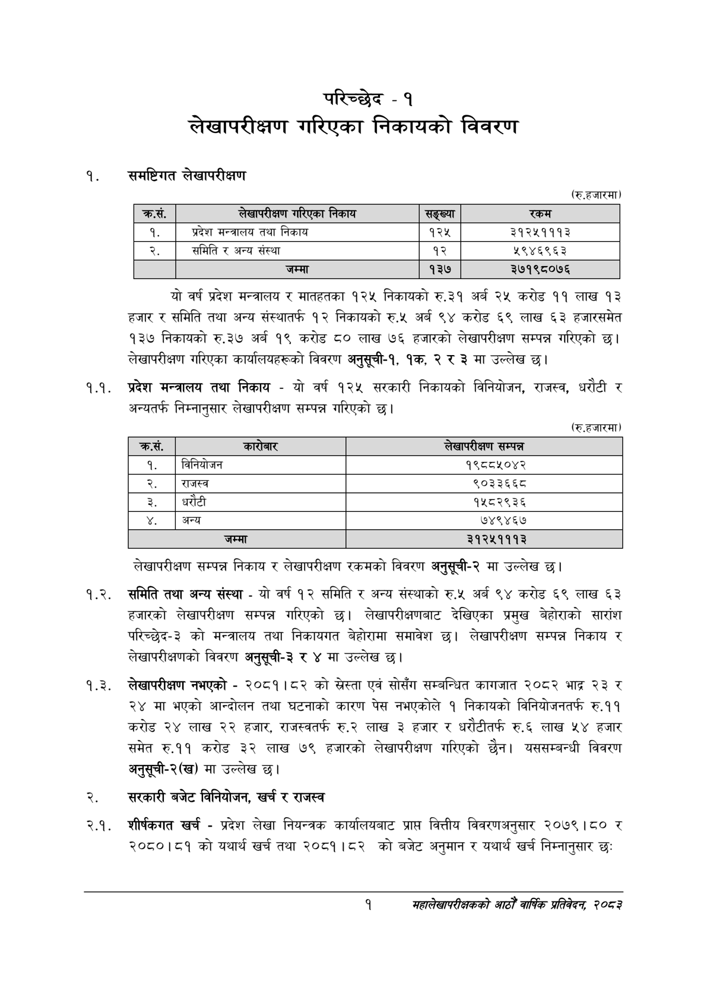

# Page 17 QA

## Rendered page


## Extracted text

```text
परिच्छेद -१ लेखापरीक्षण गरिएका निकायको विवरण
समष्टिगत लेखापरीक्षण
(रु.हजारमा)
यो वर्ष प्रदेश मन्त्रालय र मातहतका १२५ निकायको रु.३१ अर्ब २५ करोड ११ लाख १३ हजार र समिति तथा अन्य संस्थातर्फ १२ निकायको रु.५ अर्ब ९४ करोड ६९ लाख ६३ हजारसमेत १३७ निकायको रु.३७ अर्ब १९ करोड ८० लाख ७६ हजारको लेखापरीक्षण सम्पन्न गरिएको छ। लेखापरीक्षण गरिएका कार्यालयहरूको विवरण अनुस्ची-१, १क, २ र ३ मा उल्लेख छ।
१.१. प्रदेश मन्त्रालय तथा निकाय -यो वर्ष १२५ सरकारी निकायको विनियोजन, राजस्व, धरौटी र अन्यतर्फ निम्नानुसार लेखापरीक्षण सम्पन्न गरिएको छ।
(रु.हजारमा)
लेखापरीक्षण सम्पन्न निकाय र लेखापरीक्षण रकमको विवरण अनुसूची-२ मा उल्लेख |
१.२. समिति तथा अन्य संस्था -यो वर्ष १२ समिति र अन्य संस्थाको रु.५ अर्ब ९४ करोड ६९ लाख ६३ हजारको लेखापरीक्षण सम्पन्न गरिएको छ। लेखापरीक्षणबाट देखिएका प्रमुख बेहोराको सारांश परिच्छेद-३ को मन्त्रालय तथा निकायगत बेहोरामा समावेश छ। लेखापरीक्षण सम्पन्न निकाय लेखापरीक्षणको विवरण अनुसूची-३ र ४ मा उल्लेख छ।
१.३. लेखापरीक्षण नभएको -२०८१।८२ को स्रेस्ता एवं सोसँग सम्बन्धित कागजात २०८२ भाद्र २३ र २४ मा भएको आन्दोलन तथा घटनाको कारण पेस नभएकोले १ निकायको विनियोजनतर्फ रु.११ करोड २४ लाख २२ हजार, राजस्वतर्फ रु.२ लाख ३ हजार र धरौटीतर्फ रु.६ लाख ५४ हजार समेत रु.११ करोड ३२ लाख ७९ हजारको लेखापरीक्षण गरिएको छैन। यससम्बन्धी विवरण अनुसूची-२(ख) मा उल्लेख छ।
सरकारी बजेट विनियोजन, खर्च र राजस्व
शीर्षकगत खर्च -प्रदेश लेखा नियन्त्रक कार्यालयबाट प्राप्त वित्तीय विवरणअनुसार २०७९।८० र २०८०।८१ को यथार्थ खर्च तया २०८१।८२ को बजेट अनुमान र यथार्थ खर्च निम्नानुसार छः
१
सहालेखापरीक्षकको आठौँ वाषिक प्रतिवेदन २०८२

| क्रस. | लेखापरीक्षण निकाय | सङ्ख्या | रकम |
| --- | --- | --- | --- |
| १. | प्रदेश मन्त्रालय तथा निकाय | १२५ | ३१२५१११३ |
| २. | समिति र अन्य संस्था | १२ | ५९४६९६३ |
|  | जम्मा | १३७ | ३७१९८०७६ |

| क्रस. | रि | लेखापरीक्षण सम्पन्न |
| --- | --- | --- |
| १ | बिनिबोजन | १९८८४१०४२ |
| २ | राजस्व | ९०३३६६८ |
| ३ | धरौटी | १५८२९३६ |
| ४ | अन्य | ७४९४६७ |
| ५ | जम्मा | ३१२५१११३ |
```

## Flags
- table_page
- medium_quality_table
