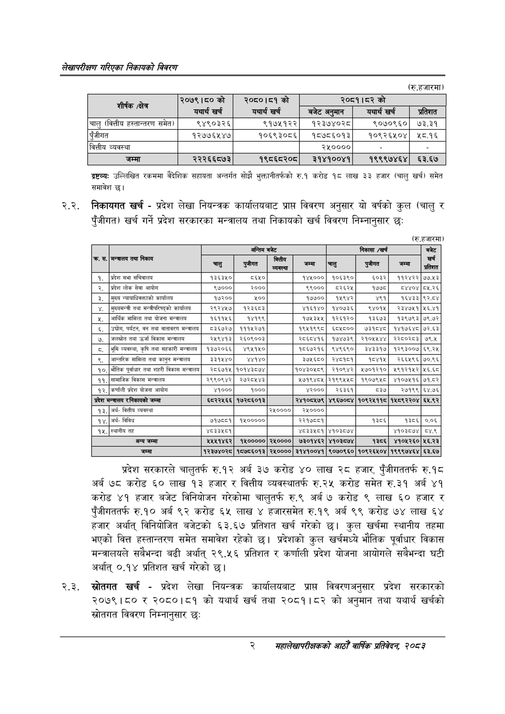

# Page 18 QA

## Rendered page


## Extracted text

```text
लेखापरीक्षण गरिएका निकायको बिवरण
(रु.हजारमा)
द्रष्टव्यः उल्लिखित रकममा वैदेशिक सहायता अन्तर्गत सोझै भुक्तानीतर्फको रु.१ करोड १८ लाख ३३ हजार (चालु खर्च) समेत समावेश |
२.२. निकायगत खर्च -प्रदेश लेखा नियन्त्रक कार्यालयबाट प्राप्त विवरण अनुसार यो वर्षको कुल (चालु र पुँजीगत) खर्च गर्ने प्रदेश सरकारका मन्त्रालय तथा निकायको खर्च विवरण निम्नानुसार छः
(रु.हजारमा)
प्रदेश सरकारले चालुतर्फ रु.१२ अर्ब ३७ करोड ४० लाख २८ हजार, पुँजीगततर्फ रु.१८ अर्ब ७८ करोड ६० लाख १३ हजार र वित्तीय व्यवस्थातर्फ रु.२५ करोड समेत रु.३१ अर्ब ४१ करोड ४१ हजार बजेट विनियोजन गरेकोमा चालुतर्फ रु.९ अर्ब ७ करोड ९ लाख ६० हजार र पुँजीगततर्फ रु.१० अर्ब ९२ करोड ६५ लाख हजारसमेत रु.१९ अर्ब ९९ करोड ७४ लाख ६४ हजार अर्थात्‌ विनियोजित बजेटको ६३. ६७ प्रतिशत खर्च गरेको छ। कुल खर्चमा स्थानीय तहमा भएको वित्त हस्तान्तरण समेत समावेश रहेको छ। प्रदेशको कुल खर्चमध्ये भौतिक पूर्वाधार विकास मन्त्रालयले सबैभन्दा बढी अर्थात्‌ २९.४५६ प्रतिशत र कर्णाली प्रदेश योजना आयोगले सबैभन्दा घटी अर्थात्‌ ०.१४ प्रतिशत खर्च गरेको छ।
२.३. खस्रोतगत खर्च -प्रदेश लेखा नियन्त्रक कार्यालयबाट प्राप्त विवरणअनुसार प्रदेश सरकारको २०७९।८० र २०८०।८१ को यथार्थ खर्च तथा २०८१।८२ को अनुमान तथा यथार्थ खर्चको स्रोतगत विवरण निम्नानुसार छः
२
सहालेखापरीक्षकको आठौँ वार्षिकि प्रतिवेदन २०८२

| शीर्षक (क्षेत्र | २०७९।८०को | २०८०।८१को |  | २०८१।५२को |  |
| --- | --- | --- | --- | --- | --- |
|  | यथार्थ खर्च | यथार्थ खर्च | 'बजेट अनुमान | यथार्थ खर्च | प्रतिशत |
| चालु (वित्तीय ह«्तानतर५ समेत) | ९४९०३२६ | ९१७५१२२ | १२३७४०२८ | ९०७०९६० | ७३.३१ |
| पुँजीगत | १२७७६५४७ | १०६९३०८६ | १८७८६०१३ | १०९२६५०४ | ४५८.१६ |
| वित्तीय व्यवस्था |  |  | २५०००० |  |  |
| जम्मा | २२२६६८७३ | १९८६८२०८ | ३१४१००४१ | १९९९७४६४ | ६३.६७ |

|  |  |  | अन्तिम | बजेट |  |  | निकासा /खर्च |  | बजेट |
| --- | --- | --- | --- | --- | --- | --- | --- | --- | --- |
| क. स. | मन्चालय तथा निकाय | चालु | 'पुजीगत | वित्तीय रा | जम्मा | चालु | 'पुजीगत | जम्मा | खर्च प्रतिशत |
| १. | प्रदेश सभा सचिवालय | ९३८३४० | ५६५० |  | १४५००० | १०६३९० | ६०३२ | ११२४२२ | ७७.१३ |
| २. | प्रदेश लोक सेवा आयोग | ९७००० | २००० |  | ९९००० | ८२६२४५ | १७७८ | ८४४०४ | ८५.२६ |
| ३. | मुख्य न्यााविकक्ताको कार्यालय | १७२०० | ५०० |  | १७७५०० | १५९४२ | ४९१ | १६४३३ | ९२.८४ |
| ४, | मुख्यमन्त्री तथा ५०च/५/२१५को कार्यालय | २९२४५७। | १२३६८३ |  | ४१६१४० | १४०७३६ | ९४०१५ | २३४७४११ | ५६.४१ |
| ५, | आर्थिक मामिला तथा योजना मन्त्रालय | १६११५६ | १४१९९ |  | १७५३५५ | १२६१२० | १३६७३ | १३९७९३ | ७९.७२ |
| ६. | , पर्यटन, वन तथा वातावरण मन्त्रालय | ८३६७२७ | १११५२७१ |  | १९५१९९८ | ६८५८०० | ७३१८४८ | १४१७६४८ | ७२.६३ |
| ७. | जलस्रोत तथा उर्जा विकास मन्त्रालय | २५९४१३ | २६०६००३ |  | २८६८४१६ | १७४७३९ | २१०४५५४४ | २२८०२८३ | ७९.४ |
| ८. | भूमि व्यवस्था, कृषि तथा सहकारी मन्त्रालय | १३७२०६६ | ४९५१५० |  | १८६७२१६ | ९४९६९० | ३४३३१७ | १२९३००७ | ६९.२५ |
| ९, | आन्तरिक मामिला तथा कानुन मन्चालय | ३३१५४० | ४४१४० |  | ३७५६८० | २४८१६१ | ८४१५ | २६६५९६ | ७०.९६ |
| १०, | भौतिक पूर्वाधार तथा शहरी विकास मन्त्राल | २८६७१५ | १०१४३८७४ |  | १०४३०५८९ | २१०९४२ | ५७०१२१० | १९१२१५२ | ५६.६८ |
| ११. | सामाजिक विकास मन्चालय | २९९०६४२ | २७२८४५४३ |  | २७१९४८५ | २१९९५५८ | १९०७९५८ | ४१०७५१६ | ७१.८२ |
| १२, | कर्णाली प्रदेश योजना आयोग | ४१००० | १००० |  | ४२००० | २६३६१ | ८३७ | २७१९९ | ६४.७६ |
| प्रदेश | मन्त्रालय ९ निकावको जम्मा | ६८२२५६६ | १७२८६०१३ |  | २४१०८४५७९ | ४९६७०८४ | १०९२५११८ | १५८९२२०४ | ६५.९२ |
| १३, | अर्थ- वित्तीय व्यवस्था |  |  | २४०००० | २४०००० |  |  |  |  |
| १४, | अर्थ- विविध | ७१७८८१ | १४५००००० |  | २२१७८८१ |  | १३८६ | १३८६ | ०.०६ |
| १५, | स्थानीय तह | ४८३३४५८१ |  |  | ४८३३५८१ | ४१०३८७४ |  | ४१०३८७४ | ८४.९ |
|  | अन्य जम्मा | ४४४१४६२ | १४५००००० | २४०००० | ७३०१४६२ | ४१०३८७४ | १३८६ | ४१०४२६० | ५६.२३ |
|  | जम्मा | १२३७४०२८ | १८७८६०१३ | २४०००० | ३१४१००४१ | ९०७०९६० | १०९२६४५०४ | १९९९७४६४ | ६३.६७ |
```

## Flags
- table_page
- medium_quality_table
