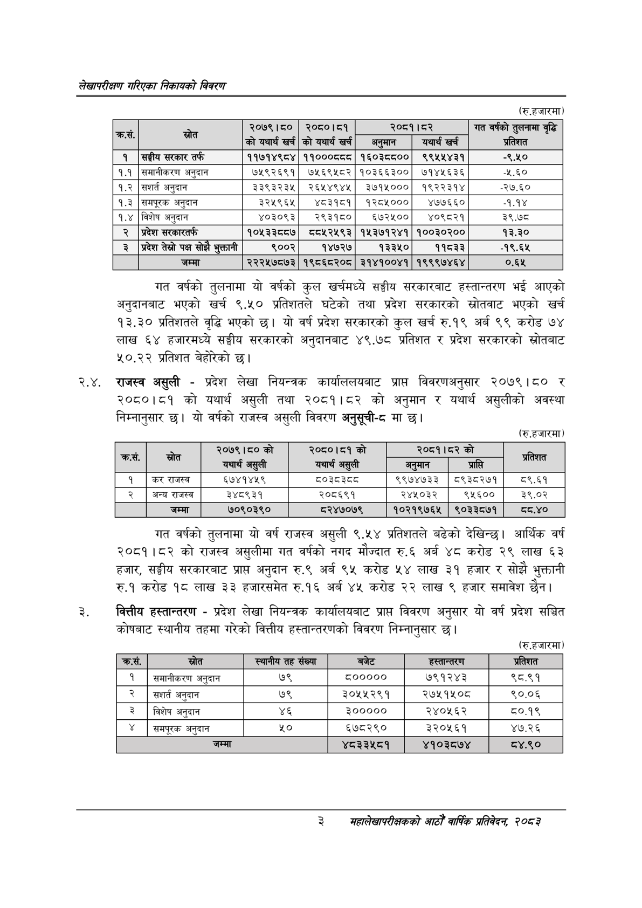

# Page 19 QA

## Rendered page


## Extracted text

```text
लेखापरीक्षण गरिएका निकायको बिवरण
(रु.हजारमा)
गत वर्षको तुलनामा यो वर्षको कुल खर्चमध्ये सङ्घीय सरकारबाट हस्तान्तरण भई आएको अनुदानबाट भएको खर्च ९.५० प्रतिशतले घटेको तथा प्रदेश सरकारको स्रोतवाट भएको खर्च १३.३० प्रतिशतले वृद्धि भएको छ। यो वर्ष प्रदेश सरकारको कुल खर्च रु.१९ अर्ब ९९ करोड ७४ लाख ६४ हजारमध्ये सङ्घीय सरकारको अनुदानबाट ४९.७८ प्रतिशत र प्रदेश सरकारको स्रोतबाट ५०.२२ प्रतिशत बेहोरेको छ।
२.४. राजस्व असुली -प्रदेश लेखा नियन्त्रक कार्याललयबाट प्राप्त विवरणअनुसार २०७९।८० र २०८०।८१ को यथार्थ असुली तथा २०८१।८२ को अनुमान र यथार्थ असुलीको अवस्था = निम्नानुसार छ। यो वर्षको राजस्व असुली विवरण अनुसूची-८ मा छ।
(रु.हजारमा)
गत वर्षको तुलनामा यो वर्ष राजस्व असुली ९.५४ प्रतिशतले बढेको देखिन्छ। आर्थिक वर्ष २०८१।८२ को राजस्व असुलीमा गत वर्षको नगद मौज्दात रु.६ अर्ब ४८ करोड २९ लाख ६३ हजार, सङ्घीय सरकारबाट प्राप्त अनुदान रु.९ अर्ब ९५ करोड ५४ लाख ३९ हजार र सोझै भुक्तानी रु.१ करोड १८ लाख ३३ हजारसमेत रु.१६ अर्ब ४५ करोड २२ लाख ९ हजार समावेश छैन।
वित्तीय हस्तान्तरण -प्रदेश लेखा नियन्त्रक कार्यालयबाट प्राप्त विवरण अनुसार यो वर्ष प्रदेश सञ्चित कोषबाट स्थानीय तहमा गरेको वित्तीय हस्तान्तरणको विवरण निम्नानुसार छ।
(रु.हजारमा)
३
सहालेखापरीक्षकको आठौँ वार्षिकि प्रतिवेदन २०८२

| हा |  | २०७९।८० को यथार्थ खर्च | २०८०।८१ को यथार्थ खर्ब | २०८१।८२ अनुमान | यथार्थ खर्च | गत वर्षको तुलनामा वृद्धि प्रतिशत |
| --- | --- | --- | --- | --- | --- | --- |
| १ | सङ्घीय सरकार तर्फ | ११७१४९८४ | ११०००८८८ | १६०३८८०० | ९९५५४३१ | -९.५० |
| १.१ | समानीकरण अनुदान | ७५९२६९१ | ७५६९५८२ | १०३६६३०० | ७१४५६३६ | ४८० |
| १.२ | अनुदान | ३३९३२३५ | २६४५४९४५ | ३७१५००० | १९२२३१४ | -२७.६० |
| १.३ | समपूरक अनुदान | ३२५९६५ | ४८३१८१ | १२८५००० | ४७७६६० | -१.१४ |
| १.४ | बिशेष अनुदान | ४०३०९३ | २९३१८० | ६७२५०० | ४०९८२१ | ३९.७८ |
| २ | प्रदेश सरकारतर्फ | १०५३३८०८७ | ००५२५९३ | १५३७१२४१ | १००३०२०० | १३.३० |
| ३ | प्रदेश तेस्रो पक्ष सोझै भुक्तानी | ९००२ | १४७२७ | १३३५० | ११८३३ | -१९.६५ |
|  | जम्मा | २२२५७८७३ | १९८६८२०८ | ३१४१००४१ | १९९९७४६४ | ०.६४५ |

| क्रस | सोत | २०७९।८० को यथार्थ असुली | २०८०।८१ को यथार्थ असुली | २०८१।८२को अनुमान |  | प्रतिशत |
| --- | --- | --- | --- | --- | --- | --- |
| १ | कर राजस्व | ६७४१४४५९ | ८०३८३८८ | ९९७४७३३ | ०९३८२७१ | ८९.६१ |
| २ | अन्य राजस्व | ३४८९३१ | २०८६९१ | २४५०३२ | ९५६०० | ३९.०२ |
|  | जम्मा | ७०९०३९० | ८२४७०७९ | १०२१९७६५ | ९०३३८७१ | दव.४० |

| क्रस.   | स्रोत           | स्थानीय तह संख्या   |    बजेट | हस्तान्तरण   | प्रतिशत   |
|---------|-----------------|---------------------|---------|--------------|-----------|
| 1       | समानीकरण अनुदान | ७९                  |  ८००००० | ७९१२४३       | ९८.९१     |
| २       | सशर्त अनुदान    | ७९                  | ३०५५२९१ | २७५१५०८      | ९०.०६     |
| ३       | विशेष अनुदान    | ४६                  |  300000 | RYougR       | oy        |
| ¥       | समपूरक अनुदान   | २०                  |  ६७८२९० | ३२०५६१       | ४७.२६     |
| जागा    | जागा            | जागा                |         |              | ०४१०      |
```

## Flags
- table_page
- medium_quality_table
