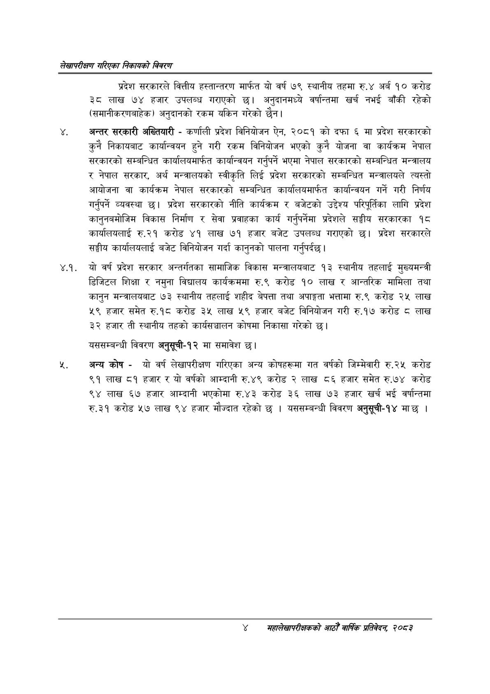

# Page 20 QA

## Rendered page


## Extracted text

```text
लेखापरीक्षण गरिएका निकायको बिवरण
प्रदेश सरकारले वित्तीय हस्तान्तरण मार्फत यो वर्ष ७९ स्थानीय तहमा रु.४ अर्ब १० करोड ३८ लाख ७४ हजार उपलब्ध गराएको छ। अनुदानमध्ये वर्षान्तमा खर्च नभई बाँकी रहेको (समानीकरणबाहेक) अनुदानको रकम यकिन गरेको छैन।
अन्तर सरकारी अख्तियारी -कर्णाली प्रदेश विनियोजन ऐन, २०८१ को दफा ६ मा प्रदेश सरकारको कुनै निकायबाट कार्यान्वयन हुने गरी रकम विनियोजन भएको कुनै योजना वा कार्यक्रम नेपाल सरकारको सम्बन्धित कार्यालयमार्फत कार्यान्वयन गर्नुपर्ने भएमा नेपाल सरकारको सम्बन्धित मन्त्रालय र नेपाल सरकार, अर्थ मन्त्रालयको स्वीकृति लिई प्रदेश सरकारको सम्बन्धित मन्त्रालयले त्यस्तो आयोजना वा कार्यक्रम नेपाल सरकारको सम्बन्धित कार्यालयमार्फत कार्यान्वयन गर्ने गरी निर्णय गर्नुपर्ने व्यवस्था छ। प्रदेश सरकारको नीति कार्यक्रम र बजेटको उद्देश्य परिपूर्तिका लागि प्रदेश कानुनबमोजिम विकास निर्माण र सेवा प्रवाहका कार्य गर्नुपर्नेमा प्रदेशले सङ्घीय सरकारका १८ कार्यालयलाई रु.२१ करोड ४१ लाख ७१ हजार बजेट उपलब्ध गराएको छ। प्रदेश सरकारले सङ्घीय कार्यालयलाई बजेट विनियोजन गर्दा कानुनको पालना गर्नुपर्दछ।
४.१. यो वर्ष प्रदेश सरकार अन्तर्गतका सामाजिक विकास मन्त्रालयबाट १३ स्थानीय तहलाई मुख्यमन्त्री डिजिटल शिक्षा र नमुना विद्यालय कार्यक्रममा रु.९ करोड १० लाख र आन्तरिक मामिला तथा कानुन मन्त्रालयबाट ७३ स्थानीय तहलाई शहीद बेपत्ता तथा अपाङ्गता भत्तामा रु.९ करोड २५ लाख ५९ हजार समेत रु.१८ करोड ३५ लाख ५९ हजार बजेट विनियोजन गरी रु.१७ करोड ८ लाख ३३ हजार ती स्थानीय तहको कार्यसञ्चालन कोषमा निकासा गरेको छ।
यससम्बन्धी विवरण अनुसूची-१२ मा समावेश
अन्य कोष -यो वर्ष लेखापरीक्षण गरिएका अन्य कोषहरूमा गत वर्षको जिम्मेवारी रु.२५ करोड ९१ लाख ८१ हजार र यो वर्षको आम्दानी रु.४९ करोड २ लाख ८६ हजार समेत रु.७४ करोड ९४ लाख ६७ हजार आम्दानी भएकोमा रु.४३ करोड ३६ लाख ७३ हजार खर्च भई वर्षान्तमा रु.३१ करोड ५७ लाख ९४ हजार मौज्दात रहेको छ | यससम्बन्धी विवरण अनुसूची-१४ माछ |
४
सहालेखापरीक्षकको आठो वार्षिक प्रतिवेदन २०८२
```

## Flags
- None
