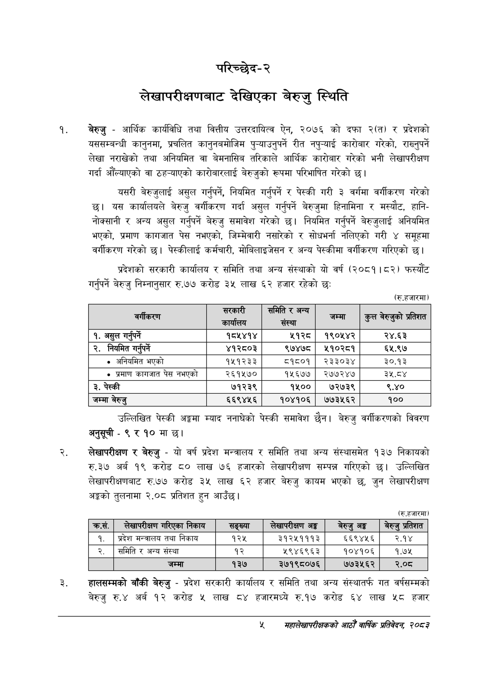

# Page 23 QA

## Rendered page


## Extracted text

```text
परिच्छेद-२
लेखापरीक्षणबाट देखिएका बेरुजु स्थिति
बेरुजु -आर्थिक कार्यविधि तथा वित्तीय उत्तरदायित्व ऐन, २०७६ को दफा २(त) र प्रदेशको यससम्बन्धी कानुनमा, प्रचलित कानुनबमोजिम पुन्याउनुपर्ने रीत नपुन्याई कारोबार गरेको, राख्नुपर्ने लेखा नराखेको तथा अनियमित वा बेमनासिब तरिकाले आर्थिक कारोबार गरेको भनी लेखापरीक्षण गर्दा औंल्याएको वा ठहन्याएको कारोबारलाई बेरुजुको रूपमा परिभाषित गरेको छ।
यसरी बेरुजुलाई असुल गर्नुपर्ने, नियमित गर्नुपर्ने र पेस्की गरी ३ वर्गमा वर्गीकरण गरेको छ। यस कार्यालयले बेरुजु वर्गीकरण गर्दा असुल गर्नुपर्ने बेरुजुमा हिनामिना र मस्यौट, हानिनोक्सानी र अन्य असुल गर्नुपर्ने बेरुजु समावेश गरेको छ। नियमित गर्नुपर्ने बेरुजुलाई अनियमित भएको, प्रमाण कागजात पेस नभएको, जिम्मेवारी नसारेको र सोधभर्ना नलिएको गरी ४ समूहमा वर्गीकरण गरेको | पेस्कीलाई कर्मचारी, मोबिलाइजेसन र अन्य पेस्कीमा वर्गीकरण गरिएको छ।
प्रदेशको सरकारी कार्यालय र समिति तथा अन्य संस्थाको यो वर्ष (२०८१।८२) फस्यौट गर्नुपर्ने बेरुजु निम्नानुसार रु.७७ करोड ३५ लाख ६२ हजार रहेको छ:
(रु.हजारमा)
उल्लिखित पेस्की अङ्कमा म्याद ननाघेको पेस्की समावेश छैन। बेरुजु वर्गीकरणको विवरण अनुसूची -९ र १० मा छ।
लेखापरीक्षण र बेरुजु -यो वर्ष प्रदेश मन्त्रालय र समिति तथा अन्य संस्थासमेत १३७ निकायको रु.३७ अर्ब १९ करोड लाख ७६ हजारको लेखापरीक्षण सम्पन्न गरिएको छ। उल्लिखित लेखापरीक्षणबाट रु.७७ करोड ३५ लाख ६२ हजार बेरुजु कायम भएको छ, जुन लेखापरीक्षण अङ्कको तुलनामा २.०८ प्रतिशत हुन आउँछ।
(रु.हजारमा)
हालसम्मको बाँकी बेरुजु -प्रदेश सरकारी कार्यालय र समिति तथा अन्य संस्थातर्फ गत वर्षसम्मको बेरुजु रु.४ अर्ब १२ करोड ५ लाख ८४ हजारमध्ये रु.१७ करोड ६४ लाख ५८ हजार
४
सहालेखापरीक्षकको आठौँ वा्िक प्रतिवेदन २०८२

| बर्गीकरण | त कायालय | डि सस्था | जम्मा | हल ब९एको प्रतिशत |
| --- | --- | --- | --- | --- |
| १. असुल गर्नपर्ने | १८५४१४ | ५१२८ | १९०५४२ | २४.६३ |
| २. नियमित गर्नपर्ने | ४१२८०३ | ९७४७८ | श५१०२८१ | ६५.९७ |
| अनिवमित भएको | १५१२३३ | ८१८०१ | २३३०३४ | ३०.१३ |
| प्रमाण का"जात पेस नभएको | २६१५७० | १५६७७ | २७७२४७ | ३५.ठ४ |
| ३. पेस्की | ७१२३९ | १५०० | ७२७३९ | ९.४० |
| जम्मा बेरुजु | ६६९४५६ | १०४१०६ | ७७३५६२ | १०० |

| क्रस. | लेखापरीक्षण गरिएका निकाय | सङ्ख्या | लेखापरीक्षण अङ्ग | बेरुजु अङ्ग | बेरुजु प्रतिशत |
| --- | --- | --- | --- | --- | --- |
| १. | प्रदेश मन्त्रालय तथा निकाय | १२५ | ३१२५१११३ | ६६९४५६ | २.१४ |
| २. | समिति र अन्य संस्था | १२ | २९४६९६३ | १०४१०६ | १.७५ |
|  | जम्मा | १३७ | ३७१९८०७६ | ७७३५६२ | र२.०८ |
```

## Flags
- table_page
- medium_quality_table
