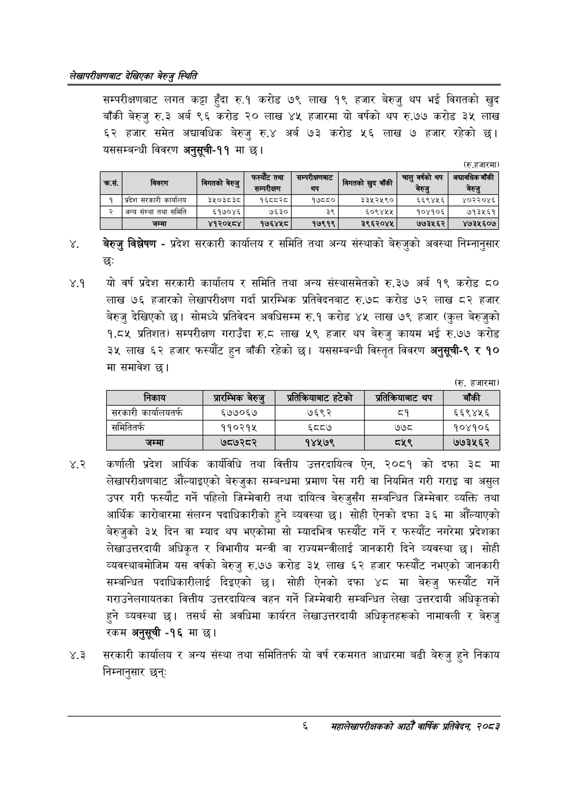

# Page 24 QA

## Rendered page


## Extracted text

```text
लेखापरीक्षणबाट देखिएका बेरुजु स्थिति
सम्परीक्षणबाट लगत कट्टा हुँदा रु.१ करोड ७९ लाख १९ हजार बेरुजु थप भई विगतको खुद बाँकी बेरुजु रु.३ अर्ब ९६ करोड २० लाख ४५ हजारमा यो वर्षको थप रु.७७ करोड ३५ लाख ६२ हजार समेत अद्यावधिक बेरुजु रु.४ अर्ब ७३ करोड ५२६ लाख ७ हजार रहेको छ। यससम्बन्धी विवरण अनुसूची-११ मा छ।
(रु.हजारमा)
बेरुजु विश्लेषण -प्रदेश सरकारी कार्यालय र समिति तथा अन्य संस्थाको बेरुजुको अवस्था निम्नानुसार छः
४.१ यौ वर्ष प्रदेश सरकारी कार्यालय र समिति तथा अन्य संस्थासमेतको रु.३७ अर्ब १९ करोड ८० लाख ७६ हजारको लेखापरीक्षण गर्दा प्रारम्भिक प्रतिवेदनबाट रु.७८ करोड ७२ लाख ८२ हजार बेरुजु देखिएको छ। सोमध्ये प्रतिवेदन अवधिसम्म रु.१ करोड ४५ लाख ७९ हजार (कुल बेरुजुको १.८५ प्रतिशत) सम्परीक्षण गराउँदा ० लाख ५९ हजार थप बेरुजु कायम भई रु.७७ करोड ३५ लाख हजार फस्यौंट हुन बाँकी रहेको छ। यससम्बन्धी विस्तृत विवरण अनुसूची-९ र १० मा समावेश छ।
४.२ कर्णाली प्रदेश आर्थिक कार्यविधि तथा वित्तीय उत्तरदायित्व ऐन, २०८१ को दफा ३ठ मा लेखापरीक्षणबाट औंल्याइएको बेरुजुका सम्बन्धमा प्रमाण पेस गरी वा नियमित गरी गराइ वा असुल उपर गरी फस्यौट गर्ने पहिलो जिम्मेवारी तथा दायित्व बेरुजुसँग सम्बन्धित जिम्मेवार व्यक्ति तथा आर्थिक कारोबारमा संलग्न पदाधिकारीको हुने व्यवस्था छ। सोही ऐनको दफा ३६ मा औंल्याएको बेरुजुको ३५ दिन वा म्याद थप भएकोमा सो म्यादभित्र फस्यौंट गर्ने र फस्यौट नगरेमा प्रदेशका लेखाउत्तरदायी अधिकृत र विभागीय मन्त्री वा राज्यमन्त्रीलाई जानकारी दिने व्यवस्था छ। सोही व्यवस्थाबमोजिम यस वर्षको बेरुजु रु.७७ करोड ३५ लाख ६२ हजार फस्यौट नभएको जानकारी सम्बन्धित पदाधिकारीलाई दिइएको छ। सोही ऐनको दफा ४८ मा बेरुजु फस्यौंट गर्ने गराउनेलगायतका वित्तीय उत्तरदायित्व वहन गर्ने जिम्मेवारी सम्बन्धित लेखा उत्तरदायी अधिकृतको हुने व्यवस्था तसर्थ सो अवधिमा कार्यरत लेखाउत्तरदायी अधिकृतहरूको नामावली र बेरुजु रकम अनुसूची -१६ मा छ।
४.३ सरकारी कार्यालय र अन्य संस्था तथा समितितर्फ यो वर्ष रकमगत आधारमा बढी बेरुजु हुने निकाय निम्नानुसार छन्‌ः
(रु. हजारमा)
६
महालेखापरीक्षकको आठौँ वार्षिक प्रतिवेदन २०८२

| कस. | विवरण | विगतको बेरुजु | तया | सन्परकानााट प्र | विगतको खुद बाँकी | चालु वर्षको | थप॒जचाननिक बाको बेरुजु |
| --- | --- | --- | --- | --- | --- | --- | --- |
| १ | प्रदेश सरकारी कार्यालय | ३५०३८३८ | १६८८२८ | १७८८० | ३३१२५९० | ६६९४४५६ | ४०२२०४६ |
| २ | अन्य संस्था तथा समिति | ६१७०४६ | ७६३० | ३९ | ६०९४५४५ | १०४१०६ | ७१३५६१ |
|  | जम्मा | ४१२०५८४ | १७६४५८ | १७९१९ | ३९६२०४५ | ७७३५६२ | ४७३५६०७ |

| 'निकाय | शर्म बेरुजु | अ्रतेनरबानाट हटेको | अत नः्वानाट थप | बाँकी |
| --- | --- | --- | --- | --- |
| सरकारी कार्यालबतर्फ | ६७७०६७ | ७६९२ | ९ | ६६९४५६ |
| समितितर्फ | ११०२१५ | नि | ७७८ | १०४१०६ |
```

## Flags
- table_page
- medium_quality_table
