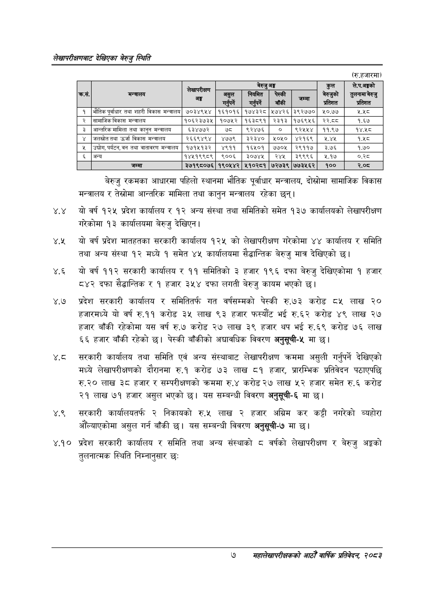

# Page 25 QA

## Rendered page


## Extracted text

```text
लेखापरीक्षणबाट देखिएका बेरुजु स्थिति
(रु.हजारमा)
बेरुजु रकमका आधारमा पहिलो स्थानमा भौतिक पूर्वाधार मन्त्रालय, दोस्रोमा सामाजिक विकास मन्त्रालय र तेस्रोमा आन्तरिक मामिला तथा कानुन मन्त्रालय रहेका छन्‌।
. यो वर्ष १२५ प्रदेश कार्यालय र १२ अन्य संस्था तथा समितिको समेत १३७ कार्यालयको लेखापरीक्षण रारेकोमा १३ कार्यालयमा बेरुजु देखिएन |
४.२ यो वर्ष प्रदेश मातहतका सरकारी कार्यालय १२५ को लेखापरीक्षण गरेकोमा ४४ कार्यालय र समिति तथा अन्य संस्था १२ मध्ये १ समेत ४५ कार्यालयमा सैद्धान्तिक बेरुजु मात्र देखिएको |
४.६ यो वर्ष ११२ सरकारी कार्यालय र ११ समितिको ३ हजार १९६ दफा बेरुजु देखिएकोमा १ हजार ८४२ दफा सैद्धान्तिक र १ हजार ३५४ दफा लगती बेरुजु कायम भएको |
४.७ प्रदेश सरकारी कार्यालय र समितितर्फ गत वर्षसम्मको पेस्की रु.७३ करोड ८५ लाख ० हजारमध्ये यो वर्ष रु.११ करोड ३५ लाख ९३ हजार फस्यौट भई रु.६२ करोड ४९ लाख २७ हजार बाँकी रहेकोमा यस वर्ष रु.७ करोड २७ लाख ३९ हजार थप भई रु.६९ करोड ७६ लाख ६६ हजार बाँकी रहेको | पेस्की बाँकीको अद्यावधिक विवरण अनुसूची-५ मा छ।
सरकारी कार्यालय तथा समिति एवं अन्य संस्थाबाट लेखापरीक्षण क्रममा असुली गर्नुपर्ने देखिएको मध्ये लेखापरीक्षणको दौरानमा रु.१ करोड ७३ लाख ८१ हजार, प्रारम्भिक प्रतिवेदन पठाएपछि रु.२० लाख ३८ हजार र सम्परीक्षणको क्रममा रु.४ करोड २७ लाख ५२ हजार समेत रु.६ करोड २१ लाख ७१ हजार असुल भएको | यस सम्बन्धी विवरण अनुसूची-६ मा छ।
४.९ सरकारी कार्यालयतर्फ २ निकायको रु.५ लाख २ हजार अग्रिम कर कट्टी नगरेको ब्यहोरा औंल्याएकोमा असुल गर्न बाँकी छ। यस सम्बन्धी विवरण अनुसूची-७ मा छ।
प्रदेश सरकारी कार्यालय र समिति तथा अन्य संस्थाको ८ वर्षको लेखापरीक्षण र बेरुजु अङ्गको तुलनात्मक स्थिति निम्नानुसार छः
७
समहालेखापरीक्षकको आठौँ वा्िकि प्रतिवेदन २०८२

|  |  |  |  | बेरुजु | अङ्ग |  | कुल | ले.प.अङ्को |
| --- | --- | --- | --- | --- | --- | --- | --- | --- |
| कस. | मन्वालय | कमाल |  |  |  |  | बेरुजुको प्रतिशत | प्रतिशत |
| १ | भौतिक पूर्वाधार तथा शहरी विकास मन्त्रालय | ७०३४९५४ | १६१०१६ | १७४३२८ | ५७४२६ | ३९२७७० | ५०.७७ | [२ |
| २ | सामाजिक विकास मन्त्रालय | १०६२३७३५ | १०७५२ | १६३८९१ | २३१३ | १७६९५६ | २२.८८ | १.६७ |
| ३ | अन्तरिक मामिला तथा कानुन मन्त्रालय | ६३४७७२ | ५ | ९२४७६ | ० | ९२४५५४ | ११.९७ | १४,४५८ |
| ४ | जलस्रोत तथा उर्जा विकास मन्त्रालय | २६६९४९४ | ४७७९ | ३२३४० | २०५० | ४२१६९ |  | १.५८ |
| ५ | उद्योग, पर्यटन, वन तथा वातावरण मन्त्रालय | १७१५१३२ | ४९११ | १६५०१ | ७७०५ | २९११७ | ३.७६ | १.७० |
| ६ | अन्य | १४५१९९८९ | ९००६ | इ३०७४५ | २४५ | ३९९९६ | २.१७ | ०३८ |
|  | जम्मा | ३७१९८०७६ | १९०५४२ | ५१०२८१ | ७२७३९ | ७७३५६२ | १०० | २.०८ |
```

## Flags
- table_page
- medium_quality_table
