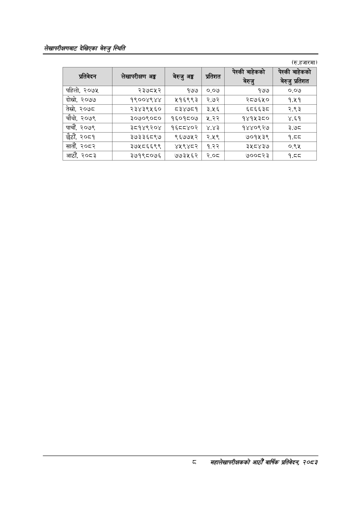

# Page 26 QA

## Rendered page


## Extracted text

```text
लेखापरीक्षणबाट देखिएका बेरुजु स्थिति
(रु.हजारमा)
८
मबहालेखापरीक्षकको आठौँ वा्िकि प्रतिवेदन २०८२

| अतिनेषन | लेखापरीक्षण अङ्ग | बेरुजु अङ्ग | प्रतिशत | \| बेरुउ | छ पाउलो प्रतिशत |
| --- | --- | --- | --- | --- | --- |
| पहिलो, २०७५ | २३७८५२ | १७७ | ०.०७ | १७७ | ०.०७ |
| दोस्रो, २०७७ | १९००४९४४ | ११६९९३ | २.७२ | २८७६५० | ९.४९ |
| तेस्रो, २०७८ | २३४३९५६० | ८३४७८१ | ३.५६ | ६८६६३८ | २.९३ |
| चौथो, २०७९ | ३०७०९०८० | १६०१८०७ | ४२.२२ | १४१५३८० | ४.६१ |
| पाचौं, २०७९ | ३८१४९२०४ | १६८८४०२ | ४.४३ | १४४०९२७ | ३.७८ |
| छैठौं, २०८१ | ३७३३६८९७ | ९६७७५२ | २.१९ | ७०१५३९ | १.८ |
| सातौं, २०८२ | ३७५८६६९९ | ४५९४८२ | १.२२ | ३५८४३७ | ०.९५ |
| आठौँ, २०८३ | ३७१९८०७६ | ७७३५६२ | २.०८ | ७००८२३ | ९.५ |
```

## Flags
- table_page
- medium_quality_table
