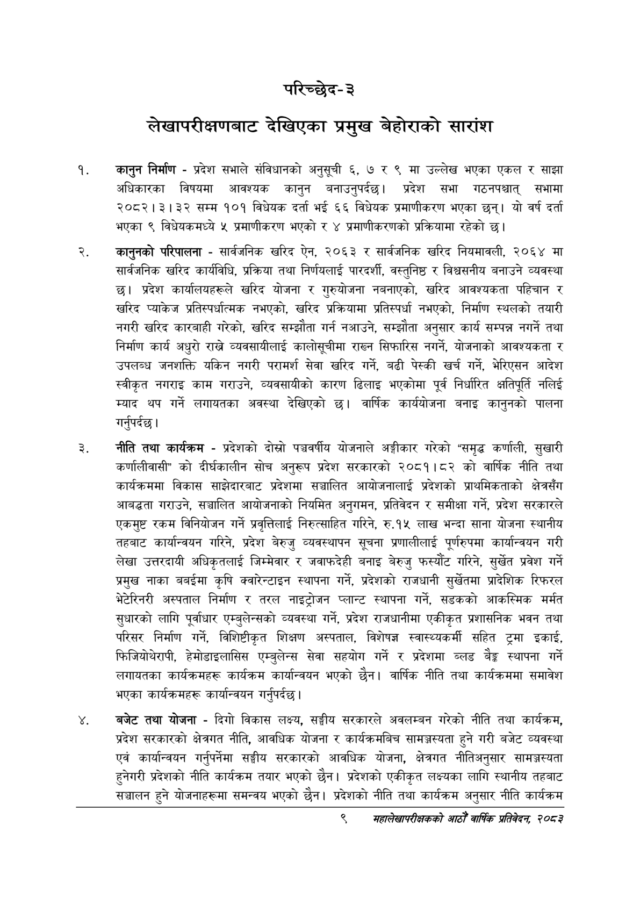

# Page 29 QA

## Rendered page


## Extracted text

```text
परिच्छेद-३
लेखापरीक्षणबाट देखिएका प्रमुख बेहोराको सारांश
कानुन निर्माण -प्रदेश सभाले संविधानको अनुसूची ६, ७ र ९ मा उल्लेख भएका एकल र साझा अधिकारका विषयमा आवश्यक कानुन बनाउनुपर्दछ। प्रदेश सभा गठनपश्चात्‌ सभामा २०८२।३।३२ सम्म १०१ विधेयक दर्ता भई ६६ विधेयक प्रमाणीकरण भएका छन्‌। यो वर्ष दर्ता भएका ९ विधेयकमध्ये ५ प्रमाणीकरण भएको र ४ प्रमाणीकरणको प्रक्रियामा रहेको छ।
कानुनको परिपालना -सार्वजनिक खरिद ऐन, २०६३ र सार्वजनिक खरिद नियमावली, २०६४ मा सार्वजनिक खरिद कार्यविधि, प्रक्रिया तथा निर्णयलाई पारदर्शी, वस्तुनिष्ठ र विश्वसनीय बनाउने व्यवस्था छ। प्रदेश कार्यालयहरूले खरिद योजना र गुरुयोजना नबनाएको, खरिद आवश्यकता पहिचान र खरिद प्याकेज प्रतिस्पर्धात्मक नभएको, खरिद प्रक्रियामा प्रतिस्पर्धा नभएको, निर्माण स्थलको तयारी नगरी खरिद कारबाही गरेको, खरिद सम्झौता गर्न नआउने, सम्झौता अनुसार कार्य सम्पन्न नगर्ने तथा निर्माण कार्य अधुरो राखने व्यवसायीलाई कालोसूचीमा राख्न सिफारिस नगर्ने, योजनाको आवश्यकता र उपलब्ध जनशक्ति यकिन नगरी परामर्श सेवा खरिद गर्ने, बढी पेस्की खर्च गर्ने, भेरिएसन आदेश स्वीकृत नगराइ काम गराउने, व्यवसायीको कारण ढिलाइ भएकोमा पूर्व निर्धारित क्षतिपूर्ति नलिई म्याद थप गर्ने लगायतका अवस्था देखिएको छ। वार्षिक कार्ययोजना बनाइ कानुनको पालना |
गर्नुपर्दछ
नीति तथा कार्यक्रम -प्रदेशको दोस्रो पञ्चवर्षीय योजनाले अङ्गीकार गरेको "समृद्ध कर्णाली, सुखारी कर्णालीवासी" को दीर्घकालीन सोच अनुरूप प्रदेश सरकारको २०८१।८२ को वार्षिक नीति तथा कार्यक्रममा विकास साझेदारबाट प्रदेशमा सञ्चालित आयोजनालाई प्रदेशको प्राथमिकताको क्षेत्रसँग आवद्धता गराउने, सञ्चालित आयोजनाको नियमित अनुगमन, प्रतिवेदन र समीक्षा गर्ने, प्रदेश सरकारले एकमुष्ट रकम विनियोजन गर्ने प्रवृत्तिलाई निरुत्साहित गरिने, रु.१५ लाख भन्दा साना योजना स्थानीय तहबाट कार्यान्वयन गरिने, प्रदेश बेरुजु व्यवस्थापन सूचना प्रणालीलाई पूर्णरुपमा कार्यान्वयन गरी लेखा उत्तरदायी अधिकृतलाई जिम्मेवार र जवाफदेही बनाइ बेरुजु फस्यौंट गरिने, सुर्खेत प्रवेश गर्ने प्रमुख नाका बबईमा कृषि क्वारेन्टाइन स्थापना गर्ने, प्रदेशको राजधानी सुर्खेतमा प्रादेशिक रिफरल भेटेरिनरी अस्पताल निर्माण र तरल नाइट्रोजन प्लान्ट स्थापना गर्ने, सडकको आकस्मिक मर्मत सुधारको लागि पूर्वाधार एम्बुलेन्सको व्यवस्था गर्ने, प्रदेश राजधानीमा एकीकृत प्रशासनिक भवन तथा परिसर निर्माण गर्ने, विशिष्टीकृत शिक्षण अस्पताल, विशेषज्ञ स्वास्थ्यकर्मी सहित ट्रमा इकाई, फिजियोथेरापी, हेमोडाइलासिस एम्बुलेन्स सेवा सहयोग गर्ने र प्रदेशमा ब्लड बेङ्ग स्थापना गर्ने लगायतका कार्यक्रमहरू कार्यक्रम कार्यान्वयन भएको छैन। वार्षिक नीति तथा कार्यक्रममा समावेश भएका कार्यक्रमहरू कार्यान्वयन गर्नुपर्दछ।
बजेट तथा योजना -दिगो विकास लक्ष्य, सङ्घीय सरकारले अवलम्बन गरेको नीति तथा कार्यक्रम, प्रदेश सरकारको क्षेत्रगत नीति, आवधिक योजना र कार्यक्रमबिच सामञ्जस्यता हुने गरी बजेट व्यवस्था एवं कार्यान्वयन गर्नुपर्नेमा सङ्घीय सरकारको आवधिक योजना, क्षेत्रगत नीतिअनुसार सामञ्जस्यता हुनेगरी प्रदेशको नीति कार्यक्रम तयार भएको छैन। प्रदेशको एकीकृत लक्ष्यका लागि स्थानीय तहबाट सञ्चालन हुने योजनाहरूमा समन्वय भएको छैन। प्रदेशको नीति तथा कार्यक्रम अनुसार नीति कार्यक्रम
९
सहालेखापरीक्षकको आठौँ वा्िक प्रतिवेदन २०८२
```

## Flags
- None
