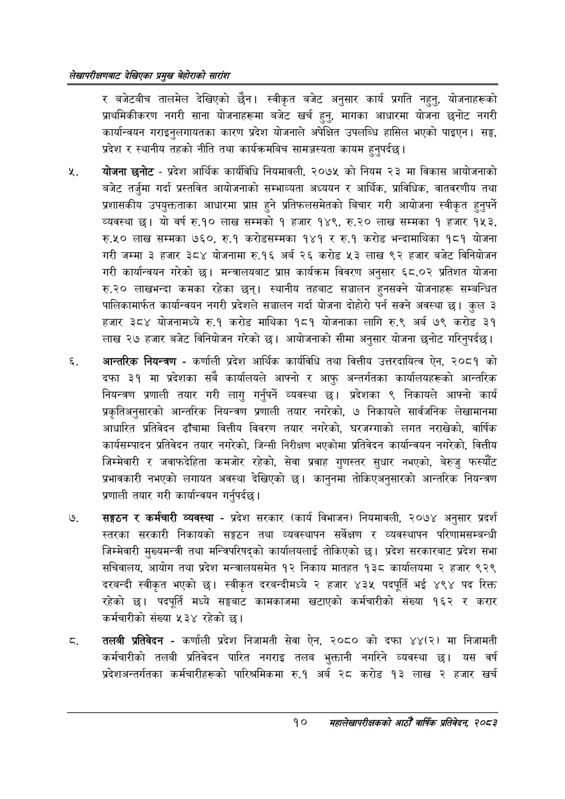

# Page 30 QA

## Rendered page


## Extracted text

```text
लेखापरीक्षणबाट देखिएका प्रमुख बेहोराको सारांश
र बजेटबीच तालमेल देखिएको छैन। स्वीकृत बजेट अनुसार कार्य प्रगति नहुनु, योजनाहरूको प्राथमिकीकरण नगरी साना योजनाहरूमा बजेट खर्च हुनु, मागका आधारमा योजना छनोट नगरी कार्यान्वयन गराइनुलगायतका कारण प्रदेश योजनाले अपेक्षित उपलब्धि हासिल भएको पाइएन। सङ्घ, प्रदेश र स्थानीय तहको नीति तथा कार्यक्रमबिच सामञ्जस्यता कायम हुनुपर्दछ |
योजना छनोट -प्रदेश आर्थिक कार्यविधि नियमावली, २०७५ को नियम २३ मा विकास आयोजनाको बजेट तर्जुमा गर्दा प्रस्तवित आयोजनाको सम्भाव्यता अध्ययन र आर्थिक, प्राविधिक, वातवरणीय तथा प्रशासकीय उपयुक्तताका आधारमा प्राप्त हुने प्रतिफलसमेतको बिचार गरी आयोजना स्वीकृत हुनुपर्ने व्यवस्था | यो वर्ष रु.१० लाख सम्मको १ हजार १४९, रु.२० लाख सम्मका १ हजार १५३, रु.५० लाख सम्मका ७६०, रु.१ करोडसम्मका १४१ र रु.१ करोड भन्दामाथिका १८१ योजना गरी जम्मा ३ हजार ३८४ योजनामा रु.१६ अर्ब २६ करोड ५३ लाख ९२ हजार बजेट विनियोजन गरी कार्यान्वयन गरेको | मन्त्रालयबाट प्राप्त कार्यक्रम विवरण अनुसार ६८.०२ प्रतिशत योजना रु.२० लाखभन्दा कमका रहेका छन्‌। स्थानीय तहबाट सञ्चालन हुनसक्ने योजनाहरू सम्बन्धित पालिकामार्फत कार्यान्वयन नगरी प्रदेशले सञ्चालन गर्दा योजना दोहोरो पर्न सक्ने अवस्था छ। कुल ३ हजार ३८४ योजनामध्ये रु.१ करोड माथिका १८१ योजनाका लागि रु.९ अर्ब ७९ करोड ३१ लाख २७ हजार बजेट विनियोजन गरेको छ। आयोजनाको सीमा अनुसार योजना छनोट गरिनुपर्दछ |
आन्तरिक नियन्त्रण -कर्णाली प्रदेश आर्थिक कार्यविधि तथा वित्तीय उत्तरदायित्व ऐन, २०८१ को दफा ३१ मा प्रदेशका सबै कार्यालयले आफ्नो र आफु अन्तर्गतका कार्यालयहरूको आन्तरिक नियन्त्रण प्रणाली तयार गरी लागु गर्नुपर्ने व्यवस्था छ। प्रदेशका ९ निकायले आफ्नो कार्य प्रकृतिअनुसारको आन्तरिक नियन्त्रण प्रणाली तयार नगरेको, ७ निकायले सार्वजनिक लेखामानमा आधारित प्रतिवेदन ढाँचामा वित्तीय विवरण तयार नगरेको, घरजग्गाको लगत नराखेको, वार्षिक कार्यसम्पादन प्रतिवेदन तयार नगरेको, जिन्सी निरीक्षण भएकोमा प्रतिवेदन कार्यान्वयन नगरेको, वित्तीय जिम्मेवारी र जवाफदेहिता कमजोर रहेको, सेवा प्रवाह गुणस्तर सुधार नभएको, बेरुजु फस्यौट प्रभावकारी नभएको लगायत अवस्था देखिएको छ। कानुनमा तोकिएअनुसारको आन्तरिक नियन्त्रण प्रणाली तयार गरी कार्यान्वयन गर्नुपर्दछ |
सङ्गठन र कर्मचारी व्यवस्था -प्रदेश सरकार (कार्य विभाजन) नियमावली, २०७४ अनुसार प्रदर्श स्तरका सरकारी निकायको सङ्गठन तथा व्यवस्थापन सर्वेक्षण र व्यवस्थापन परिणामसम्बन्धी जिम्मेवारी मुख्यमन्त्री तथा मन्त्रिपरिषद्को कार्यालयलाई तोकिएको छ। प्रदेश सरकारबाट प्रदेश सभा सचिवालय, आयोग तथा प्रदेश मन्त्रालयसमेत १२ निकाय मातहत १३८ कार्यालयमा २ हजार ९२९ दरबन्दी स्वीकृत भएको | स्वीकृत दरबन्दीमध्ये २ हजार ४३५ पदपूर्ति भ ४९४ पद रिक्त रहेको छ। पदपूर्ति मध्ये सङ्घबाट कामकाजमा खटाएको कर्मचारीको संख्या १६२ र करार कर्मचारीको संख्या ५३४ रहेको छ।
तलबी प्रतिवेदन -कर्णाली प्रदेश निजामती सेवा ऐन, २०८० को दफा ४४(२) मा निजामती कर्मचारीको तलबी प्रतिवेदन पारित नगराइ तलब भुक्तानी नगरिने व्यवस्था छ। यस वर्ष प्रदेशअन्तर्गतका कर्मचारीहरूको पारिश्रमिकमा रु.१ अर्ब २८ करोड १३ लाख २ हजार खर्च
१०
सहालेखापरीक्षकको आठौँ वा्िक प्रतिवेदन २०८२
```

## Flags
- None
