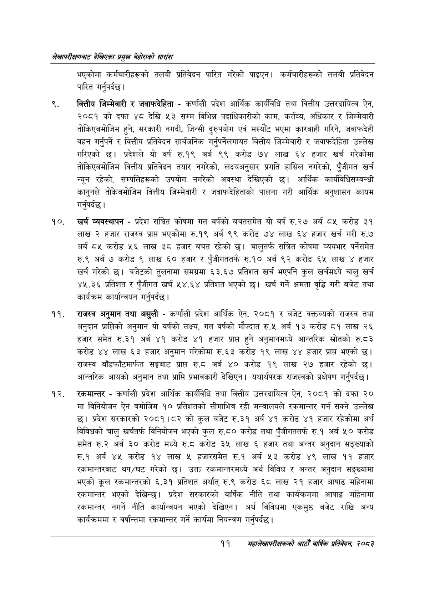

# Page 31 QA

## Rendered page


## Extracted text

```text
लेखापरीक्षणबाट देखिएका प्रमुख बेहोराको सारांश
भएकोमा कर्मचारीहरूको तलबी प्रतिवेदन पारित गरेको पाइएन। कर्मचारीहरूको तलबी प्रतिवेदन पारित गर्नुपर्दछ |
वित्तीय जिम्मेवारी र जवाफदेहिता -कर्णाली प्रदेश आर्थिक कार्यविधि तथा वित्तीय उत्तरदायित्व ऐन, २०८१ को दफा ४८ देखि ५३ सम्म विभिन्न पदाधिकारीको काम, कर्तव्य, अधिकार र जिम्मेवारी तोकिएनमोजिम हुने, सरकारी नगदी, जिन्सी दुरुपयोग एवं मस्यौट भएमा कारबाही गरिने, जवाफदेही बहन गर्नुपर्ने र वित्तीय प्रतिवेदन सार्वजनिक गर्नुपर्नेलगायत वित्तीय जिम्मेवारी र जवाफदेहिता उल्लेख गरिएको छ। प्रदेशले यो वर्ष रु.१९ अर्ब ९९ करोड ७४ लाख ६४ हजार खर्च गरेकोमा तोकिएबमोजिम वित्तीय प्रतिवेदन तयार नगरेको, लक्ष्यअनुसार प्रगति हासिल नगरेको, पुँजीगत खर्च न्यून रहेको, सम्पत्तिहरूको उपयोग नगरेको अवस्था देखिएको छ। आर्थिक कार्यविधिसम्बन्धी कानुनले तोकेबमोजिम वित्तीय जिम्मेवारी र जवाफदेहिताको पालना गरी आर्थिक अनुशासन कायम गर्नुपर्दछ |
खर्च व्यवस्थापन -प्रदेश सञ्चित कोषमा गत वर्षको बचतसमेत यो वर्ष रु.२७ अर्ब ८५ करोड ३१ लाख २ हजार राजस्व प्राप भएकोमा रु.१९ अर्ब ९९ करोड ७४ लाख ६४ हजार खर्च गरी रु.७ अर्ब ८५ करोड ५६ लाख ३८ हजार बचत रहेको छ। चालुतर्फ सञ्चित कोषमा व्ययभार पर्नेसमेत रु.९ अर्ब ७ करोड ९ लाख ६० हजार र पुँजीगततर्फ रु.१० अर्ब ९२ करोड ६५ लाख ४ हजार खर्च गरेको छ। बजेटको तुलनामा समग्रमा ६३.६७ प्रतिशत खर्च भएपनि कुल खर्चमध्ये चालु खर्च ४५.३६ प्रतिशत र पुँजीगत खर्च ५४.६४ प्रतिशत भएको छ। खर्च गर्ने क्षमता वृद्धि गरी बजेट तथा कार्यक्रम कार्यान्वयन गर्नुपर्दछ |
राजस्व अनुमान तथा असुली -कर्णाली प्रदेश आर्थिक ऐन, २०८१ र बजेट वक्तव्यको राजस्व तथा अनुदान प्राप्तिको अनुमान यो वर्षको लक्ष्य, गत वर्षको मौज्दात रु.५ अर्ब १३ करोड ८१ लाख २६ हजार समेत रु.३१ अर्ब ४१ करोड ४१ हजार प्राप्त हुने अनुमानमध्ये आन्तरिक स्रोतको रु.८३ करोड ४४ लाख ६३ हजार अनुमान गरेकोमा रु.६३ करोड १९ लाख ४४ हजार प्राप्त भएको छ। राजस्व बाँडफाँटमार्फत सङ्घबाट प्राप्त रु.८ अर्ब ४० करोड १९ लाख २७ हजार रहेको छ। आन्तरिक आयको अनुमान तथा प्राप्ति प्रभावकारी देखिएन। यथार्थपरक राजस्वको प्रक्षेपण गर्नुपर्दछ |
रकमान्तर -कर्णाली प्रदेश आर्थिक कार्यविधि तथा वित्तीय उत्तरदायित्व ऐन, २०८१ को दफा २० मा विनियोजन ऐन बमोजिम १० प्रतिशतको सीमाभित्र रही मन्त्रालयले रकमान्तर गर्न सक्ने उल्लेख छ। प्रदेश सरकारको २०८१।८२ को कुल बजेट रु.३१ अर्ब ४१ करोड ४१ हजार रहेकोमा अर्थ विविधको चालु खर्चतर्फ विनियोजन भएको कुल रु.८० करोड तथा पुँजीगततर्फ रु.१ अर्ब ५० करोड समेत अर्ब ३० करोड मध्ये रु.ट करोड ३५ लाख ६ हजार तथा अन्तर अनुदान सङ्ख्याको रु.१ अर्ब ४५ करोड १४ लाख ५ हजारसमेत रु.१ अर्ब ५३ करोड ४९ लाख ११ हजार रकमान्तरबाट थप/घट गरेको छ। उक्त रकमान्तरमध्ये अर्थ विविध र अन्तर अनुदान सङ्ख्यामा भएको कूल रकमान्तरको ६.३१ प्रतिशत अर्थात्‌ रु.९ करोड ६८ लाख २१ हजार आषाढ महिनामा रकमान्तर भएको देखिन्छ। प्रदेश सरकारको वार्षिक नीति तथा कार्यक्रममा आषाढ महिनामा रकमान्तर नगर्ने नीति कार्यान्वयन भएको देखिएन। अर्थ विविधमा एकमुष्ठ बजेट राखि अन्य कार्यक्रममा र वर्षान्तमा रकमान्तर गर्ने कार्यमा नियन्त्रण गर्नुपर्दछ |
११
सहालेखापरीक्षकको आठोँ वाषिक प्रतिवेदन २०८२
```

## Flags
- None
