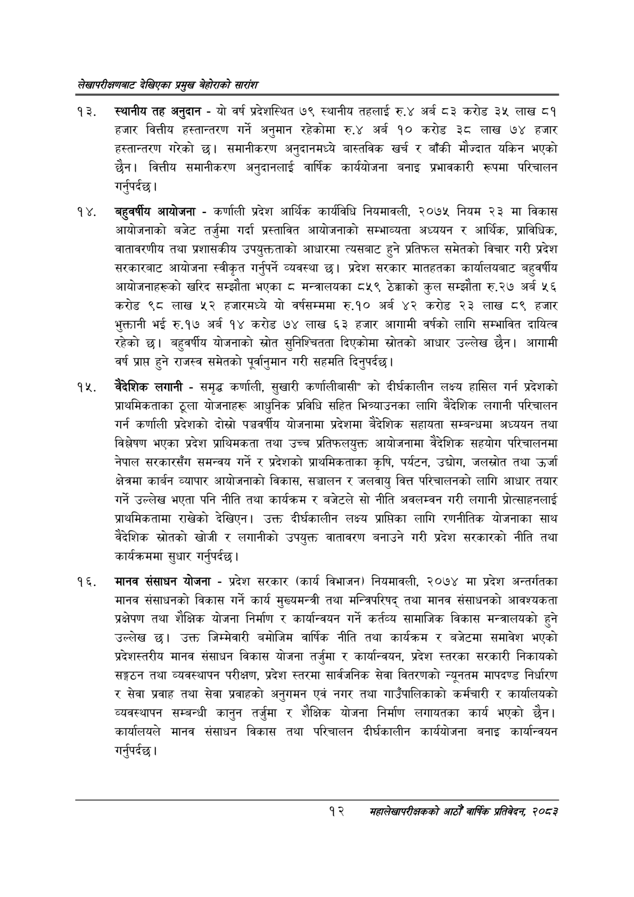

# Page 32 QA

## Rendered page


## Extracted text

```text
लेखापरीक्षणबाट देखिएका प्रमुख बेहोराको सारांश
स्थानीय तह अनुदान -यो वर्ष प्रदेशस्थित ७९ स्थानीय तहलाई रु.४ अर्ब ८३ करोड ३५ लाख ८१ हजार वित्तीय हस्तान्तरण गर्ने अनुमान रहेकोमा रु.४ अर्ब १० करोड ३८ लाख ७४ हजार हस्तान्तरण गरेको छ। समानीकरण अनुदानमध्ये बास्तविक खर्च र बाँकी मौज्दात यकिन भएको छैन। वित्तीय समानीकरण अनुदानलाई वार्षिक कार्ययोजना बनाइ प्रभावकारी रूपमा परिचालन गर्नुपर्दछ |
बहुवर्षीय आयोजना -कर्णाली प्रदेश आर्थिक कार्यविधि नियमावली, २०७५ नियम २३ मा विकास आयोजनाको बजेट तर्जुमा गर्दा प्रस्तावित आयोजनाको सम्भाव्यता अध्ययन र आर्थिक, प्राविधिक, वातावरणीय तथा प्रशासकीय उपयुक्तताको आधारमा त्यसबाट हुने प्रतिफल समेतको विचार गरी प्रदेश सरकारबाट आयोजना स्वीकृत गर्नुपर्ने व्यवस्था छ। प्रदेश सरकार मातहतका कार्यालयबाट बहुवर्षीय आयोजनाहरूको खरिद सम्झौता भएका ८ मन्त्रालयका ८५९ ठेक्काको कुल सम्झौता रु.२७ अर्ब ५६ करोड ९८ लाख ५२ हजारमध्ये यो वर्षसम्ममा रु.१० अर्ब ४२ करोड २३ लाख ८९ हजार भुक्तानी भई रु.१७ अर्ब १४ करोड ७४ लाख ६३ हजार आगामी वर्षको लागि सम्भावित दायित्व रहेको छ। बहुवर्षीय योजनाको स्रोत सुनिश्चितता दिएकोमा स्रोतको आधार उल्लेख छैन। आगामी वर्ष प्राप्त हुने राजस्व समेतको पूर्वानुमान गरी सहमति दिनुपर्दछ |
बैदेशिक लगानी -समृद्ध कर्णाली, सुखारी कर्णालीबासी" को दीर्घकालीन लक्ष्य हासिल गर्न प्रदेशको प्राथमिकताका ठूला योजनाहरू आधुनिक प्रविधि सहित भित्र्याउनका लागि बैदेशिक लगानी परिचालन गर्न कर्णाली प्रदेशको दोस्रो पञ्चवर्षीय योजनामा प्रदेशमा बैदेशिक सहायता सम्बन्धमा अध्ययन तथा विश्लेषण भएका प्रदेश प्राथिमकता तथा उच्च प्रतिफलयुक्त आयोजनामा वैदेशिक सहयोग परिचालनमा नेपाल सरकारसँग समन्वय गर्ने र प्रदेशको प्राथमिकताका कृषि, पर्यटन, उद्योग, जलस्रोत तथा उर्जा क्षेत्रमा कार्बन व्यापार आयोजनाको विकास, सञ्चालन र जलवायु वित्त परिचालनको लागि आधार तयार गर्ने उल्लेख भएता पनि नीति तथा कार्यक्रम र बजेटले सो नीति अवलम्वन गरी लगानी प्रोत्साहनलाई प्राथमिकतामा राखेको देखिएन। उक्त दीर्घकालीन लक्ष्य प्राप्तिका लागि रणनीतिक योजनाका साथ वैदेशिक स्रोतको खोजी र लगानीको उपयुक्त वातावरण बनाउने गरी प्रदेश सरकारको नीति तथा कार्यक्रममा सुधार गर्नुपर्दछ |
मानव संसाधन योजना -प्रदेश सरकार (कार्य विभाजन) नियमावली, २०७४ मा प्रदेश अन्तर्गतका मानव संसाधनको विकास गर्ने कार्य मुख्यमन्त्री तथा मन्त्रिपरिषद्‌ तथा मानव संसाधनको आवश्यकता प्रक्षेपण तथा शैक्षिक योजना निर्माण र कार्यान्वयन गर्ने कर्तव्य सामाजिक विकास मन्त्रालयको हुने उल्लेख छ। उक्त जिम्मेवारी बमोजिम वार्षिक नीति तथा कार्यक्रम र बजेटमा समावेश भएको प्रदेशस्तरीय मानव संसाधन विकास योजना तर्जुमा र कार्यान्वयन, प्रदेश स्तरका सरकारी निकायको सङ्गठन तथा व्यवस्थापन परीक्षण, प्रदेश स्तरमा सार्वजनिक सेवा वितरणको न्यूनतम मापदण्ड निर्धारण र सेवा प्रवाह तथा सेवा प्रवाहको अनुगमन एवं नगर तथा गाउँपालिकाको कर्मचारी र कार्यालयको व्यवस्थापन सम्बन्धी कानुन तर्जुमा र शैक्षिक योजना निर्माण लगायतका कार्य भएको छैन। कार्यालयले मानव संसाधन विकास तथा परिचालन दीर्घकालीन कार्ययोजना बनाइ कार्यान्वयन गर्नुपर्दछ |
१२ सहालेखापरीक्षकको वाषिक प्रतिवेदन २०८२
```

## Flags
- None
