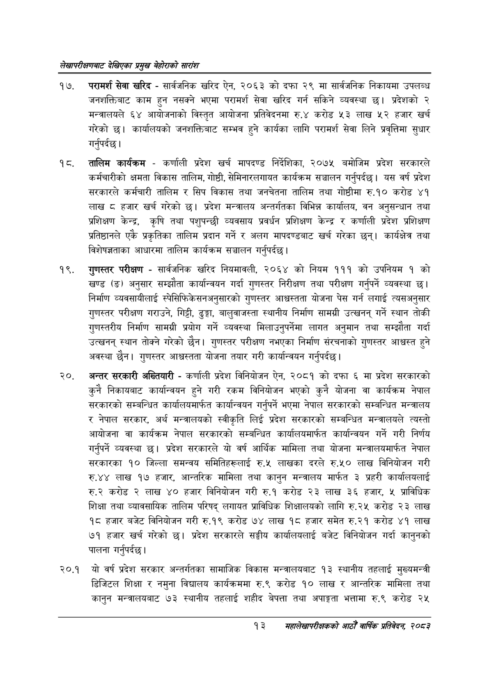

# Page 33 QA

## Rendered page


## Extracted text

```text
लेखापरीक्षणबाट देखिएका प्रमुख बेहोराको सारांश
परामर्श सेवा खरिद -सार्वजनिक खरिद ऐन, २०६३ को दफा २९ मा सार्वजनिक निकायमा उपलब्ध जनशक्तिबाट काम हुन नसक्ने भएमा परामर्श सेवा खरिद गर्न सकिने व्यवस्था छ। प्रदेशको २ मन्त्रालयले ६४ आयोजनाको विस्तृत आयोजना प्रतिवेदनमा रु.४ करोड ५३ लाख ५२ हजार खर्च गरेको | कार्यालयको जनशक्तिबाट सम्भव हुने कार्यका लागि परामर्श सेवा लिने प्रवृत्तिमा सुधार गर्नुपर्दछ |
तालिम कार्यक्रम -कर्णाली प्रदेश खर्च मापदण्ड निर्देशिका, २०७५ बमोजिम प्रदेश सरकारले कर्मचारीको क्षमता विकास तालिम, गोष्ठी, सेमिनारलगायत कार्यक्रम सञ्चालन गर्नुपर्दछ। यस वर्ष प्रदेश सरकारले कर्मचारी तालिम र सिप विकास तथा जनचेतना तालिम तथा गोष्ठीमा रु.१० करोड ४१ लाख ८ हजार खर्च गरेको छ। प्रदेश मन्त्रालय अन्तर्गतका विभिन्न कार्यालय, वन अनुसन्धान तथा प्रशिक्षण केन्द्र, कृषि तथा पशुपन्छी व्यवसाय प्रवर्धन प्रशिक्षण केन्द्र र कर्णाली प्रदेश प्रशिक्षण प्रतिष्ठानले एकै प्रकृतिका तालिम प्रदान गर्ने र अलग मापदण्डबाट खर्च गरेका छन्‌। कार्यक्षेत्र तथा विशेषज्ञताका आधारमा तालिम कार्यक्रम सञ्चालन गर्नुपर्दछ |
गुणस्तर परीक्षण -सार्वजनिक खरिद नियमावली, २०६४ को नियम १११ को उपनियम १ को खण्ड (ङ) अनुसार सम्झौता कार्यान्वयन गर्दा गुणस्तर निरीक्षण तथा परीक्षण गर्नुपर्ने व्यवस्था छ। निर्माण व्यवसायीलाई स्पेसिफिकेसनअनुसारको गुणस्तर आश्वस्तता योजना पेस गर्न लगाई त्यसअनुसार गुणस्तर परीक्षण गराउने, गिट्टी, ढुङ्गा, बालुवाजस्ता स्थानीय निर्माण सामग्री उत्खनन्‌ गर्ने स्थान तोकी गुणस्तरीय निर्माण सामग्री प्रयोग गर्ने व्यवस्था मिलाउनुपर्नेमा लागत अनुमान तथा सम्झौता गर्दा उत्खनन्‌ स्थान तोक्ने गरेको छैन। गुणस्तर परीक्षण नभएका निर्माण संरचनाको गुणस्तर आश्वस्त हुने अवस्था छैन। गुणस्तर आश्वस्तता योजना तयार गरी कार्यान्वयन गर्नुपर्दछ |
अन्तर सरकारी अख्तियारी -कर्णाली प्रदेश विनियोजन ऐन, २०८१ को दफा ६ मा प्रदेश सरकारको कुनै निकायबाट कार्यान्वयन हुने गरी रकम विनियोजन भएको कुनै योजना वा कार्यक्रम नेपाल सरकारको सम्बन्धित कार्यालयमार्फत कार्यान्वयन गर्नुपर्ने भएमा नेपाल सरकारको सम्बन्धित मन्त्रालय र नेपाल सरकार, अर्थ मन्त्रालयको स्वीकृति लिई प्रदेश सरकारको सम्बन्धित मन्त्रालयले त्यस्तो आयोजना वा कार्यक्रम नेपाल सरकारको सम्बन्धित कार्यालयमार्फत कार्यान्वयन गर्ने गरी निर्णय गर्नुपर्ने व्यवस्था छ। प्रदेश सरकारले यो वर्ष आर्थिक मामिला तथा योजना मन्त्रालयमार्फत नेपाल सरकारका १० जिल्ला समन्वय समितिहरूलाई रु.५ लाखका दरले रु.५० लाख विनियोजन गरी रु.४४ लाख १७ हजार, आन्तरिक मामिला तथा कानुन मन्त्रालय मार्फत ३ प्रहरी कार्यालयलाई करोड २ लाख ४० हजार विनियोजन गरी रु.१ करोड ३ लाख ३६ हजार, प्राविधिक शिक्षा तथा व्यावसायिक तालिम परिषद्‌ लगायत प्राविधिक शिक्षालयको लागि रु.२५ करोड २३ लाख १८ हजार बजेट विनियोजन गरी रु.१९ करोड ७४ लाख १८ हजार समेत रु.२१ करोड ४१ लाख ७१ हजार खर्च गरेको | प्रदेश सरकारले सङ्घीय कार्यालयलाई बजेट विनियोजन गर्दा कानुनको पालना गर्नुपर्दछ |
२०.१ यो वर्ष प्रदेश सरकार अन्तर्गतका सामाजिक विकास मन्त्रालयबाट १३ स्थानीय तहलाई मुख्यमन्त्री डिजिटल शिक्षा र नमुना विद्यालय कार्यक्रममा रु.९ करोड १० लाख र आन्तरिक मामिला तथा कानुन मन्त्रालयबाट ७३ स्थानीय तहलाई शहीद बेपत्ता तथा अपाङ्गता भत्तामा रु.९ करोड २५
१३ सहालेखापरीक्षकको वाषिक प्रतिवेदन २०८२
```

## Flags
- None
