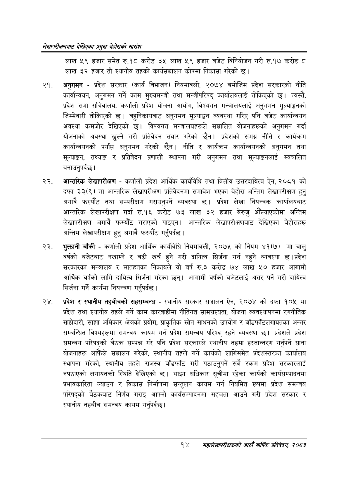

# Page 34 QA

## Rendered page


## Extracted text

```text
लेखापरीक्षणबाट देखिएका प्रमुख बेहोराको सारांश
लाख ५९ हजार समेत रु.१८ करोड ३५ लाख ५९ हजार बजेट विनियोजन गरी रु.१७ करोड © लाख ३२ हजार ती स्थानीय तहको कार्यसञ्चालन कोषमा निकासा गरेको छ।
अनुगमन -प्रदेश सरकार (कार्य विभाजन) नियमावली, २०७४ बमोजिम प्रदेश सरकारको नीति कार्यान्वयन, अनुगमन गर्ने काम मुख्यमन्त्री तथा मन्त्रीपरिषद्‌ कार्यालयलाई तोकिएको छ। त्यस्तै, प्रदेश सभा सचिवालय, कर्णाली प्रदेश योजना आयोग, विषयगत मन्त्रालयलाई अनुगमन मूल्याङ्कनको जिम्मेवारी तोकिएको छ। बहुनिकायबाट अनुगमन मूल्याङ्कन व्यवस्था गरिए पनि बजेट कार्यान्वयन अवस्था कमजोर देखिएको | विषयगत मन्त्रालयहरूले सञ्चालित योजनाहरूको अनुगमन गर्दा योजनाको अवस्था खुल्ने गरी प्रतिवेदन तयार गरेको छैन। प्रदेशको समग्र नीति र कार्यक्रम कार्यान्वयनको पर्यास अनुगमन गरेको छैन। नीति र कार्यक्रम कार्यान्वयनको अनुगमन तथा मूल्याङ्गन, तथ्याङ्क र प्रतिवेदन प्रणाली स्थापना गरी अनुगमन तथा मूल्याङ्गनलाई स्वचालित बनाउनुपर्दछ।
आन्तरिक लेखापरीक्षण -कर्णाली प्रदेश आर्थिक कार्यविधि तथा वित्तीय उत्तरदायित्व ऐन, २०८१ को दफा ३३(९) मा आन्तरिक लेखापरीक्षण प्रतिवेदनमा समावेश भएका बेहोरा अन्तिम लेखापरीक्षण हुनु अगावै फस्यौट तथा सम्परीक्षण गराउनुपर्ने व्यवस्था छ। प्रदेश लेखा नियन्त्रक कार्यालयबाट आन्तरिक लेखापरीक्षण गर्दा रु.१६ करोड ७३ लाख ३२ हजार बेरुजु औंल्याएकोमा अन्तिम लेखापरीक्षण अगावै फस्यौट गराएको पाइएन। आन्तरिक लेखापरीक्षणबाट देखिएका बेहोराहरू अन्तिम लेखापरीक्षण हुन्‌ अगावै फस्यौट गर्नुपर्दछ |
भुक्तानी बाँकी -कर्णाली प्रदेश आर्थिक कार्यविधि नियमावली, २०७५ को नियम ४१(७) मा चालु वर्षको बजेटबाट नखाम्ने र बढी खर्च हुने गरी दायित्व सिर्जना गर्न नहुने व्यवस्था छ। प्रदेश सरकारका मन्त्रालय र मातहतका निकायले यो वर्ष रु.३ करोड ७४ लाख ५० हजार आगामी आर्थिक वर्षको लागि दायित्व सिर्जना गरेका छन्‌। आगामी वर्षको बजेटलाई असर पर्ने गरी दायित्व सिर्जना गर्ने कार्यमा नियन्त्रण गर्नुपर्दछ |
२४, प्रदेश र स्थानीय तहबीचको सहसम्बन्ध -स्थानीय सरकार सञ्चालन ऐन, २०७४ को दफा १०५ मा प्रदेश तथा स्थानीय तहले गर्ने काम कारबाहीमा नीतिगत सामञ्जस्यता, योजना व्यवस्थापनमा रणनीतिक साझेदारी, साझा अधिकार क्षेत्रको प्रयोग, प्राकृतिक स्रोत साधनको उपयोग र बाँडफाँटलगायतका अन्तर सम्बन्धित विषयहरूमा समन्वय कायम गर्न प्रदेश समन्वय परिषद्‌ रहने व्यवस्था छ। प्रदेशले प्रदेश समन्वय परिषद्को बैठक सम्पन्न गरे पनि प्रदेश सरकारले स्थानीय तहमा हस्तान्तरण गर्नुपर्ने साना योजनाहरू आफैंले सञ्चालन गरेको, स्थानीय तहले गर्ने कार्यको लागिसमेत प्रदेशस्तरका कार्यालय स्थापना गरेको, स्थानीय तहले राजस्व बाँडफाँट गरी पठाउनुपर्ने सबै रकम प्रदेश सरकारलाई नपठाएको लगायतको स्थिति देखिएको छ। साझा अधिकार सूचीमा रहेका कार्यको कार्यसम्पादनमा प्रभावकारिता ल्याउन र विकास निर्माणमा सन्तुलन कायम गर्न नियमित रूपमा प्रदेश समन्वय परिषद्को बैठकबाट निर्णय गराइ आफ्नो कार्यसम्पादनमा सहजता आउने गरी प्रदेश सरकार र स्थानीय तहबीच समन्वय कायम गर्नुपर्दछ।
१४
सहालेखापरीक्षकको आठौँ वा्िक प्रतिवेदन २०८२
```

## Flags
- None
